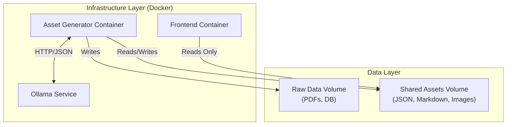
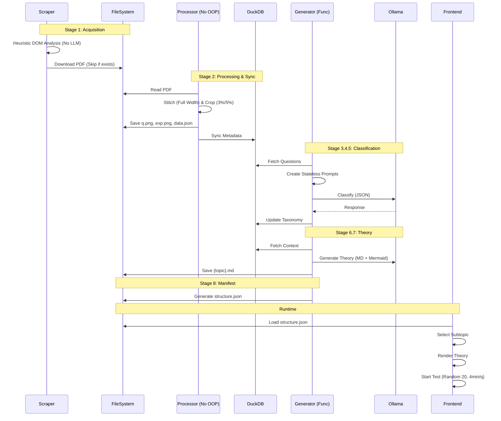

# Detailed System Design & Architecture

## 1. High-Level Architecture
**Dont Compete** follows a localized, containerized, and functional architecture. It is split into two primary autonomous systems: the **Generator** (Backend/Data Pipeline) and the **Frontend** (UI/UX). These components communicate strictly via a unidirectional data flow using shared file-system artifacts.



---

## 2. Global Constraints & Principles (Strict)

### Execution & Environment
*   **No Local Installations**: Entire workflow must run via **Docker / Docker Compose**.
*   **Single-Entry Workflow**: Docker Compose runs both asset generation and frontend.
*   **Local & Private**: Relies entirely on local LLMs (Ollama) and local artifacts; **No remote API support**.

### Data Integrity & Reusability
*   **Incremental & Idempotent**: Re-runs extend existing datasets instead of recreating them.
*   **Reusability-First**: Existing PDFs, databases, and artifacts must be reused.
*   **Single Source of Truth**: All derived data must be traceable to original PDFs.
*   **No OOP**: Strict functional programming architecture. State must be passed explicitly. Classes are prohibited for core logic.
*   **Synchronous Execution**: Generator uses synchronous code preferred over async unless significant performance gain exists.
*   **Robust Prompting**: Prompts must be self-contained (stateless) and designed to fit within model context windows.
*   **No Hardcoded Values**: Architecture should minimize hardcoded values, unless module-specific.

### Scope & Control
*   **Initial Scope**: CS and DA streams only.
*   **Stream Aliases**: Uses short codes for identification (e.g., `computer-science-information-technology` -> `cs`).
*   **Agent Autonomy**: All scraping, parsing, ordering, and generation logic is agent-decided (within spec constraints).

### Performance & Safety
*   **Skip Re-downloading**: Do not download PDFs if they already exist.
*   **Safe DB Ops**: Use `INSERT OR IGNORE`/`REPLACE` to maintain idempotency.
*   **Valid Extraction**: Image extraction occurs **only** when valid boundaries are detected.

### Non-Goals
*   Authentication, Cloud Deployment, Real-time collaboration, Analytics (beyond counts).

---

## 3. Database Schema (DuckDB)
The system uses **DuckDB** (`data/app.duckdb`) as an intermediate relational store.

| Table | Column | Type | Description |
| :--- | :--- | :--- | :--- |
| **questions** | `id` | VARCHAR | Global composite ID (`{stream}_{packet}_{qno}`) |
| | `stream_code` | VARCHAR | e.g., `computer-science-information-technology` |
| | `packet_id` | VARCHAR | Source PDF identifier (e.g., `2024-M`) |
| | `question_no` | VARCHAR | e.g., `1`, `55` |
| | `q_type` | VARCHAR | `MCQ`, `MSQ`, `NAT` |
| | `q_key` | VARCHAR | Answer Key (e.g. `A`, `55.2`) |
| | `q_text` | TEXT | Extracted text of question |
| | `a_text` | TEXT | Extracted text of answer |
| | `exp_text` | TEXT | Extracted text of explanation |
| | `subtopic_id` | VARCHAR | FK to `subtopics.id`. Populated by LLM. |
| | `img_path_q` | VARCHAR | Relative path to question image |
| | `img_path_exp` | VARCHAR | Relative path to explanation image |
| **subjects** | `id` | VARCHAR | e.g., `cs_subj_1` |
| | `name` | VARCHAR | e.g., `Digital Logic` |
| **subtopics** | `id` | VARCHAR | e.g., `cs_subj_1_topic_3` |
| | `subject_id` | VARCHAR | FK to `subjects.id` |
| | `name` | VARCHAR | e.g., `Minimization` |
| **theory** | `id` | VARCHAR | e.g., `theory_cs_subj_1_topic_3` |
| | `subtopic_id` | VARCHAR | FK to `subtopics.id` |
| | `content_md` | TEXT | Generated Markdown content |

---

## 4. Configuration Management
*   **Central Config**: `generator/src/config.py`.
*   **Secrets**: Reads from `.env` (passed to Docker).
*   **Parameters**:
    *   `TARGET_STREAMS`: Defines active streams (e.g., CS, DA).
    *   `OLLAMA_MODEL`: Configurable model selection (Llama 3, Qwen, etc.).
    *   `CLASSIFICATION_BATCH_SIZE`: Control prompt context size.

---

## 5. Data Pipeline: Detailed Components & Flows

The generator (`generator/src/main.py`) runs a sequential, atomic pipeline.

### Stage 1: Acquisition (Scraping)
**Component**: `ScraperEngine` (`scraper_engine.py`) using **Playwright**.
*   **Constraint**: **LLMs are explicitly NOT used** for detection/downloading. Logic must be procedural/heuristic.
*   **Logic**:
    1.  **Syllabus**: Visit `/syllabus/{stream}` -> Find year page -> Extract PDF link.
    2.  **PYQs**: Visit `/py-papers` -> Filter by stream slug -> Iterate years -> Extract PDF links.
*   **Optimization**: Skips re-downloading if file exists in `data/raw/`.

### Stage 2: Processing (Ingestion)
**Component**: `pdf_utils.py` using **PyMuPDF (fitz)** and **Pillow**.
*   **State Machine**:
    *   `START` -> `Question \d+` -> `QUESTION`
    *   `QUESTION` -> `Ans.` -> `ANSWER`
    *   `ANSWER` -> `Sol.` -> `EXPLANATION`
*   **Image Stitching**:
    *   **Full Width**: Captures full content width.
    *   **Vertical Merge**: Merges multi-page segments into single `q.png`/`exp.png`.
*   **Heuristic Cropping**:
    *   Removes headers/footers (e.g., Top 3%, Bottom 5%).
    *   Excludes page numbers/artifacts.
*   **Validation**: Image extraction occurs **only** when valid boundaries are detected.

### Stage 3: AI Analysis (Syllabus Parsing)
**Component**: `knowledge_utils.py` + `SyllabusParser`
*   **Input**: Syllabus PDFs from Stage 1.
*   **Prompt**: Extracts structured hierarchy (Subjects -> Subtopics) from raw PDF text.
*   **Output**: Populates `subjects` and `subtopics` tables (idempotent).
*   **Constraint**: Must run *before* Question Classification.

### Stage 4: AI Analysis (Classification)
**Component**: `knowledge_utils.py` + `prompt_utils.py` + **Ollama**.

#### Prompt Generation
*   **Stateless**: Prompts must be self-contained within context window.
*   **Input**: Syllabus Database + Batch of Questions (default 5).
*   **Task**: Map Question ID -> Subject -> Subtopic.
*   **Handling Unknowns**: Maps "Other" to "General Aptitude" -> "Miscellaneous".

#### LLM Processing
*   **Orchestration**: Sequential/Batched execution to handle local resource limits.
*   **Output**: JSON-only response parsed and synced to `questions` table.

### Stage 5: AI Analysis (Theory Generation)
For each Subtopic with > 0 questions:
*   **Prompt**: Includes all question texts as context to determine depth/scope.
*   **Output**: Markdown with Mermaid diagrams (`graph LR`, etc.) and KaTeX math.
*   **Update Rule**: Updates existing files only if new content exists.

### Stage 6: Manifest Generation (Export)
**Component**: `knowledge_utils.generate_manifest` (Per-Stream)
*   **No Global Registry**: Does *not* generate a global `exams.json` or `info.json`. Discovery is purely filesystem-based.
*   **Output**: Generates `structure.json` inside each stream's folder.
*   **Copy/Linking**: Ensures all referenced images exist in `frontend/assets`.

---

## 6. Frontend Architecture (React)

### Tech Stack
*   **Framework**: TanStack Start / React (Vite).
*   **Styling**: Tailwind CSS + DaisyUI.
*   **Routing**: File-based (`@tanstack/react-router`).
*   **Linting**: Biome (No ESLint/Prettier).
*   **MDX**: `rehype-katex` and `mermaid` support.

### Modular & Dynamic UI
*   **Modular Root Layout**: `__root.tsx` acts as a minimal structural shell, delegating specific behaviors to:
    *   `ThemeScript`: Injects a synchronous, blocking script into `<head>` to prevent Flash of Unstyled Content (FOUC).
    *   `GlobalBreadcrumbs`: Dynamically generates consistent navigation from URI path segments, avoiding hardcoded labels.
*   **Stateful Dashboard**: Uses query parameters (`?expanded=`) for targeted expansion while defaulting to "All Expanded" to maximize content visibility.

### Assessment Logic
*   **Flow**: Stream -> Subject -> Subtopic -> Theory -> Assessment.
*   **Rules**:
    *   **Max 20 questions** per attempt (Randomized).
    *   **Time Limit**: **4 minutes per question**.
*   **Interaction**:
    *   **MCQ/MSQ/NAT**: Adaptive input fields.
    *   **Submission**: Correct -> Next; Incorrect -> Show Explanation.
*   **Rendering**:
    *   Theory: MDX with `rehype-katex` and `mermaid`.
    *   Placeholders: Code-based UI for missing artifacts.

---

## 7. Data Contracts & Artifacts

### 7.1 Location
All frontend-consumable data resides in: `frontend/public/assets/gate/`

### 7.2 File Structure
```text
assets/gate/
└── cs/
    ├── structure.json
    ├── digital-logic/
    │   ├── boolean-algebra.md
    │   └── number-systems.md
    └── questions/
        └── 2024-M/
            └── 1/
                ├── q.png
                ├── exp.png
                └── data.json
```

---

---

## 8. Testing & CI/CD
*   **Unit Testing**: `pytest` for all backend modules (scraper, parser, utils).
*   **Frontend Testing**: Component testing via Vitest/Jest.
*   **CI Pipeline**: GitHub Actions to:
    *   Lint code (Biome/Ruff).
    *   Run unit tests.
    *   Build Docker images (dry run).

---

## 9. System Design Diagram



---
