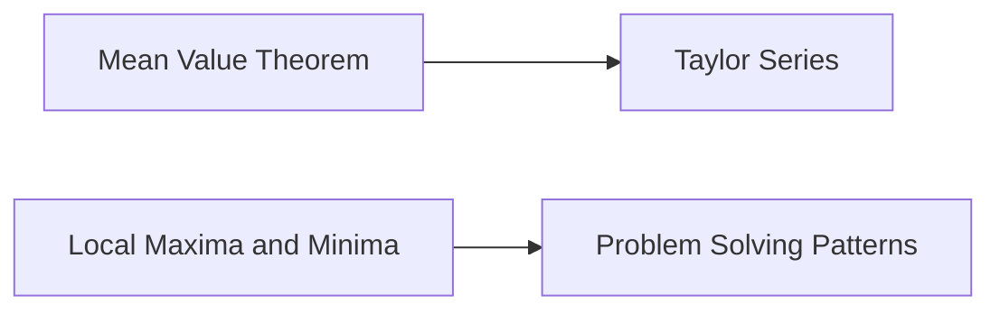

# Mean Value Theorems, Local Maxima and Minima, Taylor Series
===========================================================

## Introduction

This note covers the essential concepts of mean value theorems, local maxima and minima, and Taylor series. These topics are crucial for calculus exams, particularly GATE CS.

## Core Concepts

### Mean Value Theorem (MVT)

The MVT states that if a function `f(x)` is continuous on `[a, b]` and differentiable on `(a, b)`, then there exists at least one point `c` in `(a, b)` such that:

$$\frac{f(b)-f(a)}{b-a} = f'(c)$$

The MVT has two forms: First Form and Second Form.

#### First Form (Lagrange's Form)

Given `f(x)` continuous on `[a, b]` and differentiable on `(a, b)`, there exists a point `c` in `(a, b)` such that:

$$f'(c) = \frac{f(b)-f(a)}{b-a}$$

#### Second Form (Cauchy's Form)

Given `f(x)` continuous on `[a, b]` and differentiable on `(a, b)`, there exists a point `c` in `(a, b)` such that:

$$\lim_{x \to c^-} f'(x) = \lim_{x \to c^+} f'(x)$$

### Local Maxima and Minima

A function `f(x)` has a local maximum at `x=c` if there exists an interval `(c-δ, c+δ)` such that for all `x ∈ (c-δ, c+δ)`, `f(c) ≥ f(x)`. Similarly, it has a local minimum at `x=c` if `f(c) ≤ f(x)`.

### Taylor Series

The Taylor series of a function `f(x)` centered at `a` is given by:

$$f(x+a) = \sum_{n=0}^{\infty} \frac{f^{(n)}(a)}{n!}(x-a)^n$$

## Key Formulas/Theorems

* Mean Value Theorem: $\frac{f(b)-f(a)}{b-a} = f'(c)$
* Taylor Series: $f(x+a) = \sum_{n=0}^{\infty} \frac{f^{(n)}(a)}{n!}(x-a)^n$

## Problem Solving Patterns

1. **Identify the function**: Determine the function for which you need to find the mean value or Taylor series.
2. **Apply MVT or Taylor Series formula**: Use the appropriate formula based on the type of problem (e.g., MVT for rate of change, Taylor series for approximating functions).
3. **Simplify and solve**: Simplify the equation obtained after applying the formula and solve for the required value.

## Examples with Solutions

### Example 1: Mean Value Theorem

Suppose `f(x) = x^2 + 5` on `[0, 4]`. Find the value of `c` such that `f'(c) = (f(4)-f(0))/(4-0)`.

```latex
\frac{d}{dx}(x^2+5) &= \frac{(16+5)-(0+5)}{4} \\
2x &= \frac{11}{4} \\
c &= \frac{11}{8}
```

### Example 2: Taylor Series

Find the Taylor series expansion of `f(x) = e^x` centered at `a=1`.

$$e^{(x+1)-1} = \sum_{n=0}^{\infty} \frac{(x-1)^n}{n!} e^1$$

## Common Pitfalls

* Failing to apply the correct formula (MVT or Taylor series).
* Not identifying the function properly.
* Not simplifying the equation correctly.

## Quick Summary

* Mean Value Theorem: $\frac{f(b)-f(a)}{b-a} = f'(c)$
* Local Maxima and Minima: `f(c)` is a local maximum if `f(c) ≥ f(x)` for all `x` in `(c-δ, c+δ)`
* Taylor Series: $f(x+a) = \sum_{n=0}^{\infty} \frac{f^{(n)}(a)}{n!}(x-a)^n$

### Mermaid Diagrams


Note: External images or links are not used in this response.