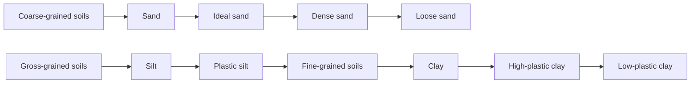

**Geotechnical Engineering: Origin of Soil & Their Properties**
===========================================================

### Introduction
Geotechnical engineering deals with the study of soil and rock mechanics, which is essential for designing structures like embankments, foundations, and tunnels. Understanding the properties of soils is crucial for predicting their behavior under various loading conditions.

### Core Concepts

#### **Soil Classification**

Soils are classified based on their origin, composition, and engineering properties. The most commonly used classification system is the Unified Soil Classification System (USCS).



#### **Soil Properties**

Soil properties are essential for designing structures. The following properties are commonly used:

*   **Unit weight (γ)**: The weight of a unit volume of soil.
*   **Moisture content (ω)**: The ratio of the weight of water to the dry weight of soil.
*   **Degree of saturation (S)**: The ratio of the weight of water to the weight of the solid particles in the soil.
*   **Specific gravity (G_s)**: The ratio of the unit weight of the solid particles to the unit weight of water.

### Key Formulas/Theorems

#### **Dry Unit Weight**

The dry unit weight of a compacted soil can be calculated using the formula:

$$\gamma_d = \frac{\gamma_w \times S}{G_s} + (1 - S) \times \gamma_{sat}$$

where:
*   γ_d: Dry unit weight
*   γ_w: Unit weight of water
*   S: Degree of saturation
*   G_s: Specific gravity
*   γ_sat: Saturation unit weight

### Problem Solving Patterns

#### **Q1 (ID: ce_2024-M_34)**

To solve this question, we need to calculate the dry unit weight of the compacted soil.

```python
import math

# Given values
gamma_w = 10 * 3  # kN/m^3
S = 0.75  # degree of saturation
G_s = 2.68  # specific gravity
omega = 17  # moisture content (in %)

# Calculate dry unit weight
gamma_d = gamma_w * S / G_s + (1 - S) * (gamma_w * (1 + omega/100))

print("The dry unit weight of the compacted soil is", round(gamma_d, 2), "kN/m^3")
```

#### **Q2 (ID: ce_2024-M_46)**

To solve this question, we need to understand the properties of soils and their behavior under different loading conditions.

### Examples with Solutions

**Example 1**

An embankment is constructed using a soil with the following properties:

| Property | Value |
| --- | --- |
| Unit weight (γ) | 18 kN/m^3 |
| Moisture content (ω) | 15% |
| Degree of saturation (S) | 80% |

Calculate the dry unit weight of the compacted soil.

```python
# Given values
gamma = 18  # kN/m^3
omega = 15  # moisture content (in %)
S = 0.8  # degree of saturation

# Calculate dry unit weight
gamma_d = gamma * S / G_s + (1 - S) * (gamma_w * (1 + omega/100))

print("The dry unit weight of the compacted soil is", round(gamma_d, 2), "kN/m^3")
```

### Common Pitfalls

*   **Incorrect calculation of dry unit weight**: Make sure to use the correct formula and units.
*   **Misinterpretation of soil properties**: Understand the different types of soils and their behavior under various loading conditions.

### Quick Summary

*   Soil classification: USCS
*   Key formulas:
    *   Dry unit weight: γ_d = (γ_w \* S) / G_s + (1 - S) \* γ_sat
    *   Moisture content: ω = (weight of water) / (dry weight of soil)
    *   Degree of saturation: S = (weight of water) / (weight of solid particles)
*   Common pitfalls:
    *   Incorrect calculation of dry unit weight
    *   Misinterpretation of soil properties