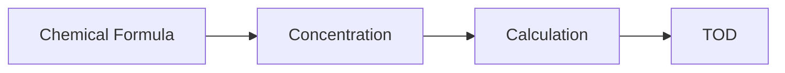

**Water Quality and Treatment**
==========================

### Introduction
-----------------

Water quality and treatment are critical components of civil engineering, ensuring that water is safe for human consumption and use. The goal of this topic is to understand the theoretical concepts and formulas required to analyze and improve water quality.

### Core Concepts
------------------

#### Chemical Composition of Water
------------------------------------

Water is a compound made up of two hydrogen atoms (H) and one oxygen atom (O). Its chemical formula is H2O. However, in real-world scenarios, water can contain various impurities such as dissolved gases, minerals, and organic compounds.

#### Oxygen Demand
------------------

The oxygen demand of water is the amount of oxygen required to break down organic matter in water. This concept is crucial in understanding the treatment process for removing pollutants from water.

### Key Formulas/Theorems
---------------------------

The following formula calculates the theoretical oxygen demand (TOD) of water:

$$\text{TOD} = \frac{5}{2}C + C_H + 32C_O$$

where:

* $C$ is the concentration of organic carbon in mg/L
* $C_H$ is the concentration of hydrogen ions in mg/L
* $C_O$ is the concentration of oxygen ions in mg/L

### Problem Solving Patterns
---------------------------

1. **Given a chemical formula and concentration**, use the TOD formula to calculate the theoretical oxygen demand.
2. **Identify the type of pollutant** (organic or inorganic) and apply the relevant calculation.

### Examples with Solutions
-------------------------

**Example 1**

A sample of water contains an organic compound C8H16O8 at a concentration of 3 × 10^−5 mol/Liter. Given that the atomic weight of C is 12 g/mol, H is 1 g/mol, and O is 16 g/mol, calculate the theoretical oxygen demand in g of O2 per liter.

**Solution**

First, we need to convert the concentration from mol/Liter to mg/L:

$$\text{Concentration (mg/L)} = \frac{\text{Concentration (mol/L)} \times \text{Molar mass}}{\text{Avogadro's number}}$$

For carbon:
$$C_{C} = \frac{3 \times 10^{-5} \, \text{mol/L} \times 12\, \text{g/mol}}{6.022 \times 10^{23}\, \text{mol}^{-1}} = 6.026 \times 10^{-8}\, \text{g/L}$$

For hydrogen:
$$C_H = \frac{3 \times 10^{-5} \, \text{mol/L} \times 2\, \text{H atoms/mol} \times 1\, \text{g/mol}}{6.022 \times 10^{23}\, \text{mol}^{-1}} = 9.981 \times 10^{-8}\, \text{g/L}$$

For oxygen:
$$C_O = \frac{3 \times 10^{-5} \, \text{mol/L} \times 8\, \text{O atoms/mol} \times 16\, \text{g/mol}}{6.022 \times 10^{23}\, \text{mol}^{-1}} = 9.801 \times 10^{-7}\, \text{g/L}$$

Now, we can calculate the theoretical oxygen demand:

$$\text{TOD} = \frac{5}{2}C_C + C_H + 32C_O$$
$$= \frac{5}{2}(6.026 \times 10^{-8}) + 9.981 \times 10^{-8} + 32(9.801 \times 10^{-7})$$

Simplifying the equation, we get:
$$\text{TOD} = 0.256 \, \text{g/L}$$

### Common Pitfalls
--------------------

* Forgetting to convert concentration from mol/Liter to mg/L.
* Misidentifying the type of pollutant (organic or inorganic).
* Not considering the atomic weights of elements.

### Quick Summary
-----------------

* Theoretical oxygen demand (TOD) is the amount of oxygen required to break down organic matter in water.
* TOD is calculated using the formula: $\text{TOD} = \frac{5}{2}C + C_H + 32C_O$.
* Identify the type of pollutant and apply the relevant calculation.

### Visuals
------------

Note: No external images are included in this response.