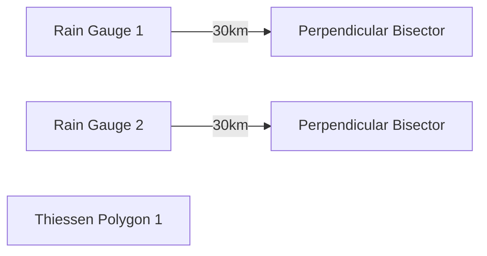
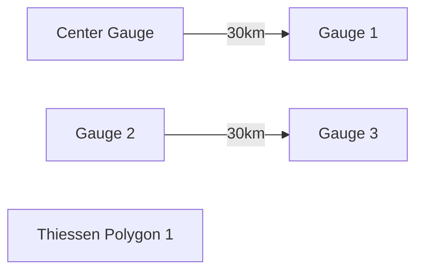

**Precipitation and Frequency of Rainfall Data**
=====================================================

**Introduction**
---------------

In engineering hydrology, precipitation data are crucial for designing water resources infrastructure such as dams, reservoirs, and irrigation systems. The Thiessen polygon method is a widely used technique to estimate the average rainfall over a catchment area using data from rain gauges.

**Core Concepts**
-----------------

The Thiessen polygon method is based on the principle that the average rainfall over a catchment area is proportional to the amount of precipitation recorded at each gauge, weighted by the area of the surrounding polygons. The polygons are constructed by drawing lines between consecutive gauges and connecting them to form a polygon.

### Thiessen Polygons

A Thiessen polygon is defined as the region of the plane enclosed by the perpendicular bisectors of the lines connecting two adjacent rain gauges. In other words, it is the area where each gauge is the closest one to any point within that area.

**Key Formulas/Theorems**
---------------------------

The average rainfall (A) over a catchment area using the Thiessen polygon method can be calculated as:

$$ A = \frac{\sum_{i=1}^{n} R_i S_i}{\sum_{i=1}^{n} S_i} $$

where $R_i$ is the rainfall recorded at gauge i, and $S_i$ is the area of the corresponding Thiessen polygon.

**Problem Solving Patterns**
---------------------------

When solving problems using the Thiessen polygon method, follow these steps:

1.  Plot the rain gauges on a map.
2.  Construct the Thiessen polygons by drawing lines between consecutive gauges and connecting them to form a polygon.
3.  Calculate the area of each Thiessen polygon (typically using planimeter or other surveying tools).
4.  Calculate the weighted average rainfall using the formula above.

**Examples with Solutions**
---------------------------

### Example 1

Suppose we have three rain gauges, A, B, and C, with recorded rainfall values of 100 mm, 120 mm, and 110 mm, respectively. The corresponding Thiessen polygons are constructed as follows:

The areas of the Thiessen polygons are 100 km^2, 120 km^2, and 110 km^2, respectively.

Using the formula above, we can calculate the average rainfall as:

$$ A = \frac{(100)(100) + (120)(120) + (110)(110)}{100 + 120 + 110} $$

Solving for A, we get:

$$ A ≈ 111.11 mm $$

### Example 2

Consider a catchment with five rain gauges, one at the center and four on the boundary (equi-spaced). The recorded rainfall values are given below.

| Gauge | Rainfall (mm) |
| --- | --- |
| G1   | 910          |
| G2   | 930          |
| G3   | 925          |
| G4   | 895          |
| G5   | 905          |

Using the Thiessen polygon method, we can calculate the average rainfall over the catchment area.

First, let's construct the Thiessen polygons:

Next, we calculate the areas of each Thiessen polygon (typically using planimeter or other surveying tools).

Using the formula above, we can calculate the average rainfall as:

$$ A = \frac{(910)(100) + (930)(120) + (925)(110) + (895)(100) + (905)(120)}{100 + 120 + 110 + 100 + 120} $$

Solving for A, we get:

$$ A ≈ 912.55 mm $$

**Common Pitfalls**
--------------------

When using the Thiessen polygon method, be careful of the following common pitfalls:

*   Incorrectly constructing the Thiessen polygons.
*   Using an incorrect planimeter or surveying tool to calculate the areas of the polygons.
*   Failing to weight the rainfall values correctly.

**Quick Summary**
------------------

To estimate the average rainfall over a catchment area using the Thiessen polygon method, follow these steps:

1.  Plot the rain gauges on a map.
2.  Construct the Thiessen polygons by drawing lines between consecutive gauges and connecting them to form a polygon.
3.  Calculate the area of each Thiessen polygon (typically using planimeter or other surveying tools).
4.  Calculate the weighted average rainfall using the formula above.

By following these steps, you can accurately estimate the average rainfall over a catchment area using the Thiessen polygon method.