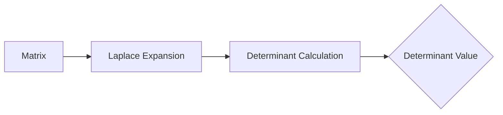
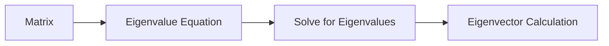

# Linear Algebra Theory Note
=====================================

## Introduction
--------------

Linear algebra is a fundamental branch of mathematics that deals with the study of linear equations, vector spaces, linear transformations, and eigenvalues. It is an essential tool for solving systems of equations, data analysis, machine learning, and computer graphics.

## Core Concepts
-----------------

### Vectors and Vector Spaces

A **vector** is a mathematical object that has both magnitude (length) and direction. A **vector space** is a set of vectors that satisfy certain properties:

*   Closure under addition: The sum of two vectors in the space is also in the space.
*   Commutativity of addition: The order of vectors does not change the result.
*   Associativity of addition: The way we group vectors when adding them does not matter.
*   Existence of additive identity: There exists a vector (usually denoted as `0`) that, when added to any other vector, leaves it unchanged.
*   Existence of additive inverse: For each vector, there exists an "opposite" vector such that their sum is the zero vector.

### Linear Transformations

A **linear transformation** is a function between two vector spaces that preserves linear combinations. In other words:

f(v + u) = f(v) + f(u)
f(kv) = kf(v)

for any vectors `u` and `v`, scalar `k`.

### Eigenvalues and Eigenvectors

An **eigenvalue** of a matrix is a scalar `λ` such that there exists a non-zero vector `v` (the corresponding eigenvector) satisfying:

Av = λv

This equation describes the scaling effect of applying the linear transformation represented by `A` to the vector `v`.

## Key Formulas/Theorems
-------------------------

### Determinant of a Matrix

The **determinant** of an `n x n` matrix can be calculated using various methods, including:

*   Laplace expansion: Calculate each minor and cofactor.
*   LU decomposition: Express the matrix as a product of lower and upper triangular matrices.

The determinant is denoted by `det(A)` or `|A|`.

### Inverse of a Matrix

The **inverse** of an invertible square matrix `A` is another matrix `B` such that:

AB = BA = I

where `I` is the identity matrix. The inverse can be calculated using various methods, including:

*   Gauss-Jordan elimination.
*   LU decomposition.

### Eigenvalues and Eigenvectors Calculations

The **eigenvalues** of a matrix can be found by solving the characteristic polynomial equation:

|A - λI| = 0

Once the eigenvalues are determined, corresponding eigenvectors can be calculated using various methods.

## Problem Solving Patterns
---------------------------

### Finding Eigenvalues and Eigenvectors

1.  Write down the characteristic polynomial equation.
2.  Solve for the eigenvalues (roots of the equation).
3.  For each eigenvalue, calculate a corresponding eigenvector(s).

### Determinant Calculations

1.  Choose a method to calculate the determinant (e.g., Laplace expansion or LU decomposition).
2.  Apply the chosen method to the matrix.

## Examples with Solutions
---------------------------

Example 1: Calculate the determinant of the matrix:

|3 4|
|5 6|

Solution:

Using Laplace expansion, we get:

det(A) = (3*6 - 4*5)
= 18 - 20
= -2

Example 2: Find the eigenvalues and eigenvectors of the matrix:

|1 2|
|2 1|

Solution:

The characteristic polynomial equation is:

|(A - λI)| = 0

Expanding the matrix, we get a quadratic equation in `λ` with roots 3 and -1.

## Common Pitfalls
-------------------

*   Failing to check if a matrix is invertible before attempting to calculate its inverse.
*   Misapplying properties of determinants (e.g., treating the determinant as a scalar function).

## Quick Summary
---------------

### Key Concepts:

*   Vector spaces and vectors
*   Linear transformations
*   Eigenvalues and eigenvectors
*   Determinant calculations
*   Inverse matrix calculations

### Formulas/Theorems:

*   Determinant of an `n x n` matrix: various methods (Laplace expansion, LU decomposition)
*   Inverse of a square matrix: various methods (Gauss-Jordan elimination, LU decomposition)
*   Eigenvalues and eigenvectors: characteristic polynomial equation

### Problem Solving Patterns:

*   Finding eigenvalues and eigenvectors
*   Determinant calculations