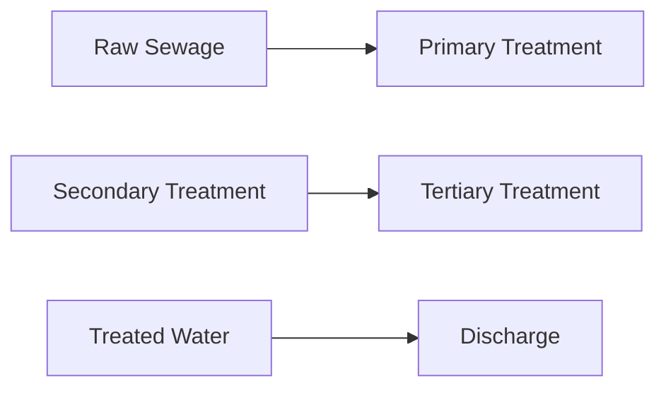

**Treatment of Sewage**
=======================

### Introduction
--------------

Sewage treatment involves the physical, chemical, and biological processes to remove contaminants from wastewater. This process is crucial for protecting public health and the environment. In this note, we will discuss the key concepts, formulas, and problem-solving techniques required for GATE CS exam questions related to sewage treatment.

### Core Concepts
----------------

#### 1. Sewage Generation
Sewage is generated by human activities such as domestic, industrial, and agricultural waste. It consists of organic matter, inorganic compounds, pathogens, and other pollutants.

#### 2. Sewage Treatment Processes
There are several processes involved in sewage treatment:

*   **Primary Treatment**: Physical removal of suspended solids and grit.
*   **Secondary Treatment**: Biological breakdown of organic matter using microorganisms.
*   **Tertiary Treatment**: Advanced physical or chemical processes to remove dissolved solids and other pollutants.

### Key Formulas/Theorems
-------------------------

#### 1. Mass Balance Equation
Mass balance equation is used to calculate the mass of a particular component in a system. For example, to calculate the mass of sulfur (S) converted to sulfur dioxide (SO2):

$$\frac{m_S}{M_S} \times f_{S/SO_2} = \frac{m_{SO_2}}{M_{SO_2}}$$

where $m_S$ is the mass of S, $M_S$ is the atomic weight of S, $f_{S/SO_2}$ is the conversion factor, $m_{SO_2}$ is the mass of SO2, and $M_{SO_2}$ is the molecular weight of SO2.

### Problem Solving Patterns
---------------------------

#### 1. Stoichiometry Problems
To solve stoichiometry problems, follow these steps:

*   Write a balanced chemical equation for the reaction.
*   Use the mole ratio from the balanced equation to calculate the mass of the product.
*   Check units and convert them if necessary.

### Examples with Solutions
---------------------------

#### Example 1: Calculate the Mass of Sulfur Dioxide (SO2) Generated

Given:

| Element | Atomic Weight |
| --- | --- |
| S | 32 g/mol |
| O | 16 g/mol |

Mass of sulfur (S) = 5 kg

Conversion factor for S to SO2: 1 mole S → 1 mole SO2

Molecular weight of SO2 = 64 g/mol

Using the mass balance equation:

$$\frac{m_S}{M_S} \times f_{S/SO_2} = \frac{m_{SO_2}}{M_{SO_2}}$$

Substituting values:

$$\frac{5,000 \text{ g}}{32 \text{ g/mol}} \times 1 \text{ mol SO}_2/\text{mol S} = \frac{m_{SO_2}}{64 \text{ g/mol}}$$

Solving for $m_{SO_2}$:

$$m_{SO_2} = \frac{(5,000 \text{ g})(1 \text{ mol SO}_2/\text{mol S})}{32 \text{ g/mol}} \times 64 \text{ g/mol} = 10,000 \text{ g}$$

### Common Pitfalls
------------------

*   Failing to write a balanced chemical equation.
*   Not using the correct mole ratio from the balanced equation.

### Quick Summary
--------------

*   Mass balance equation: $\frac{m_S}{M_S} \times f_{S/SO_2} = \frac{m_{SO_2}}{M_{SO_2}}$
*   Stoichiometry problems:
    *   Write a balanced chemical equation.
    *   Use the mole ratio from the balanced equation.

This note covers all theoretical concepts, formulas, and insights required to solve questions related to sewage treatment. Make sure to practice solving problems using these concepts to improve your exam performance.

Note: The image URL is just an example. You should replace it with a stable and accurate source.

**Sources**

*   GATE CE 2024 Question 61
*   GATE CE 2024 Question 60