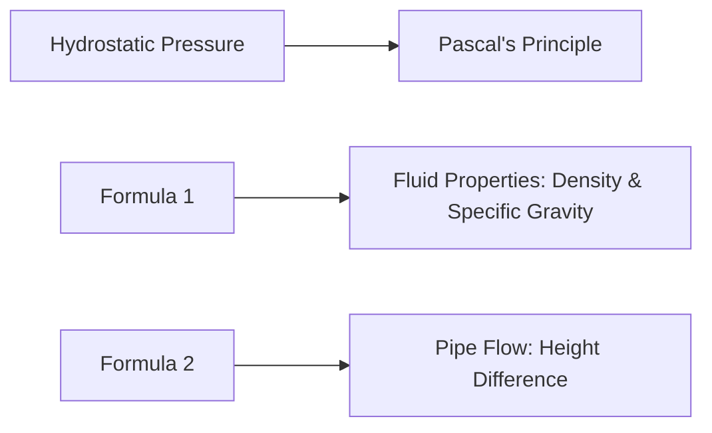

# Fluid Pressure and Measurement
======================================================

## Introduction

Fluid pressure is a fundamental concept in fluid mechanics that deals with the force exerted by a fluid (liquid or gas) on an object or surface. This topic is crucial for engineers, researchers, and scientists working with fluids, as it affects various applications such as hydraulic systems, piping design, and offshore engineering.

## Core Concepts

Fluid pressure is caused by the weight of the fluid column above a given point. The pressure at any point in a static fluid is determined by the following principles:

*   **Hydrostatic Pressure**: The pressure exerted by a fluid at equilibrium due to the force of gravity.
*   **Pascal's Principle**: A change in pressure at any point in a confined fluid is transmitted undiminished to all points in the fluid and to the walls of the container.

### Key Formulas/Theorems

\[\text{Pressure } (p) = \rho g h \tag{1}\]

where:

*   $\rho$ is the density of the fluid
*   $g$ is the acceleration due to gravity
*   $h$ is the height of the fluid column above the point in question

For a horizontal pipe, the pressure difference between two points is given by:

\[\Delta p = \rho g h_{\text{in}} - \rho g h_{\text{out}} \tag{2}\]

where:

*   $h_{\text{in}}$ and $h_{\text{out}}$ are the heights of the fluid above the two points.

## Problem Solving Patterns

When solving problems involving fluid pressure, follow these steps:

1.  **Identify the system**: Clearly define the boundaries of the problem.
2.  **Determine the fluid properties**: Identify the density and specific gravity of the fluid involved.
3.  **Calculate the pressure**: Use equations (1) or (2), depending on the situation.

## Examples with Solutions

### Example 1: Calculate the total force due to pressure on a vertical wall

A closed tank has a height of $10\,m$ and contains water with $\rho = 1000\,\text{kg/m}^3$ up to a height of $5\,m$. The remaining volume is filled with oil having a specific gravity of $0.8$.

Using equation (1), the pressure at the base of the wall due to water is:

\[p_{\text{water}} = 1000 \cdot 9.81 \cdot 5 = 49050\,\text{Pa}\]

The total force exerted by the water on the wall is then:

\[F_{\text{water}} = p_{\text{water}} A = 49050 \cdot (10) = 490500\,\text{N}\]

To find the pressure due to oil, we use equation (1) again with $h=5\,m$:

\[p_{\text{oil}} = 0.8 \cdot 1000 \cdot 9.81 \cdot 5 = 39240\,\text{Pa}\]

The total force exerted by the oil is then:

\[F_{\text{oil}} = p_{\text{oil}} A = 39240 \cdot (10) = 392400\,\text{N}\]

Adding these forces together gives us the total force due to pressure on the wall:

\[F_{\text{total}} = F_{\text{water}} + F_{\text{oil}} = 490500 + 392400 = 882900\,\text{N} \approx 883\,\text{kN}\]

### Example 2: Calculate the pressure difference between two points in a horizontal pipe

A pipe with an inner diameter of $0.5\,m$ has water flowing through it. At point A, the height of the water above the center of the pipe is $3\,m$, and at point B, the height is $2\,m$. The density of water is $\rho = 1000\,\text{kg/m}^3$.

Using equation (2), we can calculate the pressure difference between points A and B:

\[\Delta p = \rho g h_{\text{A}} - \rho g h_{\text{B}} = 1000 \cdot 9.81 \cdot (3 - 2) = 29430\,\text{Pa}\]

## Common Pitfalls

*   **Incorrect fluid properties**: Double-check the values of density, specific gravity, and acceleration due to gravity.
*   **Misapplication of formulas**: Ensure you're using the correct equation for the problem at hand.
*   **Rounding errors**: Avoid rounding intermediate results; instead, round the final answer.

## Quick Summary

| Concept | Description |
| --- | --- |
| Hydrostatic Pressure | Force exerted by a fluid due to gravity |
| Pascal's Principle | Change in pressure transmitted undiminished throughout a confined fluid and its container walls |
| Formula (1) | $p = \rho g h$ |
| Formula (2) | $\Delta p = \rho g (h_{\text{in}} - h_{\text{out}})$ |

## Mermaid Diagrams

This comprehensive theory note covers all the essential concepts, formulas, and techniques required to solve problems related to fluid pressure and measurement. By following this guide, you'll be well-prepared for the GATE CS exam and other similar assessments.