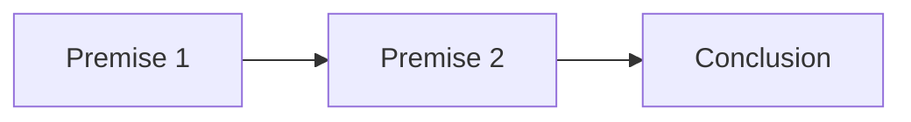

**Language Comprehension**
=========================

**Introduction**
---------------

Language comprehension is a crucial aspect of the General Aptitude section of GATE CS, requiring the ability to understand and interpret written information. This note focuses on developing the skills necessary for logical inference and reasoning.

**Core Concepts**
-----------------

### Logical Inference

Logical inference involves drawing conclusions based on given statements or premises. It requires understanding the relationships between statements and identifying the most probable conclusion.

*   **Conditional Statements**: These are statements that describe a relationship between two events, typically denoted by "if-then" (p → q).
*   **Conjunctions**: Statements connected with "and" (∧) imply that both conditions must be true.
*   **Disjunctions**: Statements connected with "or" (∨) indicate that at least one condition is true.

**Mermaid Diagram**

This diagram illustrates the basic structure of logical inference, where premises (A and B) lead to a conclusion (C).

### Types of Logical Inference

*   **Modus Ponens**: If p → q and p are true, then q must be true.

*   **Modus Tollens**: If p → q and ¬q are true, then ¬p must be true.

### Quantifiers

Quantifiers specify the scope of statements. They can be applied to:

*   **Universal Statements** (For all): (∀x)P(x)
*   **Existential Statements** (There exists): (∃x)P(x)

**Key Formulas/Theorems**
-------------------------

No specific formulas or theorems are required for language comprehension, as it primarily deals with logical reasoning and inference.

**Problem Solving Patterns**
-----------------------------

### Identifying Conditional Relationships

*   Identify the conditional statement (if-then).
*   Determine the antecedent (condition) and consequent (outcome).
*   Apply modus ponens or modus tollens as applicable.

### Analyzing Conjunctions and Disjunctions

*   Break down conjunctions into individual conditions.
*   Evaluate disjunctions by considering both possible outcomes.

**Examples with Solutions**
---------------------------

### Example 1:

If it is raining, then the streets will be wet. The streets are wet. Therefore...

Solution:
Applying modus ponens: If p → q and p, then q.
The conclusion is that it is indeed raining.

### Example 2:

A company can only have a profit if all its employees work efficiently. All employees work efficiently. However, the company still faces financial losses. Why?

Solution:
Analyzing the conjunction: "if all employees work efficiently" does not guarantee a profit. The company's financial situation depends on other factors.

**Common Pitfalls**
-------------------

*   **Ignoring Conditional Relationships**: Failing to recognize the conditional statement and its implications.
*   **Overlooking Quantifiers**: Incorrectly applying universal or existential statements.
*   **Insufficient Analysis of Conjunctions and Disjunctions**: Not evaluating individual conditions or considering both possible outcomes.

**Quick Summary**
------------------

*   Logical inference involves drawing conclusions from given statements.
*   Understand conditional relationships, conjunctions, and disjunctions.
*   Apply modus ponens and modus tollens as applicable.