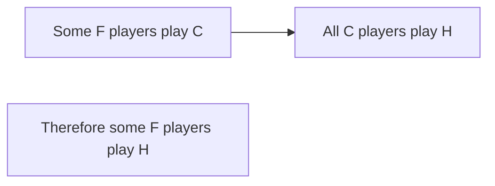

**Lateral Thinking and Problem Solving**
=====================================

### Introduction
-----------------

Lateral thinking is a problem-solving approach that encourages creative, innovative solutions by thinking "outside the box." This involves making connections between seemingly unrelated ideas, redefining problems, and using analogies to find novel solutions. In the context of the GATE CS exam, lateral thinking questions often involve logical reasoning, pattern recognition, and critical thinking.

### Core Concepts
------------------

#### Logical Reasoning

*   **Modus Ponens**: A valid argument form where if P -> Q is true and P is true, then Q must be true.
    \[ (P \rightarrow Q) \land P \vdash Q \]
*   **Modus Tollens**: A valid argument form where if P -> Q is true and ¬Q is true, then ¬P must be true.
    \[ (P \rightarrow Q) \land \neg Q \vdash \neg P \]

### Key Formulas/Theorems
-------------------------

No specific formulas or theorems are directly applicable to this topic. However, a basic understanding of propositional and predicate logic is necessary for logical reasoning.

### Problem Solving Patterns
---------------------------

#### Using Deductive Reasoning

*   **Identify**: Identify the main concepts involved in the problem.
*   **Connect**: Connect these concepts using logical rules or principles.
*   **Deduce**: Deduce a solution based on the connected concepts.

**Example 1:**
Q1 (ID: ce_2021-N_7): Some football players play cricket, all cricket players play hockey. What logically follows?

| Step | Reasoning |
| --- | --- |
| 1   | From (1), some football players play cricket |
| 2   | From (2), all cricket players play hockey     |
| 3   | Connect the two: If a football player plays cricket, then he must also play hockey.      |
| 4   | Since we are asked for what logically follows, the conclusion is that some football players play hockey. |

#### Visualizing Logical Arguments

### Examples with Solutions
---------------------------

**Example 2:**
Q2 (ID: ce_2021-N_9): The probability of a randomly chosen point falling in the shaded region.

| Step | Reasoning |
| --- | --- |
| 1   | Recognize that PQRS is a square and RS = r (radius) |
| 2   | Observe that the shaded area consists of four equal circular sectors, each with radius r.       |
| 3   | The total area of these four sectors equals πr^2 (since area = π(1/4)r^2)        |
| 4   | Since there are 4 such sectors in the square PQRS, we must divide by 4 to find the probability.     |
| 5   | Therefore, the desired probability is $\frac{1}{4} \pi$ |

### Common Pitfalls
-------------------

*   Failing to recognize the question type (logical reasoning or pattern recognition).
*   Making assumptions based on incomplete information.
*   Overlooking subtle connections between concepts.

### Quick Summary
------------------

*   Lateral thinking involves creative, innovative solutions by making connections between seemingly unrelated ideas.
*   Logical reasoning is a key aspect of lateral thinking problems.
*   Deductive reasoning and visualization techniques can help solve such questions.

**Note:** The above summary should be memorized for the exam.