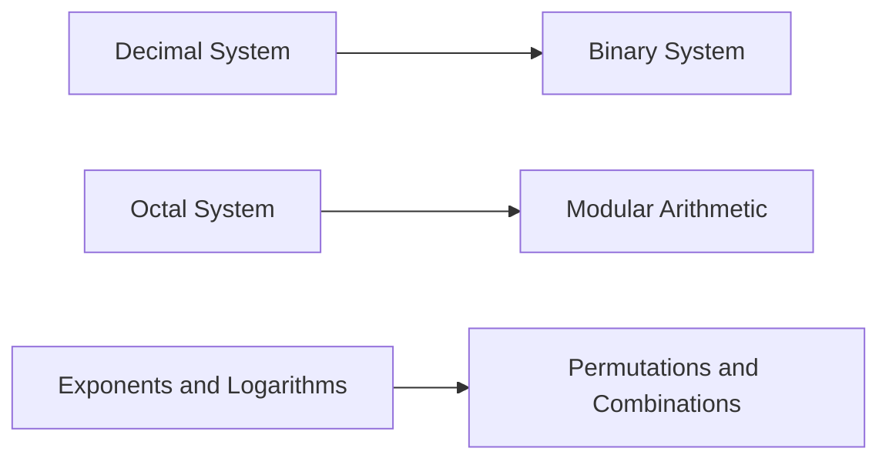

**Numerical Ability - General Aptitude**
=====================================

**Introduction**
---------------

Numerical Ability (NA) is a crucial component of the GATE CS exam, comprising approximately 15% of the total marks. It tests your ability to perform mathematical calculations and apply logical reasoning to solve problems.

**Core Concepts**
-----------------

### Number System

*   **Decimal System**: The decimal system uses base-10 (0-9) and is commonly used in everyday life.
    *   Example: 1234 in base-10 is equal to $1 \times 10^3 + 2 \times 10^2 + 3 \times 10^1 + 4 \times 10^0$
*   **Binary System**: The binary system uses base-2 (0,1) and is the foundation of computer science.
    *   Example: 101 in base-2 is equal to $1 \times 2^2 + 0 \times 2^1 + 1 \times 2^0$
*   **Octal System**: The octal system uses base-8 (0-7) and is commonly used in computing.
    *   Example: 123 in base-8 is equal to $1 \times 8^2 + 2 \times 8^1 + 3 \times 8^0$

### Exponents and Logarithms

*   **Exponent Rules**: Familiarize yourself with the rules of exponents, including:
    *   Product Rule: $a^m \times a^n = a^{m+n}$
    *   Power Rule: $(a^m)^n = a^{mn}$
    *   Quotient Rule: $\frac{a^m}{a^n} = a^{m-n}$
*   **Logarithmic Functions**: Understand the properties of logarithms, including:
    *   Logarithmic Identity: $log_b(a) = \frac{1}{log_a(b)}$
    *   Change of Base Formula: $log_b(a) = \frac{log_c(a)}{log_c(b)}$

### Other Concepts

*   **Modular Arithmetic**: Familiarize yourself with the concepts of modular arithmetic, including:
    *   Congruence Relations: $a \equiv b \pmod{n}$
    *   Modular Addition and Multiplication: $(a+b) \pmod{n}$ and $(ab) \pmod{n}$
*   **Permutations and Combinations**: Understand the concepts of permutations and combinations, including:
    *   Permutation Formula: $P(n,r) = \frac{n!}{(n-r)!}$
    *   Combination Formula: $C(n,r) = \frac{n!}{r!(n-r)!}$

### Problem Solving Patterns

1.  **Guess and Check**: Use this strategy for problems with multiple-choice answers, especially when the question is not straightforward.
2.  **Unit Analysis**: Break down the problem into smaller units, using dimensional analysis to check your answer.

**Examples with Solutions**

Example 1: Find the value of $x$ in the equation $8^x = 256$

Solution:

Using logarithmic properties:

$$log_8(256) = x \Rightarrow log_8(2^8) = x \Rightarrow 8\cdot log_8(2) = x \Rightarrow x = 3$$

Example 2: Find the unit's place in $11001626591749$

Solution:

Divide the number by 10,000 and take the remainder.

$1100162659 \div 10,000 = 11001$ with a remainder of 659.

The next digit is the unit's place, which is **1**.

### Common Pitfalls

*   **Rounding Errors**: Avoid rounding numbers unnecessarily, as this can lead to incorrect answers.
*   **Significant Figures**: Keep track of significant figures when performing calculations.
*   **Unit Analysis**: Verify your answer using dimensional analysis.

### Quick Summary
------------------

*   Number System (Decimal, Binary, Octal)
*   Exponents and Logarithms (Rules, Properties)
*   Modular Arithmetic (Congruence Relations, Modular Operations)
*   Permutations and Combinations (Formulas)

This comprehensive theory note covers all the essential concepts for Numerical Ability in the GATE CS exam. Make sure to practice problems and apply these concepts to achieve mastery.

**Mermaid Diagrams**
--------------------

Note: The above Mermaid diagram illustrates the relationships between different concepts in Numerical Ability.