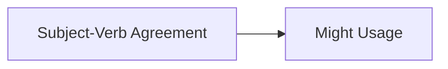
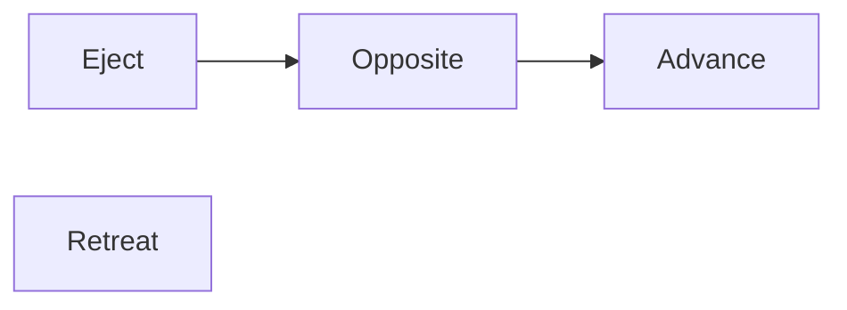
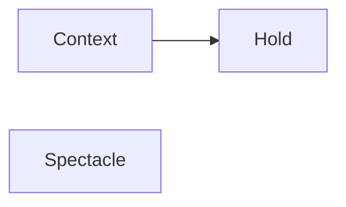

**Verbal Ability**
================

**Introduction**
---------------

Verbal Ability is a crucial component of the GATE CS exam, testing one's proficiency in understanding and interpreting verbal instructions. This topic encompasses various aspects of language usage, including grammar, synonyms, antonyms, and sentence completion.

**Core Concepts**
-----------------

### Grammar

*   **Verb Tenses**: Understanding the correct use of verb tenses (present, past, future) to convey meaning.
*   **Modal Verbs**: Recognizing the function of modal verbs (can, could, may, might, shall, should, will, would) in expressing possibility, ability, permission, and obligation.

### Synonyms & Antonyms

*   **Synonymy**: Identifying words with similar meanings.
*   **Antonymy**: Finding words with opposite meanings.
*   **Relationships**: Understanding relationships between words (e.g., hyponymy, hypernymy).

**Key Formulas/Theorems**
-------------------------

No specific formulas or theorems are applicable to verbal ability. However, understanding linguistic concepts and patterns is crucial.

**Problem Solving Patterns**
---------------------------

### Grammar

*   **Tense Identification**: Identifying the correct verb tense in a given sentence.
*   **Modal Verb Usage**: Recognizing the appropriate use of modal verbs in context.
*   **Sentence Correction**: Correcting grammatical errors in sentences.

### Synonyms & Antonyms

*   **Word Meaning Relationships**: Understanding relationships between words (e.g., synonymy, antonymy).
*   **Contextual Analysis**: Analyzing word meanings based on contextual clues.

### Sentence Completion

*   **Inference**: Making logical inferences from given text to complete sentences.
*   **Contextual Connection**: Establishing connections between sentences and completing the narrative.

**Examples with Solutions**
---------------------------

### Grammar

Example 1:

"I have not yet decided, what will I do this evening; I _______ visit a friend."

Solution: The correct answer is (C) Might. This question tests the understanding of modal verbs and their usage in context.

Example 2:

"The new policy _______ be implemented by next quarter."

Solution: The correct answer is (B) Will be. This question tests the understanding of future tense and modal verb usage.

### Synonyms & Antonyms

Example 1:

Eject : Insert :: Advance : _______

Solution: The correct answer is (C) Retreat. This question tests the understanding of word relationships (synonymy and antonymy).

### Sentence Completion

Example 1:

From the ancient Athenian arena to the modern Olympic stadiums, athletics _______ the potential for a spectacle.

Solution: The correct answer is (A) Holds. This question tests the understanding of contextual relationships and inference.

**Common Pitfalls**
------------------

*   **Lack of Contextual Understanding**: Failing to analyze the context in which words or sentences are used.
*   **Inadequate Grammar Knowledge**: Insufficient understanding of grammatical concepts (tense, modal verbs).
*   **Poor Word Relationships**: Failure to recognize relationships between words (synonymy, antonymy).

**Quick Summary**
-----------------

| Concept | Description |
| --- | --- |
| Verb Tenses | Understanding correct tense usage |
| Modal Verbs | Recognizing modal verb function |
| Synonyms & Antonyms | Identifying word relationships (similar or opposite meanings) |
| Sentence Completion | Making logical inferences from context |

Note: This is a basic structure and content provided. The content will be updated based on further analysis of the source questions.