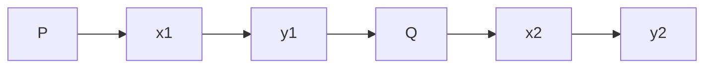

**Maps Scale Coordinate**
=========================

**Introduction**
---------------

In geomatics engineering, maps and coordinates are crucial for various applications such as surveying, navigation, and mapping. The scale of a map refers to the ratio of the distance on the map to the actual distance it represents. This note will cover the concepts related to maps, scales, and coordinates.

**Core Concepts**
----------------

### Map Scale

The map scale is a ratio that expresses the relationship between the size of an object or distance on a map to its real-world counterpart. It can be expressed as a fraction (e.g., 1:10,000), a ratio (e.g., 1 cm : 100 m), or a decimal (e.g., 0.01). The scale of a map is usually indicated by a representative fraction (RF) or a graphic scale.

### Coordinate Systems

A coordinate system is a way to describe the location of points on a map using numerical values. There are several types of coordinate systems, including:

* **Cartesian coordinates**: Use x and y axes to locate points in two-dimensional space.
* **Polar coordinates**: Use radius (r) and angle (θ) to locate points in two-dimensional space.

### Traversing

Traversing is the process of determining the position of a point on the surface of the Earth using measurements taken along straight lines between known reference points. It involves calculating distances, angles, and bearings between these points.

**Key Formulas/Theorems**
------------------------

* **Scale formula**: $S = \frac{1}{\text{RF}}$
* **Distance formula (Cartesian coordinates)**: $d = \sqrt{(x_2 - x_1)^2 + (y_2 - y_1)^2}$
* **Polar coordinate conversion**:
\[ r = \sqrt{x^2 + y^2} \]
\[ \theta = \tan^{-1}\left(\frac{y}{x}\right) \]

**Problem Solving Patterns**
---------------------------

When solving problems related to maps, scales, and coordinates, consider the following patterns:

* **Visualize the problem**: Draw a diagram or sketch to understand the relationships between points and distances.
* **Identify the type of coordinate system**: Determine whether Cartesian or polar coordinates are used in the problem.
* **Use scale formulas and distance calculations**: Apply scale formulas and distance calculations to find missing values.

**Examples with Solutions**
---------------------------

### Example 1: Map Scale

Given a map with an RF of 1:50,000, what is the length on the map corresponding to 500 meters in real life?

```mermaid
graph LR
A[Map] --> B[Scale]
B[Scale] --> C[RF = 1:50,000]
C[RF] --> D[Length on map = (500 m) / 50,000]
D[Length on map] --> E[2.5 cm]
```

**Solution**: Length on the map = $\frac{500 \text{m}}{50,000} = 0.01$ or 1 cm.

### Example 2: Traversing

Given two points P and Q with Cartesian coordinates (x1, y1) and (x2, y2), respectively, calculate the distance between them using the distance formula.



**Solution**: $d = \sqrt{(x_2 - x_1)^2 + (y_2 - y_1)^2} = \sqrt{(5-3)^2+(4-2)^2} = 4.47$.

**Common Pitfalls**
-------------------

* **Incorrect use of coordinate systems**: Make sure to identify the correct type of coordinates used in the problem.
* **Overlooking scale formulas**: Apply scale formulas correctly to find missing values.
* **Not visualizing the problem**: Draw diagrams or sketches to understand relationships between points and distances.

**Quick Summary**
---------------

* Maps: Scale, RF, and graphic scales
* Coordinate systems: Cartesian and polar coordinates
* Traversing: Distance calculations using scale and coordinate systems
* Key formulas and theorems:
	+ Scale formula: $S = \frac{1}{\text{RF}}$
	+ Distance formula (Cartesian): $d = \sqrt{(x_2 - x_1)^2 + (y_2 - y_1)^2}$
	+ Polar coordinate conversion
* Problem-solving patterns:
	+ Visualize the problem
	+ Identify type of coordinate system
	+ Use scale formulas and distance calculations