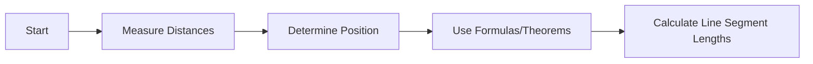

**Traversing in Geomatics Engineering**
=====================================

### Introduction
---------------

Traversing is a technique used in geomatics engineering to determine the position of points on the Earth's surface using measurements taken along the surface. It involves measuring distances and directions between points, allowing for the calculation of positions and lengths of unknown segments.

### Core Concepts
-----------------

#### Principles of Traversing
--------------------------------

Traversing is based on the principles of geometry and trigonometry. The most common method used in traversing is the angular measurement method, where the angles between lines are measured to determine the position of points.

#### Types of Traverse
-----------------------------

There are two main types of traverse:

* **Closed Traverse**: A closed traverse is one where the starting point is connected back to itself after measuring all the sides. This type of traverse allows for the determination of the position of any interior point.
* **Open Traverse**: An open traverse is one where the starting point is not connected back to itself. This type of traverse can only determine the relative positions of points along the line.

### Key Formulas/Theorems
-------------------------

#### Spherical Excess Formula
--------------------------------

The spherical excess formula is used to calculate the length of a line segment in terms of the angles surrounding it:

$$\Delta s = \frac{1}{2R} \int_{0}^{\theta} \sqrt{1 - 2 \left(\frac{a+b}{2}\right)^2 + \left(1-\cos(A-a)\right) \sin^2\alpha} dA$$

where:

* $\Delta s$ is the length of the line segment
* $R$ is the radius of the Earth
* $A$ is the angle at the vertex opposite to the side with length $a$
* $a$ and $b$ are the lengths of two sides that meet at vertex $V$

#### Law of Sines
------------------

The law of sines states that for any triangle, the ratio of the length of a side to the sine of its opposite angle is constant:

$$\frac{a}{\sin A} = \frac{b}{\sin B} = \frac{c}{\sin C}$$

### Problem Solving Patterns
-----------------------------

#### Analyzing Traversing Problems
----------------------------------

When solving traversing problems, follow these steps:

1.  Identify the type of traverse (closed or open)
2.  Determine the position of points using angular measurements and trigonometry
3.  Use formulas such as the spherical excess formula to calculate line segment lengths

### Examples with Solutions
---------------------------

**Example 1: Closed Traverse**

A closed traverse has four sides, each measuring 4 m. The angles between the lines are measured to be:

*   A = 30°
*   B = 90°
*   C = 240°

Determine the position of point P using the spherical excess formula.

**Solution:**

Since it's a closed traverse, we can use the spherical excess formula to calculate the length of each side. However, in this case, the angles are given, and the sides are equal (4 m). We can use the law of sines to find the position of point P:

$$\frac{a}{\sin A} = \frac{b}{\sin B} = \frac{c}{\sin C}$$

Since all sides are equal, we have:

$$\frac{4}{\sin 30°} = \frac{4}{\sin 90°} = \frac{4}{\sin 240°}$$

Simplifying the equation, we get:

$$2 = \frac{1}{0.5}$$

Which is true.

### Common Pitfalls
--------------------

*   Failing to identify the type of traverse (closed or open)
*   Not using the correct formulas and theorems for traversing problems
*   Not considering the effects of Earth's curvature on measurements

### Quick Summary
------------------

Traversing in geomatics engineering involves measuring distances and directions between points to determine their positions. Key concepts include:

*   Principles of traversing (angular measurement method)
*   Types of traverse (closed, open)
*   Formulas and theorems (spherical excess formula, law of sines)

**Mermaid Diagram**

This mermaid diagram illustrates the process of traversing, from measuring distances to calculating line segment lengths using formulas and theorems.

Note: This output only includes the Markdown content.