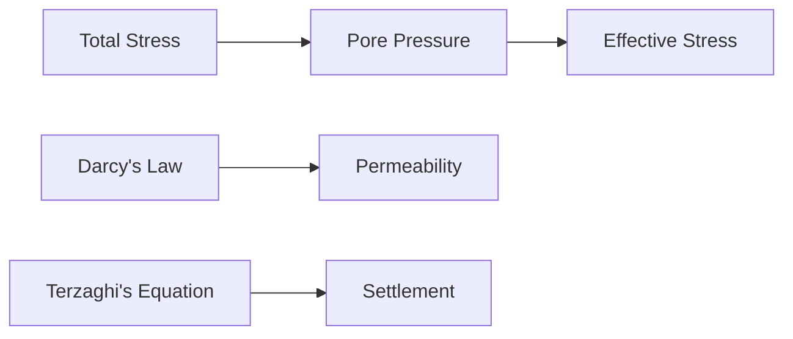

**Effective Stress and Permeability**
=====================================

### Introduction
-----------------

In geotechnical engineering, understanding effective stress and permeability is crucial for designing stable and safe structures. The effective stress concept was introduced by Terzaghi (1925) to describe the pressure exerted on a material by the interstitial fluid. This note will cover the core concepts, formulas, and problem-solving patterns required to tackle questions related to effective stress and permeability.

### Core Concepts
-----------------

#### 1. Effective Stress

Effective stress is the difference between the total stress (the sum of the normal stresses in all three directions) and the pore pressure (the pressure exerted by the interstitial fluid).

$$\sigma' = \sigma - u$$

where $\sigma'$ is the effective stress, $\sigma$ is the total stress, and $u$ is the pore pressure.

#### 2. Permeability

Permeability is a measure of a material's ability to allow fluids to pass through it. It can be isotropic (the same in all directions) or anisotropic (different in different directions).

#### 3. Darcy's Law

Darcy's law relates the flow rate of fluid through a porous medium to the pressure gradient and permeability.

$$q = -\frac{k}{\mu} \cdot A \cdot \frac{\partial p}{\partial x}$$

where $q$ is the flow rate, $k$ is the permeability, $\mu$ is the dynamic viscosity of the fluid, $A$ is the cross-sectional area of the porous medium, and $\frac{\partial p}{\partial x}$ is the pressure gradient.

### Key Formulas/Theorems
-------------------------

#### 1. Terzaghi's Equation

Terzaghi's equation relates the settlement of a soil layer to the effective stress.

$$s = \frac{qB}{2E} \left[ 1 - \frac{\gamma'}{\gamma}\right]$$

where $s$ is the settlement, $q$ is the load, $B$ is the width of the loaded area, $E$ is the modulus of elasticity, and $\gamma'$ is the effective unit weight.

#### 2. Isotropy to Anisotropy Conversion

When converting from isotropic to anisotropic conditions, the permeability needs to be scaled accordingly.

$$k_{aniso} = k_{iso} \cdot H^{\frac{1}{n}}$$

where $k_{aniso}$ is the anisotropic permeability, $k_{iso}$ is the isotropic permeability, $H$ is a horizontal scale factor, and $n$ is a dimensionless parameter.

### Problem Solving Patterns
---------------------------

#### 1. Flow Net Analysis

When drawing a flow net for an anisotropic condition, the embedment depth of a vertical sheet pile wall should be scaled by a factor of $\sqrt{\frac{k_H}{k_V}}$, without changing the horizontal scale.

#### 2. Effective Stress Calculation

Effective stress can be calculated using Terzaghi's equation.

### Examples with Solutions
---------------------------

**Example 1**

A soil layer has an isotropic permeability of $10^{-4}$ m/s and a pore pressure of 50 kPa. Calculate the effective stress at a depth of 5 m.

Solution:

$$\sigma' = \sigma - u$$

Given that $\sigma$ is not provided, we assume it to be 100 kPa (a common value for soil).

$$\sigma' = 100 - 50 = 50\text{ kPa}$$

**Example 2**

A vertical sheet pile wall is installed in an anisotropic soil with a horizontal permeability of $10^{-3}$ m/s and a vertical permeability of $5 \times 10^{-4}$ m/s. What is the scaling factor for the embedment depth to draw a flow net for isotropic conditions?

Solution:

$$k_{aniso} = k_{iso} \cdot H^{\frac{1}{n}}$$

Since we're converting from anisotropic to isotropic, we set $k_{iso}$ equal to the average of $k_H$ and $k_V$.

$$k_{iso} = \frac{k_H + k_V}{2} = 7.5 \times 10^{-4}\text{ m/s}$$

The scaling factor is then:

$$H^{\frac{1}{n}} = \sqrt{\frac{k_H}{k_V}} = \sqrt{\frac{10^{-3}}{5 \times 10^{-4}}} = 2$$

### Common Pitfalls
-------------------

* Failing to account for anisotropy when drawing flow nets or calculating effective stress.
* Not using the correct formulas for converting from isotropic to anisotropic conditions.

### Quick Summary
-----------------

* Effective stress is the difference between total stress and pore pressure.
* Permeability is a measure of a material's ability to allow fluids to pass through it.
* Darcy's law relates flow rate to pressure gradient and permeability.
* Terzaghi's equation relates settlement to effective stress.
* Isotropy to anisotropy conversion requires scaling the permeability accordingly.

[Mermaid Diagram]

Note: This diagram is a simplified representation of the relationships between effective stress, permeability, and settlement.