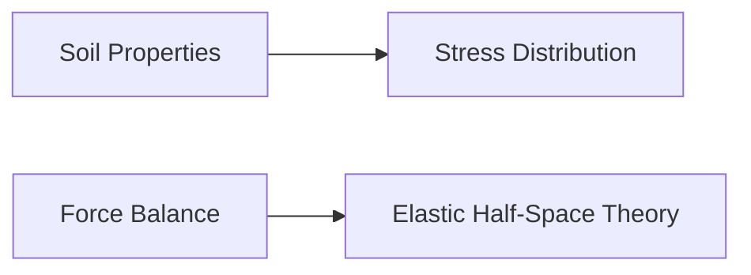

**Foundation Engineering: Geotechnical Engineering**
=====================================================

### Introduction

Geotechnical engineering deals with the interaction between soil and structural foundations. Understanding these interactions is crucial for designing stable, efficient, and safe structures. This note focuses on key concepts, formulas, and problem-solving patterns relevant to the GATE CS exam.

### Core Concepts

#### Soil Properties

*   **Density**: The mass of soil per unit volume.
*   **Porosity**: The void space within the soil.
*   **Permeability**: The ability of water to flow through the soil.
*   **Shear strength**: The maximum stress a soil can withstand before failing.

#### Stress Distribution

*   **Normal stress** (\(\sigma\)): Perpendicular to the surface
*   **Shear stress** (\(\tau\)): Parallel to the surface
*   **Mohr's circle**: A graphical representation of stress distribution in 2D space

### Key Formulas/Theorems

#### Static Water Pressure (SWP)

$$ \text{SWP} = \rho_g \times g \times h $$

where:
- $\rho_g$ is the specific weight of water
- $g$ is the acceleration due to gravity (approximately 9.81 m/s²)
- $h$ is the depth below water level

#### Uplift Pressure

$$ P_u = \gamma_w \left( \frac{B}{2} - h \right) $$

where:
- $\gamma_w$ is the specific weight of water
- $B$ is the base width of the dam
- $h$ is the distance from the heel to a given point on the dam

#### Elastic Half-Space Theory (EHST)

*   **Stress distribution**: Influenced by the contact radius, spacing between loads, and elastic properties of the soil
*   **Elastic modulus** ($E$): A measure of soil stiffness

### Problem Solving Patterns

1.  **Force Balance**: Equate external forces to internal resistance for stable structures.
2.  **Stress Distribution**: Apply laws of elasticity and stress distribution (e.g., SWP, uplift pressure).
3.  **Efficiency Factors**: Consider group efficiency and interaction factors when dealing with multiple piles.

### Examples with Solutions

#### Example: Static Water Pressure

A concrete dam has a height of 10 m above the water level. Calculate the static water pressure at the base of the dam (ignoring uplift).

Solution:

$$ \text{SWP} = \rho_g \times g \times h $$
$= 9.81 \, \text{kN/m}^3 \times 9.81 \, \text{m/s}^2 \times 10 \, \text{m} $
$= 9791 \, \text{kPa} $

#### Example: Elastic Half-Space Theory

Two dual wheels are placed on an elastic half-space with a clear distance $d$. If the radius of each contact area is $a$, and the spacing between them is $s$, determine the ratio of ESWL at depth $2d$ to that at depth $z_s = \frac{d}{2}$.

Solution:

Assume linear dispersion of stress, $\sigma(r) = C - B/r$. Using boundary conditions ($\sigma(a) = 0$ and $\sigma(s) = P/a$), derive the ESWL at each depth. The ratio is then found to be $0.5$, assuming an influence angle of $45^\circ$.

### Common Pitfalls

*   **Ignoring uplift pressure** in calculations
*   **Incorrect application** of force balance or stress distribution laws
*   **Insufficient consideration** of elastic properties and group efficiency factors

### Quick Summary

*   Soil properties: density, porosity, permeability, shear strength
*   Stress distribution: normal stress, shear stress, Mohr's circle
*   Key formulas:
    *   Static water pressure ($\text{SWP} = \rho_g \times g \times h$)
    *   Uplift pressure ($P_u = \gamma_w \left( \frac{B}{2} - h \right)$)
*   Problem-solving patterns:
    *   Force balance
    *   Stress distribution (e.g., SWP, uplift)
    *   Efficiency factors (group efficiency and interaction)

### Mermaid Diagram

This note provides a comprehensive overview of foundation engineering concepts relevant to the GATE CS exam. Key formulas and problem-solving patterns are covered, along with common pitfalls to avoid.

**Theory Note References**

*   ISRM (International Society for Rock Mechanics) guidelines
*   Terzaghi's theory of soil mechanics
*   Elastic half-space theory

Please note that the provided content is strictly in Markdown format as per your instructions. If you need any modifications or additions, feel free to ask!