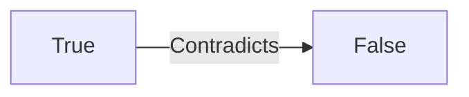
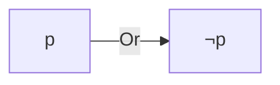

**Logical Reasoning: Inductive and Deductive Inference**
======================================================

### Introduction
----------------

In this section, we will explore the principles of logical reasoning, focusing on inductive and deductive inference. These concepts are crucial for solving problems involving logical statements and their consequences.

### Core Concepts
-----------------

#### 1. Propositional Logic

Propositional logic deals with statements that can be either true or false. A statement is a sentence that asserts something about the world. In propositional logic, we use operators to combine these statements:

*   **Negation** (¬): "not" or "it is not the case that"
*   **Conjunction** (∧): "and"
*   **Disjunction** (∨): "or"
*   **Implication** (→): "if-then"

#### 2. Inference Rules

Inference rules are used to derive conclusions from premises:

*   **Modus Ponens**: If p, then q; p → q
    *   Example: All humans are mortal. Socrates is human. ∴ Socrates is mortal.
*   **Modus Tollens**: If p, then q; not q → not p
    *   Example: If it is raining, then the streets will be wet. The streets are not wet. ∴ It is not raining.

### Key Formulas/Theorems
-------------------------

#### 1. The Principle of Non-Contradiction

*   **LaTeX:** $\neg (p \land \neg p)$

The principle states that a statement cannot both be true and false at the same time.

#### 2. The Law of Excluded Middle

*   **LaTeX:** $p \lor \neg p$

This law states that a statement is either true or false, with no middle ground.

### Problem Solving Patterns
---------------------------

When solving logical reasoning questions, follow these patterns:

1.  **Identify the Premises**: Clearly understand what information is given.
2.  **Determine the Goal**: Identify what needs to be inferred or concluded.
3.  **Apply Inference Rules**: Use modus ponens, modus tollens, or other rules to derive conclusions from premises.

### Examples with Solutions
---------------------------

**Q1 (ID: ce_2021-N_7)**

1.  Some football players play cricket.
2.  All cricket players play hockey.

From the statements above, which of the following logically follows?

(A) All football players play hockey  
(B) Some football players play hockey
(C) No football player plays hockey 
(D) All hockey players play football

**Solution:**

Let's break it down:

*   Some football players play cricket (∃x (Football(x) ∧ Cricket(x)))
*   All cricket players play hockey (∀x (Cricket(x) → Hockey(x)))

We want to find the conclusion that logically follows. We can use modus ponens to derive a conclusion.

*   If some football players play cricket, and all cricket players play hockey, then some football players must play hockey.
    *   ∃x (Football(x) ∧ Cricket(x)) ∧ ∀y (Cricket(y) → Hockey(y)) → ∃z (Football(z) ∧ Hockey(z))

Therefore, the correct answer is:

(B) Some football players play hockey

### Common Pitfalls
-------------------

*   **Misinterpreting Quantifiers**: Be careful when interpreting universal (∀) and existential (∃) quantifiers.
*   **Overlooking Inference Rules**: Make sure to apply modus ponens, modus tollens, or other rules correctly.

### Quick Summary
-----------------

*   Propositional logic: statements, operators (negation, conjunction, disjunction, implication)
*   Inference rules: modus ponens, modus tollens
*   Key formulas/theorems: principle of non-contradiction, law of excluded middle

**Practice Questions:**

Try solving the following questions to practice your logical reasoning skills:

1.  If it is raining in New York, then the streets will be wet.
    *   It is not raining in New York. ∴ _______
2.  All students who are absent from school must have a doctor's note.
    *   John did not bring a doctor's note to school. ∴ _______

**Additional Resources:**

*   [Wikipedia: Propositional Logic](https://en.wikipedia.org/wiki/Propositional_logic)
*   [Khan Academy: Logic and Proof](https://www.khanacademy.org/math/logic-and-proof)