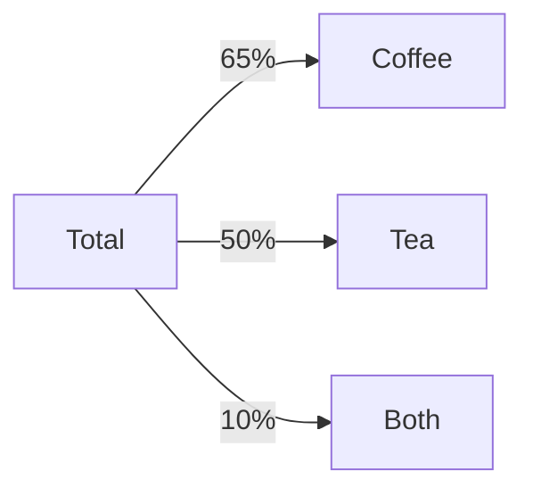

**Descriptive Statistics**
=========================

### Introduction

Descriptive statistics is a branch of statistics that deals with summarizing and describing the basic features of data. It involves using numerical measures to describe the characteristics of the dataset, such as central tendency, dispersion, and shape.

### Core Concepts

#### Measures of Central Tendency

*   **Mean**: The average value of the dataset.
    \[ E(X) = \frac{1}{n} \sum_{i=1}^{n} x_i \]
*   **Median**: The middle value of the dataset when it is sorted in ascending order.
*   **Mode**: The value that appears most frequently in the dataset.

#### Measures of Dispersion

*   **Variance**: A measure of how spread out the data is from its mean value.
    \[ Var(X) = \frac{1}{n} \sum_{i=1}^{n} (x_i - E(X))^2 \]
*   **Standard Deviation**: The square root of the variance.
*   **Range**: The difference between the largest and smallest values in the dataset.

#### Measures of Shape

*   **Skewness**: A measure of how symmetrical or asymmetrical the data is.
*   **Kurtosis**: A measure of how "tailed" or "peaked" the data is.

### Key Formulas/Theorems

None relevant to this topic.

### Problem Solving Patterns

1.  **Venn Diagrams**: Use Venn diagrams to visualize and solve problems involving set theory.
    ```mermaid
    graph LR
    A[Total] -->|35%| B[Coffee]
    A -->|40%| C[Tea]
    A -->|10%| D[Both]
    ```
2.  **Inclusion-Exclusion Principle**: Use the inclusion-exclusion principle to solve problems involving set theory.
3.  **Ratio and Proportion**: Use ratio and proportion to solve problems involving ratios of quantities.

### Examples with Solutions

**Example 1**

A company has 100 employees, 35% of whom drink coffee, 40% of whom drink tea, and 10% of whom drink both. What percentage of employees drink neither coffee nor tea?

Let's use a Venn diagram to visualize the problem:

Since 35% drink coffee and 40% drink tea, the percentage of employees who drink at least one of these is:
\[ \text{Percentage} = 35\% + 40\% - 10\% = 65\% \]

So, the percentage of employees who drink neither is:
\[ \text{Percentage} = 100\% - 65\% = 35\% \]

**Example 2**

P invests ₹5000 per month for 6 months in a partnership business. Q invests x per month for 8 months. The profit is shared in proportion to the total investment made in that year. If at the end of that investment year, Q receives 49/90 of the total profit, what is the value of x?

Let's use ratio and proportion to solve this problem:
\[ \frac{\text{Profit received by Q}}{\text{Total profit}} = \frac{x \times 8}{5000 \times 6 + x \times 8} = \frac{49}{90} \]

Solving for x, we get:
\[ x \times 8 = \frac{(5000 \times 6) (49)}{90} \]
\[ x = \frac{(5000 \times 6) (49)}{720} \]
\[ x = 3000 \]

### Common Pitfalls

*   Failing to consider the inclusion-exclusion principle when solving set theory problems.
*   Misunderstanding the concept of ratio and proportion.

### Quick Summary

*   Measures of central tendency: mean, median, mode
*   Measures of dispersion: variance, standard deviation, range
*   Measures of shape: skewness, kurtosis
*   Venn diagrams and inclusion-exclusion principle for set theory problems
*   Ratio and proportion for solving ratio-of-quantities problems