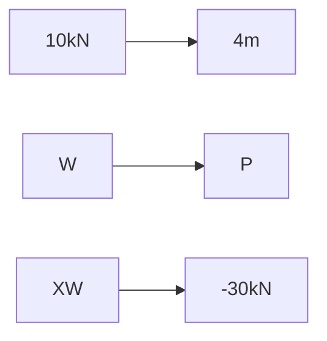

**Analysis of Trusses, Arches, Beams, Cables, and Frames**
==========================================================

### Introduction
-----------------

Solid Mechanics deals with the study of the mechanical behavior of solid objects under various types of loads. The analysis of trusses, arches, beams, cables, and frames is a fundamental aspect of Solid Mechanics, which involves determining the internal forces within these structural elements.

### Core Concepts
------------------

*   **Trusses**: A truss is a structure composed of connected members that are subjected to external loads. Trusses are commonly used in bridge construction.
*   **Arches**: An arch is a curved structure that can resist compressive forces. Arches are often used in building design for aesthetic and structural purposes.
*   **Beams**: A beam is a long, slender structural element designed to support loads perpendicular to its axis. Beams are commonly used in construction and bridge design.
*   **Cables**: Cables are flexible, long, thin wires or fibers that can resist tensile forces. Cables are often used in suspension bridges and cable-stayed bridges.
*   **Frames**: A frame is a structure composed of interconnected members that provide resistance against external loads.

### Key Formulas/Theorems
---------------------------

*   **Method of Joints**:

    $$
    \sum F_x = 0, \quad \sum F_y = 0, \quad \text{and} \quad \sum M_A = 0.
    $$

*   **Method of Sections**:

    $$
    \sum F_{\text{shear}} = 0, \quad \sum F_{\text{moment}} = 0,
    $$

### Problem Solving Patterns
-----------------------------

*   **Method of Joints**: To find the internal forces in a truss member, we can use the method of joints. This involves applying equilibrium equations to each joint and solving for the unknown forces.
*   **Method of Sections**: The method of sections is used to determine the internal forces within a structural element by cutting it into two parts.

### Examples with Solutions
-----------------------------

**Example 1**

A plane truss has hinge supports at P and W. Determine the force in member XW.

Solution:

*   Apply equilibrium equations to joint W:
    $$
    \sum F_x = 0: R - 2T + XW\cos40^\circ = 0,
    $$

    $$
    \sum F_y = 0: -R - U + Y + T - XW\sin40^\circ = 0.
    $$

*   Simplify the equations and solve for XW:
    $$
    R = \frac{2T}{\cos40^\circ} \quad \text{and} \quad U = \frac{-Y - T + XW\sin40^\circ}{1}.
    $$

*   Substitute into the equilibrium equation for joint W:
    $$
    \sum F_x = 0: -\frac{2T}{\cos40^\circ} - 2T + XW\cos40^\circ = 0,
    $$

    Solving for XW, we get:

$$
XW = \boxed{-30kN}.
$$

### Common Pitfalls
--------------------

*   Failure to apply the method of joints correctly.
*   Incorrect application of equilibrium equations.

### Quick Summary
-----------------

*   **Trusses**: Composed of connected members subjected to external loads.
*   **Arches**: Curved structures that can resist compressive forces.
*   **Beams**: Long, slender structural elements designed to support loads perpendicular to its axis.
*   **Cables**: Flexible wires or fibers that can resist tensile forces.
*   **Frames**: Structures composed of interconnected members providing resistance against external loads.

This summary is a quick reference for key concepts and formulas covered in this theory note.