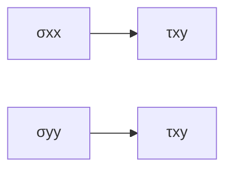
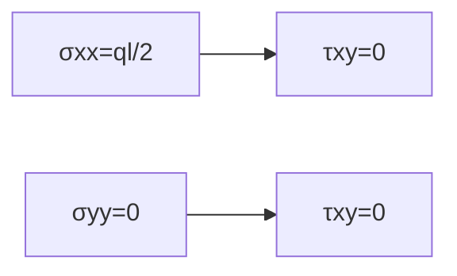

**Principal Stress and Principal Strain**
=====================================

### Introduction
The analysis of stress and strain in materials is crucial in understanding their behavior under various loads. In this topic, we will delve into principal stresses and strains, which are essential concepts in strength of materials.

### Core Concepts
#### Principal Stresses
Principal stresses are the maximum and minimum normal stresses acting on an object at any point. They can be found using the Mohr's circle diagram or by solving the stress tensor equation.

Let $\sigma_{xx}$, $\sigma_{yy}$, and $\tau_{xy}$ represent the normal stresses in the x, y directions, and the shear stress between them respectively. The principal stresses ($\sigma_1$ and $\sigma_2$) can be calculated using:

$\sigma_{1,2} = \frac{\sigma_{xx} + \sigma_{yy}}{2} \pm \sqrt{\left(\frac{\sigma_{xx} - \sigma_{yy}}{2}\right)^2 + \tau^2}$

where $\tau$ is the shear stress.

#### Principal Strains
Principal strains are the maximum and minimum linear extensions or compressions in an object. They can be related to principal stresses by the following equations:

$\epsilon_1 = \frac{\sigma_1}{E} - \nu\frac{\sigma_{yy}}{E}$

$\epsilon_2 = \frac{\sigma_2}{E} - \nu\frac{\sigma_{xx}}{E}$

where $\epsilon_1$ and $\epsilon_2$ are the principal strains, $E$ is the modulus of elasticity, and $\nu$ is Poisson's ratio.

### Key Formulas/Theorems
#### Mohr's Circle Diagram

The Mohr's circle diagram represents the relationship between normal stresses and shear stresses. The principal stresses can be found by drawing a circle with its center at $(\frac{\sigma_{xx} + \sigma_{yy}}{2}, 0)$ and radius $\sqrt{\left(\frac{\sigma_{xx} - \sigma_{yy}}{2}\right)^2 + \tau^2}$.

### Problem Solving Patterns
When solving problems involving principal stresses and strains, follow these steps:

1. Draw the free-body diagram of the object.
2. Identify the normal stresses and shear stresses acting on the object.
3. Use Mohr's circle diagram to find the principal stresses.
4. Relate the principal stresses to principal strains using the equations above.

### Examples with Solutions
**Example 1:** A beam is subjected to a uniformly distributed load of intensity $q$. Find the support reactions at points $A$ and $B$.

Let's analyze this problem step by step:

* Draw the free-body diagram of the beam.
* Identify the normal stresses acting on the beam: $\sigma_{xx} = \frac{ql}{2}$, $\sigma_{yy} = 0$, and $\tau_{xy} = 0$.
* Use Mohr's circle diagram to find the principal stresses.

The principal stresses are $\sigma_1 = \frac{ql}{2} + \sqrt{\left(\frac{ql}{4}\right)^2}$ and $\sigma_2 = \frac{ql}{2} - \sqrt{\left(\frac{ql}{4}\right)^2}$.

* Relate the principal stresses to principal strains using the equations above.

The principal strains are $\epsilon_1 = \frac{\sigma_1}{E} - \nu\frac{\sigma_{yy}}{E}$ and $\epsilon_2 = \frac{\sigma_2}{E} - \nu\frac{\sigma_{xx}}{E}$.

### Common Pitfalls
* Failing to draw the free-body diagram of the object.
* Ignoring the normal stresses and shear stresses acting on the object.
* Misinterpreting Mohr's circle diagram.

### Quick Summary

* Principal stresses are the maximum and minimum normal stresses acting on an object at any point.
* Principal strains are related to principal stresses by the equations above.
* Use Mohr's circle diagram to find the principal stresses.
* Relate the principal stresses to principal strains using the equations above.