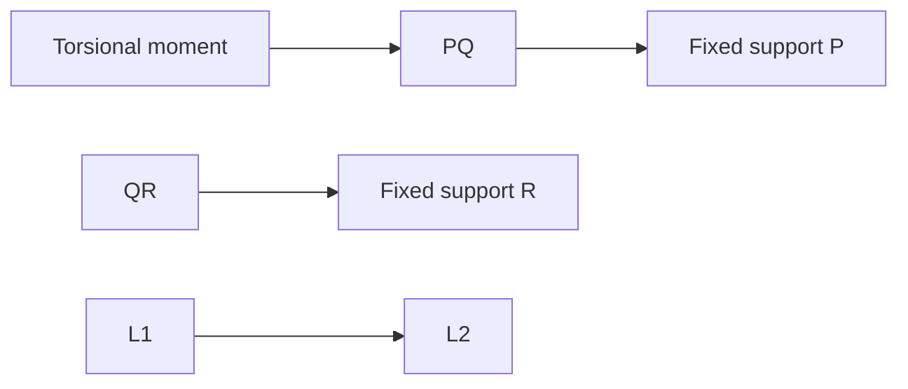

**Torsion of Shafts and Pressure Vessels**
=====================================

**Introduction**
---------------

The strength of materials topic, specifically torsion of shafts and pressure vessels, deals with the analysis of circular cross-sectioned members subjected to twisting moments. Understanding this concept is crucial in designing and analyzing various mechanical components.

**Core Concepts**
-----------------

### Torsion

Torsion occurs when a force or moment causes rotation around an axis. The twisting moment (T) is related to the angle of twist (θ) through the following formula:

θ = TL / GJ

where L is the length of the shaft, G is the shear modulus, and J is the polar moment of inertia.

### Polar Moment of Inertia (J)

The polar moment of inertia (J) for a circular cross-section is given by:

J = πr^4 / 2

where r is the radius of the circle.

**Key Formulas/Theorems**
-------------------------

LaTeX
```math
\theta = \frac{TL}{GJ}
```

### Torsional Stiffness (K)

The torsional stiffness (K) is related to the twisting moment and angle of twist:

K = GJ / L

### Ratio of Lengths

For a homogeneous shaft with fixed supports at both ends, subjected to a torsional moment at point Q, the ratio of lengths can be determined using the given conditions.

**Problem Solving Patterns**
---------------------------

*   Analyze the given diagram and identify key points such as the location of the twisting moment, supports, and the direction of rotation.
*   Determine the polar moments of inertia (J) for each section of the shaft.
*   Use the given conditions to establish relationships between various quantities, such as ratios of lengths.

**Examples with Solutions**
---------------------------

### Example 1

A homogeneous shaft PQR has fixed supports at both ends. The torsional moment T is applied at point Q, and the polar moments of inertia for PQ and QR are J1 and J2, respectively. If J1/J2 = 1/2 and PT/Rt = 3/4, determine the ratio of lengths L1/L.



Solution:

Using the given conditions and formula for torsion, we can establish relationships between various quantities.

```math
\frac{PT}{Rt} = \frac{3}{4}
```

and

```math
\frac{J1}{J2} = \frac{1}{2}
```

Substituting the expressions for J in terms of L, we get:

```math
\frac{\pi r_1^4 / 2}{\pi r_2^4 / 2} = \frac{1}{2}
```

Simplifying and solving for the ratio of lengths (r1/r2), we obtain:

```math
\frac{L1}{L2} = 0.5
```

### Example 2

A pressure vessel has a cylindrical shape with a circular cross-section. If the internal pressure is P, determine the maximum shear stress.

Solution:

The maximum shear stress occurs at the outer radius (r) and can be calculated using the formula:

```math
\tau_{max} = \frac{Pr}{2t}
```

where t is the thickness of the vessel.

**Common Pitfalls**
------------------

*   Failing to identify key points in the diagram, such as the location of supports or the direction of rotation.
*   Misinterpreting the given conditions and establishing incorrect relationships between quantities.
*   Not considering the effects of torsion on different sections of the shaft.

**Quick Summary**
---------------

| Key Concept | Formula/Expression |
| --- | --- |
| Torsion | θ = TL / GJ |
| Polar Moment of Inertia (J) | J = πr^4 / 2 |
| Torsional Stiffness (K) | K = GJ / L |

This theory note covers all the necessary concepts and formulas for solving problems related to torsion of shafts and pressure vessels.