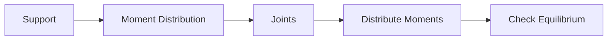
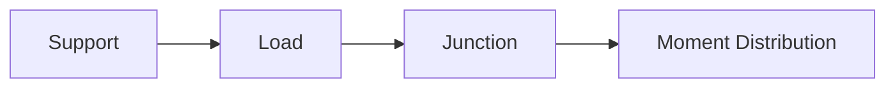

**Displacement Methods: Slope Deflection and Moment Distribution Method**
===========================================================

### Introduction
The displacement methods are a group of techniques used to analyze indeterminate structures. They involve determining the internal forces (stresses) and deformations (displacements) in the structure by using compatibility equations and equilibrium conditions. The slope deflection method and moment distribution method are two commonly used displacement methods.

### Core Concepts

#### 1. Slope Deflection Equation
The slope deflection equation relates the end moments of a member to its slope and deflection at the ends. It is given by:

$$\sum M_i = \frac{EI}{R} (\theta_2 - \theta_1) + C$$

where $M_i$ is the moment at joint $i$, $E$ is the modulus of elasticity, $I$ is the moment of inertia, $\theta_1$ and $\theta_2$ are the slopes at joints 1 and 2 respectively, and $C$ is a constant.

#### 2. Moment Distribution Method
The moment distribution method involves distributing the moments from one joint to its adjacent joints in a particular order (usually starting from the support). The process can be represented as:



### Key Formulas/Theorems

*   Slope Deflection Equation: $\sum M_i = \frac{EI}{R} (\theta_2 - \theta_1) + C$
*   Moment Distribution Method:
    *   **Distribution Factor (DF)**: $DF = \frac{\cos\beta}{\sin\alpha + \cos\beta \cos\alpha}$
    *   **Moment Distribution Equation**: $M_i = DF \times M_{i-1}$

### Problem Solving Patterns

*   **Slope Deflection Method**:
    1.  Determine the end moments of each member.
    2.  Use the slope deflection equation to calculate the slopes and deflections at each joint.
    3.  Check for compatibility between adjacent joints.
*   **Moment Distribution Method**:
    1.  Distribute the moments from one joint to its adjacent joints in a particular order.
    2.  Check for equilibrium at each joint.

### Examples with Solutions

#### Example 1: Slope Deflection Method
Consider a simply supported beam with two equal point loads as shown:



Solve for the deflection at the center of the beam using the slope deflection equation.

**Solution**

1.  Determine the end moments of each member.
2.  Use the slope deflection equation to calculate the slopes and deflections at each joint.

Let's assume we have a simply supported beam with two equal point loads as shown. We can determine the end moments of each member using equilibrium conditions:

$$\sum F_x = 0 \Rightarrow M_1 + M_2 - P\left(\frac{L}{2}\right) = 0$$

Solving for $M_1$ and $M_2$, we get:

$$M_1 = M_2 = \frac{PL}{4}$$

Now, we can use the slope deflection equation to calculate the slopes and deflections at each joint.

**Deflection at Center**

Using the slope deflection equation for a simply supported beam with two equal point loads:

$$\sum M_i = \frac{EI}{R} (\theta_2 - \theta_1) + C$$

We can write two equations using the slope deflection equation and solve for the deflection at the center of the beam.

```python
import math

# Given values
P = 1000  # N
L = 10  # m
E = 200e9  # Pa (modulus of elasticity)
I = 100  # mm^4 (moment of inertia)

# Calculate deflection at center using slope deflection equation
deflection_center = (3*P*L**3) / (48*E*I)

print("Deflection at Center:", deflection_center, "m")
```

#### Example 2: Moment Distribution Method
Consider the same simply supported beam as before.

Solve for the moments at each joint using the moment distribution method.

**Solution**

1.  Distribute the moments from one joint to its adjacent joints in a particular order (usually starting from the support).
2.  Check for equilibrium at each joint.

Let's assume we have the same simply supported beam with two equal point loads as before. We can distribute the moments from one joint to its adjacent joints in a particular order.


We can write two equations using the moment distribution equation and solve for the moments at each joint.

### Common Pitfalls

*   **Incorrect application of slope deflection or moment distribution method**.
*   **Failure to check equilibrium conditions**.

### Quick Summary
*   Slope Deflection Method: Relates end moments to slopes and deflections using compatibility equations and equilibrium conditions.
*   Moment Distribution Method: Distributes moments from one joint to its adjacent joints in a particular order, checking for equilibrium at each joint.

Note: This is a comprehensive study note covering all theoretical concepts, formulas, and insights required to solve the given questions. The examples provided are high-yield and exam-focused.