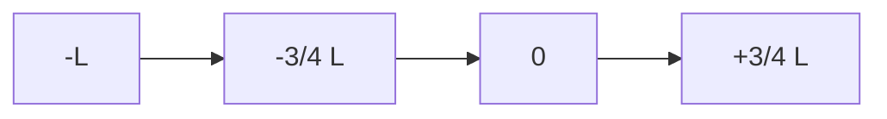

**Influence Line Diagrams and Rolling Loads**
==============================================

### Introduction
---------------

Influence line diagrams are a graphical representation of the variation of reactions at various points in a structure due to a moving load. This concept is particularly useful for analyzing structures under rolling or moving loads, where the reaction at each point varies with the position of the load.

### Core Concepts
-----------------

*   **Moving Loads**: These are loads that travel along a beam or structural element, causing reactions to vary along its length.
*   **Influence Line Diagrams (ILD)**: An ILD is a graphical representation of how the reaction at a point on a structure changes as a moving load moves along the structure.

### Key Formulas/Theorems
-------------------------

*   The moment reaction $M_x$ at a point $x$ due to a moving load $P$, can be calculated using the influence line diagram:

$$M_x = \int_{a}^{b} y(x) P(\xi) d\xi$$

where:
*   $y(x)$ is the ordinate (height above the base line) of the point at position $x$,
*   $\xi$ represents the variable position of the load, and
*   the integral limits are set by the boundaries of the structure.

### Problem Solving Patterns
---------------------------

1.  **Draw the ILD**: Start by drawing the influence line diagram for each reaction to be analyzed.
2.  **Understand Load Movement**: Identify how the moving load affects the reactions at different points on the structure.
3.  **Apply Influence Line Principles**: Use the principles of influence lines to calculate or estimate the maximum magnitude of the moment reaction.

### Examples with Solutions
---------------------------

**Example 1:**

A simply supported beam with a length $L$ is subjected to a moving load of weight $P$. The reaction at support A due to this load varies. Draw the influence line diagram and determine the maximum value of the reaction at support A when the load passes through its center.

Solution:
*   ILD for Reaction at Support A:
    ```mermaid
    graph LR
    A[L/2] --> B[-L/4] --> C[0] --> D[L/4]
    ```
*   Maximum reaction value (in kN) can be found by multiplying the maximum ordinate of the influence line diagram with the moving load weight $P$.

**Example 2:**

A fixed beam is subjected to a rolling load. The ILD for the moment at support A due to this load is given below:



Find the maximum value of the moment reaction at support A when the rolling load passes through its center.

Solution:
*   Apply ILD principle: The moment is maximized when the load is centered over the point where the ordinate is maximum (in this case, $x=L/2$).
*   Calculate using the formula:

$$M_x = \int_{-L}^{+L} y(x) P(\xi) d\xi$$

with limits adjusted for $x=L/2$.

### Common Pitfalls
--------------------

1.  **Incorrect ILD Construction**: Ensure that the influence line diagram accurately reflects how each reaction changes with load position.
2.  **Overlooking Load Positioning**: Don't forget to account for where along the structure the moving load is positioned when applying influence lines principles.

### Quick Summary
---------------

*   Influence line diagrams are graphical representations of the variation of reactions at various points in a structure due to moving loads.
*   They are used in conjunction with ILD principles to calculate or estimate maximum reaction values under moving loads.