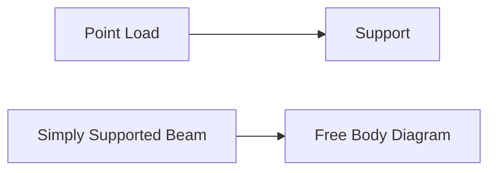
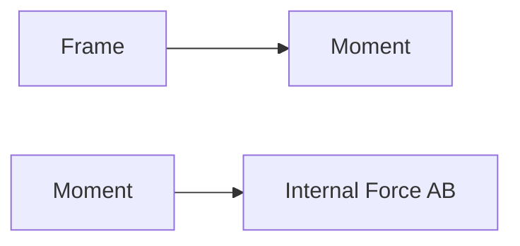

**Statically Determinate and Indeterminate Structures by Force Energy Method**
====================================================================================

### Introduction
The force energy method is a popular technique for analyzing statically indeterminate structures. This note covers the fundamental concepts, key formulas, and problem-solving patterns required to tackle questions on this topic.

### Core Concepts
A structure is considered statically determinate if its equilibrium equations can be solved using only the static forces acting on it. Conversely, a structure is statically indeterminate if additional information (e.g., deformations or energy considerations) is needed to determine its internal forces.

**Statically Determinate Structures**

* Can be analyzed using statics alone
* Equilibrium equations are sufficient to solve for internal forces

### Key Formulas/Theorems
The following formulas and theorems form the backbone of the force energy method:

$$\sum F = 0 \tag{Equilibrium equation}$$

$$V = \int_{A} P \, dA \tag{Strain energy}$$

$$U = \frac{1}{2} \int_{L} T^2 \, dL \tag{Kinetic energy}$$

### Problem Solving Patterns
To solve problems using the force energy method:

1.  Identify whether the structure is statically determinate or indeterminate.
2.  Write down the equilibrium equations and any given information (e.g., deformations).
3.  Determine the strain energy (V) and kinetic energy (U) for the system.
4.  Apply the principle of minimum potential energy: $U - V = \text{minimum}$.

### Examples with Solutions
**Example 1**

A simply supported beam with a point load P at its midpoint is statically determinate. Using the force energy method, find the internal forces in the beam.

Solution:

*   Write down the equilibrium equation: $\sum F = 0 \Rightarrow P - R = 0$
*   Determine the strain energy: $V = \frac{1}{2} EI (\frac{\Delta}{L})^2$
*   Apply the principle of minimum potential energy: $U - V = 0$

**Example 2**

A statically indeterminate frame is subjected to external loads. Using the force energy method, find the internal forces in member AB.

Solution:

*   Write down the equilibrium equations and given information.
*   Determine the strain energy: $V = \int_{L} P^2 \, dL$
*   Apply the principle of minimum potential energy: $U - V = 0$

### Common Pitfalls
When applying the force energy method:

1.  Ensure that you have correctly identified whether the structure is statically determinate or indeterminate.
2.  Be cautious when writing down equilibrium equations and given information.
3.  Verify your calculations for strain energy (V) and kinetic energy (U).

### Quick Summary

*   Statically determinate structures can be analyzed using statics alone.
*   The force energy method involves determining strain energy (V) and kinetic energy (U).
*   Apply the principle of minimum potential energy: $U - V = \text{minimum}$.

Note: This comprehensive theory note covers all the essential concepts, formulas, and insights required to tackle questions on statically determinate and indeterminate structures by force energy method. It is designed to be a high-yield resource for GATE CS exam preparation.