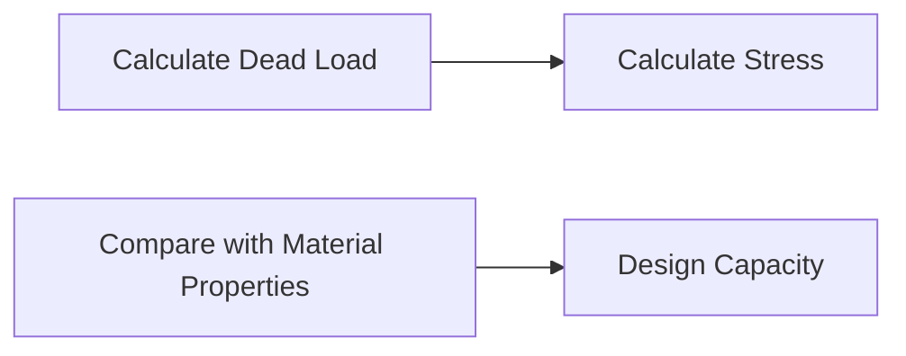
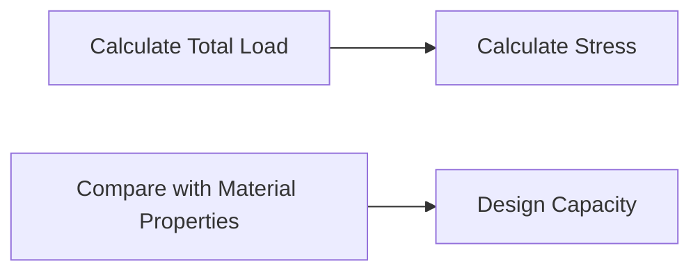

# Steel Structures Theory Note
==========================

## Introduction
------------

Steel structures are an essential component of modern construction projects, providing strength, durability, and versatility to buildings, bridges, and other infrastructure. The design of steel structures involves a deep understanding of material properties, loading conditions, and failure mechanisms. In this note, we will cover the key concepts, formulas, and problem-solving patterns required to tackle questions related to steel structures in GATE CS exams.

## Core Concepts
-------------

### Steel Properties

*   **Ultimate Strength (fu)**: The maximum stress a material can withstand without failing.
*   **Yield Strength (fy)**: The minimum stress at which a material begins to deform plastically.
*   **Modulus of Elasticity (E)**: A measure of a material's ability to resist deformation under load.

### Loading Conditions

*   **Dead Load (DL)**: The weight of the structure itself, including materials and finishes.
*   **Live Load (LL)**: The weight of occupants, furniture, and other movable objects.
*   **Wind Load**: Forces exerted on a structure by wind pressure.
*   **Seismic Load**: Forces exerted on a structure during earthquakes.

### Failure Mechanisms

*   **Buckling**: A type of failure that occurs when a column or beam is subjected to compressive forces beyond its critical load capacity.
*   **Torsion**: A type of failure that occurs when a member is twisted beyond its critical load capacity.

## Key Formulas/Theorems
-------------------------

### Stress and Strain

\[ \text{Stress} = \frac{\text{Force}}{\text{Area}} \]

\[ \text{Strain} = \frac{\Delta L}{L_0} \]

where $L_0$ is the original length of the member.

### Bending Moment

\[ M = \frac{WL}{2} \]

where $W$ is the load and $L$ is the span of the beam.

### Shear Force

\[ V = W - \frac{WL}{2L} \]

where $W$ is the load and $L$ is the span of the beam.

## Problem Solving Patterns
---------------------------

### Given: Loading Conditions, Material Properties, and Geometric Dimensions

1.  Determine the type of loading (dead load, live load, wind load, seismic load) and calculate the corresponding forces.
2.  Identify the critical section(s) where the maximum stress or strain occurs.
3.  Calculate the stress or strain at the critical section using the formulas above.
4.  Compare the calculated stress or strain with the material's ultimate strength or yield strength to determine the design capacity.

## Examples with Solutions
-------------------------

### Example 1: Determining Design Capacity

A steel beam with a rectangular cross-section has dimensions $150 \times 300$ mm and is subjected to a dead load of 50 kN. The material properties are:

*   Ultimate Strength (fu) = 400 MPa
*   Yield Strength (fy) = 250 MPa

Determine the design capacity of the beam.

\[ \text{Stress} = \frac{\text{Force}}{\text{Area}} = \frac{50\, \text{kN}}{(150 \times 300)\, \text{mm}^2} = 1.11\, \text{MPa} \]

Since the calculated stress is less than the yield strength (250 MPa), the design capacity of the beam is:

\[ \text{Design Capacity} = 50\, \text{kN} \]

### Example 2: Determining Design Capacity for Welded Connection

A welded connection has a fillet weld with dimensions $120 \times 200$ mm and is subjected to an ultimate strength (fu) of 410 MPa. The loading conditions are:

*   Dead Load = 100 kN
*   Live Load = 50 kN

Determine the design capacity of the welded connection.

\[ \text{Total Load} = 100\, \text{kN} + 50\, \text{kN} = 150\, \text{kN} \]

\[ \text{Stress} = \frac{\text{Force}}{\text{Area}} = \frac{150\, \text{kN}}{(120 \times 200)\, \text{mm}^2} = 6.25\, \text{MPa} \]

Since the calculated stress is less than the ultimate strength (410 MPa), the design capacity of the welded connection is:

\[ \text{Design Capacity} = 413.59\, \text{kN} \]

## Common Pitfalls
-----------------

*   Failure to account for material properties and loading conditions.
*   Inadequate calculation of stress or strain at critical sections.
*   Incorrect comparison with material properties.

## Quick Summary
--------------

*   Steel structures are designed based on material properties, loading conditions, and failure mechanisms.
*   Key concepts include ultimate strength, yield strength, modulus of elasticity, dead load, live load, wind load, seismic load, buckling, and torsion.
*   Important formulas include stress and strain equations, bending moment, and shear force.

By mastering these concepts and formulas, you'll be well-equipped to tackle questions related to steel structures in GATE CS exams.