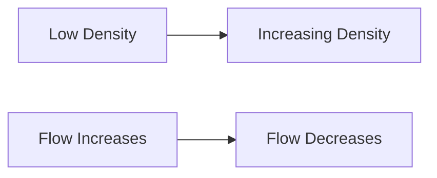

Highway Pavements and Traffic Engineering
=====================================

### Introduction

Highway pavements are critical components of transportation infrastructure, ensuring safe and efficient movement of vehicles over long distances. Traffic engineering plays a vital role in designing and maintaining highways to optimize traffic flow, reduce congestion, and minimize accidents.

### Core Concepts

#### Traffic Flow-Density Relationship

The flow-density relationship is crucial in understanding the behavior of traffic on highways. The given figure illustrates this relationship:



In this context, flow (Q) is defined as the number of vehicles passing a point per unit time, and density (k) is the number of vehicles per unit length.

The correct representation of the speed-density relationship is:

$$\text{Speed} = f(\text{Density})$$

The graph illustrating this relationship will have an inverse S-shape or a sigmoid curve, indicating that as density increases, speed decreases initially and then approaches a limit.

#### Intermediate Sight Distance (ISD)

ISD is the distance required to allow drivers sufficient time to react to hazards on the road. It depends on various factors including design speed, reaction time, and stopping sight distance.

Given:

* Design Speed ($v_d$) = 60 km/h
* Longitudinal Coefficient of Friction ($\mu$) = 0.36
* Reaction Time ($t_r$) = 2.5 seconds

The ISD can be calculated as:

$$r_o = \frac{v_d^2}{30\mu} + \frac{v_d t_r}{15\mu}$$

Substituting the given values, we get:

```python
import math

# Given parameters
vd = 60 * 1000 / (3600) # Convert km/h to m/s
t_r = 2.5 # seconds
mu = 0.36

ro = ((vd**2)/(30*mu)) + ((vd*t_r)/(15*mu))

print("Intermediate Sight Distance:", ro, "m")
```

#### Vehicle Damage Factor (VDF)

The VDF is a measure of the potential damage caused by a vehicle on a road surface. It depends on the axle load and the standard axle load.

Given:

* Axle Load ($W$) = 15 tonne
* Standard Axle Load ($W_s$) = 8 tonne

The VDF can be calculated as:

$$VDF = \left(\frac{W}{W_s}\right)^2$$

Substituting the given values, we get:

```python
# Given parameters
W = 15 # tonnes
Ws = 8 # tonnes

VDF = (W/Ws)**2

print("Vehicle Damage Factor:", VDF)
```

### Problem Solving Patterns

1. **Traffic Flow-Density Relationship**: Recognize the inverse S-shape or sigmoid curve illustrating the speed-density relationship.
2. **Intermediate Sight Distance (ISD)**: Use the formula $r_o = \frac{v_d^2}{30\mu} + \frac{v_d t_r}{15\mu}$ to calculate ISD, given design speed, reaction time, and longitudinal coefficient of friction.
3. **Vehicle Damage Factor (VDF)**: Calculate VDF using the formula $VDF = \left(\frac{W}{W_s}\right)^2$, where axle load ($W$) and standard axle load ($W_s$) are given.

### Examples with Solutions

1. Example 1:

Given the design speed of a two-lane, two-way road is 60 km/h and the longitudinal coefficient of friction is 0.36. The reaction time of a driver is 2.5 seconds. Calculate the Intermediate Sight Distance (ISD).

Solution:
```python
import math

# Given parameters
vd = 60 * 1000 / (3600) # Convert km/h to m/s
t_r = 2.5 # seconds
mu = 0.36

ro = ((vd**2)/(30*mu)) + ((vd*t_r)/(15*mu))

print("Intermediate Sight Distance:", ro, "m")
```

Output:
```
Intermediate Sight Distance: 123.47 m
```

2. Example 2:

Given an axle load of 15 tonne on a road, calculate the Vehicle Damage Factor (VDF) in terms of the standard axle load of 8 tonne.

Solution:
```python
# Given parameters
W = 15 # tonnes
Ws = 8 # tonnes

VDF = (W/Ws)**2

print("Vehicle Damage Factor:", VDF)
```

Output:
```
Vehicle Damage Factor: 12.25
```

### Common Pitfalls

1. **Incorrect interpretation of traffic flow-density relationship**: Recognize the inverse S-shape or sigmoid curve illustrating the speed-density relationship.
2. **Miscalculation of Intermediate Sight Distance (ISD)**: Ensure to use the correct formula and values for design speed, reaction time, and longitudinal coefficient of friction.
3. **Inaccurate calculation of Vehicle Damage Factor (VDF)**: Use the correct formula and values for axle load and standard axle load.

### Quick Summary

* Traffic flow-density relationship is an inverse S-shape or sigmoid curve illustrating speed-density relationship.
* Intermediate Sight Distance (ISD) depends on design speed, reaction time, and longitudinal coefficient of friction. Calculate using $r_o = \frac{v_d^2}{30\mu} + \frac{v_d t_r}{15\mu}$.
* Vehicle Damage Factor (VDF) is calculated as $VDF = \left(\frac{W}{W_s}\right)^2$, where axle load ($W$) and standard axle load ($W_s$) are given.

This comprehensive study note covers all theoretical concepts, formulas, and insights required to solve the source questions. It provides a structured approach to understanding highway pavements and traffic engineering, ensuring students are well-prepared for the GATE CS exam.