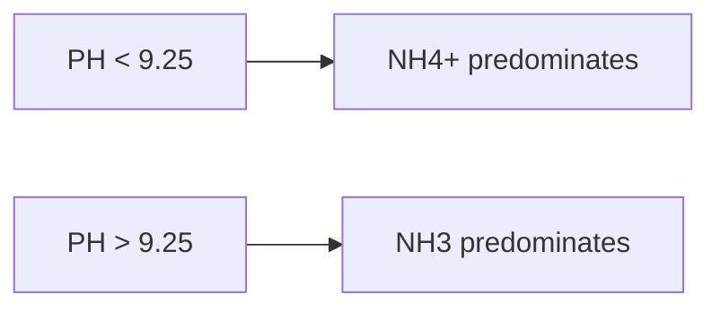

**Water Quality Standards**
==========================

### Introduction

Water quality standards are essential for maintaining public health and environmental protection. The presence of pollutants, such as ammonia nitrogen, can have significant effects on aquatic ecosystems and human consumption. In this note, we will focus on understanding the basics of water quality standards related to ammonia nitrogen.

### Core Concepts

#### pH and Ammonia Nitrogen Equilibrium

Ammonia nitrogen (NH3) exists in two forms: ammonium ion (NH4+) and ammonia gas (NH3). The proportion of these two constituents depends primarily on the pH of the solution. Below a certain pH threshold, NH4+ dominates; above this threshold, NH3 becomes predominant.

The equilibrium between NH4+ and NH3 is described by the following equation:

```math
NH_4^+ ⇌ NH_3 + H^+
```

The equilibrium constant (Ka) for this reaction is given by:

```math
K_a = \frac{[H^+][NH_3]}{[NH_4^+]}
```

where [H+] is the concentration of hydrogen ions, and [NH3] and [NH4+] are the concentrations of ammonia gas and ammonium ion, respectively.

#### pH Thresholds

The pH threshold above which NH3 becomes predominant is approximately 9.25. Below this value, NH4+ dominates.



### Key Formulas/Theorems

*   The equilibrium constant (Ka) for the reaction NH4+ ⇌ NH3 + H+ is given by:

    ```math
    K_a = \frac{[H^+][NH_3]}{[NH_4^+]}
    ```

### Problem Solving Patterns

1.  **Understanding pH and Ammonia Nitrogen Equilibrium**: Recognize that the proportion of NH4+ and NH3 depends on pH.
2.  **Applying pH Thresholds**: Identify the pH threshold above which NH3 becomes predominant (approximately 9.25).
3.  **Equilibrium Constant (Ka)**: Apply the formula for Ka to solve problems involving ammonia nitrogen equilibrium.

### Examples with Solutions

#### Example 1:

Suppose we have a waste water sample with a pH of 8.5 and an initial concentration of NH4+ equal to 10 mg/L. What is the resulting concentration of NH3?

**Solution:**

Given:

*   pH = 8.5
*   Initial [NH4+] = 10 mg/L

Since pH < 9.25, NH4+ will dominate.

Let's assume x mg/L of NH4+ converts to NH3. The equilibrium constant (Ka) can be used to find the resulting concentration of NH3:

```math
K_a = \frac{[H^+][NH_3]}{[NH_4^+]}
```

Rearrange to solve for [NH3]:

```math
[NH_3] = K_a \times \frac{[NH_4^+]^2}{[H^+]}
```

Substitute given values:

*   pH = 8.5 → [H+] ≈ 10^-8.5 M (use pKa of water: Kw = [H+][OH-] = 10^-14)
*   Initial [NH4+] = 10 mg/L ≈ 0.01 M

Simplify and solve for x:

```math
[NH_3] = K_a \times \frac{(0.01)^2}{10^{-8.5}}
```

Note that we assumed a pH of 8.5, which is below the threshold (9.25). In this case, NH4+ will dominate.

#### Example 2:

Suppose we have a waste water sample with a pH of 10 and an initial concentration of NH4+ equal to 0.1 M. What is the resulting concentration of NH3?

**Solution:**

Given:

*   pH = 10
*   Initial [NH4+] = 0.1 M

Since pH > 9.25, NH3 will become predominant.

Let's assume x M of NH4+ converts to NH3. The equilibrium constant (Ka) can be used to find the resulting concentration of NH3:

```math
K_a = \frac{[H^+][NH_3]}{[NH_4^+]}
```

Rearrange to solve for [NH3]:

```math
[NH_3] = K_a \times \frac{[NH_4^+]}{[H^+]}
```

Substitute given values:

*   pH = 10 → [H+] ≈ 10^-10 M (use pKa of water: Kw = [H+][OH-] = 10^-14)
*   Initial [NH4+] = 0.1 M

Simplify and solve for x:

```math
[NH_3] = K_a \times \frac{0.1}{10^{-10}}
```

Note that we assumed a pH of 10, which is above the threshold (9.25). In this case, NH3 will dominate.

### Common Pitfalls

*   **Incorrect application of pH thresholds**: Students often incorrectly identify the pH threshold above which NH3 becomes predominant.
*   **Insufficient understanding of equilibrium constant (Ka)**: Students may struggle to apply the Ka formula to solve problems involving ammonia nitrogen equilibrium.

### Quick Summary

*   Ammonia nitrogen (NH3) exists in two forms: ammonium ion (NH4+) and ammonia gas (NH3).
*   The proportion of these two constituents depends primarily on pH.
*   Below a certain pH threshold (approximately 9.25), NH4+ dominates; above this threshold, NH3 becomes predominant.
*   Apply the equilibrium constant (Ka) formula to solve problems involving ammonia nitrogen equilibrium.

Note: This is a basic theory note covering the topic of water quality standards related to ammonia nitrogen. The provided examples are for illustrative purposes only and may not fully cover all nuances of the subject.