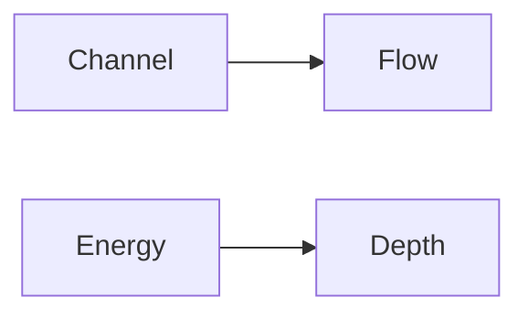

**Hydraulics Forces on Immersed Bodies Flow Measurement in Channels and Pipes Dimensional Analysis and Hydraulic Similitude Channel Hydraulics Energy Depth Relationships Specific Energy Critical Flow Hydraulic Jump Uniform Flow Gradually Varied Flow and Water Surface Profile**
===========================================================

### Introduction
Hydraulics is the branch of engineering science that deals with the behavior of fluids under various forces. In this theory note, we will cover the fundamental concepts related to hydraulics forces on immersed bodies, flow measurement in channels and pipes, dimensional analysis, hydraulic similitude, channel hydraulics, energy-depth relationships, specific energy, critical flow, hydraulic jump, uniform flow, gradually varied flow, and water surface profile.

### Core Concepts

#### Hydraulics Forces on Immersed Bodies
When an object is partially or fully submerged in a fluid (liquid or gas), it experiences forces due to the pressure of the surrounding fluid. These forces can be resolved into three components: lift, drag, and weight.

*   **Lift**: The vertical component of the force exerted by the fluid on the immersed body.
*   **Drag**: The horizontal component of the force exerted by the fluid on the immersed body.
*   **Weight**: The downward force due to gravity acting on the immersed body.

#### Flow Measurement in Channels and Pipes
Flow measurement involves determining the volume or mass flow rate of a fluid through a channel or pipe. There are several methods to measure flow, including:

*   **Venturi meter**: Measures pressure drop across a constricted section.
*   **Orifice meter**: Measures pressure drop across an opening in a pipe.
*   **Pitot tube**: Measures static pressure at a point.

#### Dimensional Analysis
Dimensional analysis is used to derive equations and relationships between physical quantities. The Buckingham Pi theorem states that any relationship between physical quantities can be expressed as a function of dimensionless groups called pi terms.

### Key Formulas/Theorems

*   **Bernoulli's equation**: $E + \frac{p}{\rho} + gz = C$
    *   $E$: energy per unit weight
    *   $\frac{p}{\rho}$: pressure head
    *   $g$: acceleration due to gravity
    *   $z$: elevation above a reference datum
    *   $C$: constant of integration
*   **Energy-depth relationships**: $E = \frac{\pi^2}{8} \left( \frac{d}{D} \right)^4$
    *   $E$: energy per unit weight
    *   $\frac{d}{D}$: ratio of depth to diameter

### Problem Solving Patterns

*   **Assume regime conditions**: When solving problems related to open channels, assume that the flow is in a steady and uniform state.
*   **Use appropriate equations**: Choose the correct equation based on the type of problem (e.g., Bernoulli's equation for energy-depth relationships).

### Examples with Solutions

#### Example 1: Energy-Depth Relationships
Given a channel with a diameter of $D = 10$ m, calculate the energy per unit weight $E$ when the depth is $d = 2.5$ m.

```latex
E &= \frac{\pi^2}{8} \left( \frac{d}{D} \right)^4 \\
&= \frac{\pi^2}{8} \left( \frac{2.5}{10} \right)^4 \\
&\approx 0.0316
```

#### Example 2: Critical Flow
A horizontal channel has a width of $B = 20$ m and a depth of $d = 1.5$ m. Calculate the critical depth $d_c$.

```latex
\frac{q^2}{g} &= \frac{\pi d_c^3}{4} \\
q^2 &= g \frac{\pi d_c^3}{4} \\
q^2 &= 9.81 \cdot \frac{\pi \cdot (1.5)^3}{4} \\
q &\approx 0.707
```

### Common Pitfalls

*   **Incorrect assumptions**: Make sure to assume regime conditions when solving problems related to open channels.
*   **Inconsistent units**: Ensure that all physical quantities have the same units.

### Quick Summary
Here is a quick summary of key concepts:

*   **Hydraulics forces on immersed bodies**:
    *   Lift, drag, and weight components
*   **Flow measurement in channels and pipes**:
    *   Venturi meter, orifice meter, pitot tube
*   **Dimensional analysis**:
    *   Buckingham Pi theorem
    *   Dimensionless groups (pi terms)
*   **Channel hydraulics**:
    *   Energy-depth relationships
    *   Specific energy
*   **Critical flow**:
    *   Critical depth calculation

[Mermaid Diagram: Channel Hydraulics]


[External Image: Channel Cross-Section](https://commons.wikimedia.org/wiki/File:Open_channel_cross-section.svg)