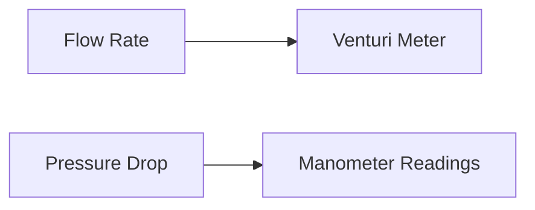

**Fluid Mechanics and Mechanical Operation**
==============================================

**Introduction**
---------------

Fluid mechanics plays a crucial role in chemical engineering, especially in the design of equipment and processes involving fluids. Understanding fluid behavior is essential to optimize efficiency, safety, and environmental sustainability. This theory note covers key concepts, formulas, and problem-solving techniques related to fluid mechanics.

**Core Concepts**
-----------------

### 1. Viscosity

Viscosity ($\mu$) is a measure of a fluid's resistance to flow. It depends on temperature and pressure.

$$ \mu = \frac{F}{A} \times \frac{t}{v} $$

where $F$ is the force applied, $A$ is the cross-sectional area, $t$ is the time, and $v$ is the velocity.

### 2. Density

Density ($\rho$) is defined as mass per unit volume.

$$ \rho = \frac{m}{V} $$

where $m$ is the mass and $V$ is the volume.

### 3. Pressure Drop

Pressure drop occurs when a fluid flows through a pipe or channel with friction losses.

$$ \Delta P = f \times \frac{\rho v^2}{2} \times \frac{L}{D} $$

where $f$ is the friction factor, $\rho$ is the density, $v$ is the velocity, $L$ is the length of the pipe, and $D$ is the diameter.

### 4. Flow Rate

Flow rate ($Q$) is defined as the volume of fluid per unit time.

$$ Q = \frac{V}{t} $$

where $V$ is the volume and $t$ is the time.

### 5. Reynolds Number

Reynolds number ($Re$) characterizes the nature of fluid flow:

$$ Re = \frac{\rho v D}{\mu} $$

where $\rho$ is the density, $v$ is the velocity, $D$ is the diameter, and $\mu$ is the viscosity.

**Key Formulas/Theorems**
-------------------------

### 1. Bernoulli's Equation

Bernoulli's equation relates pressure and velocity:

$$ \frac{P_1}{\rho g} + \frac{v_1^2}{2g} = \frac{P_2}{\rho g} + \frac{v_2^2}{2g} $$

where $P$ is the pressure, $\rho$ is the density, $g$ is the acceleration due to gravity, and $v$ is the velocity.

### 2. Poiseuille's Law

Poiseuille's law describes laminar flow in a pipe:

$$ Q = \frac{\pi \Delta P r^4}{8 \mu L} $$

where $Q$ is the flow rate, $\Delta P$ is the pressure drop, $r$ is the radius, $\mu$ is the viscosity, and $L$ is the length.

### 3. Darcy-Weisbach Equation

Darcy-Weisbach equation relates pressure drop to pipe roughness:

$$ \frac{\Delta P}{L} = f \times \frac{v^2}{2g} $$

where $\Delta P$ is the pressure drop, $L$ is the length, $f$ is the friction factor, and $v$ is the velocity.

**Problem Solving Patterns**
---------------------------

### 1. Venturi Meter

When using a venturi meter to measure flow rate, ensure you:

* Calculate the pressure drop across the venturi.
* Use the discharge coefficient ($C_d$) to correct for losses.
* Apply Bernoulli's equation to relate pressure and velocity.

**Example:**

A venturi meter with a throat diameter of 2 cm measures the flow rate in a pipe of diameter 6 cm. Assuming a discharge coefficient of 0.98, calculate the ratio of manometer readings when the volumetric flow rate is doubled.

**Solution:**

1. Calculate the pressure drop across the venturi using Bernoulli's equation.
2. Use the discharge coefficient to correct for losses.
3. Apply the formula $\frac{\Delta h_2}{\Delta h_1} = \left( \frac{Q_2}{Q_1} \right)^2$.

**Common Pitfalls**
------------------

* Failing to account for losses in flow rate measurements.
* Misinterpreting the relationship between pressure and velocity.
* Ignoring the effect of viscosity on fluid behavior.

**Quick Summary**
----------------

* Viscosity, density, and pressure drop are crucial concepts in fluid mechanics.
* Bernoulli's equation relates pressure and velocity.
* Poiseuille's law describes laminar flow in a pipe.
* Darcy-Weisbach equation relates pressure drop to pipe roughness.

**Additional Resources**

For further reading on fluid mechanics, consult:

* "Fluid Mechanics" by C. T. Crowe
* "Chemical Engineering Fluid Mechanics" by R. K. Bhatt

Note: This theory note is based on the source questions provided and may not be comprehensive. Students are encouraged to supplement their learning with additional resources and practice problems.