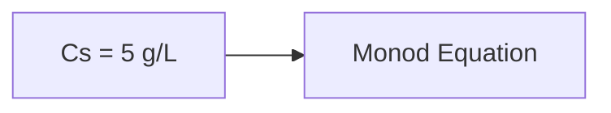

**Monod Kinetics**
================

### Introduction
---------------

Monod kinetics is a mathematical model describing the growth of microorganisms in a chemostat. It relates the specific growth rate of cells to the substrate concentration, assuming that the growth is limited by one substrate. The Monod equation has been widely used to describe microbial growth and can be applied to various biochemical engineering problems.

### Core Concepts
----------------

#### Monod Equation
The Monod equation for specific cell growth rate (μg) as a function of substrate concentration (CS) is given by:

$$\mu_g = \frac{\mu_m C_S}{K_S + C_S}$$

where μm is the maximum specific growth rate and Ks is the half-saturation constant.

#### Parameters
- **Maximum Specific Growth Rate (μm)**: The highest possible specific growth rate of a microorganism in a given environment.
- **Half-Saturation Constant (Ks)**: The substrate concentration at which the specific growth rate is half of its maximum value.

### Key Formulas/Theorems

$$\mu_g = \frac{\mu_m C_S}{K_S + C_S}$$

### Problem Solving Patterns
---------------------------

- **Given a chemostat with cell recycle**: Identify the Monod equation parameters, such as μm and Ks.
- **Determine the specific growth rate (μg)**: Use the Monod equation to relate μg to substrate concentration CS.
- **Assume steady-state operation**: Set the accumulation of cells equal to zero.

### Examples with Solutions
---------------------------

**Example 1:** A chemostat has a feed flow rate of F = 75 L/h and culture volume V = 200 L. The glucose concentration in the feed is Cs0 = 15 g/L. Assuming Monod kinetics with μm = 0.25 h-1 and Ks = 2 g/L, find the specific growth rate (μg) at steady-state operation when the substrate concentration is Cs = 5 g/L.

Solution:

$$\mu_g = \frac{0.25 \times 5}{2 + 5} = \frac{1.25}{7} \approx 0.179 h^{-1}$$

**Example 2:** A chemostat with cell recycle has a feed flow rate of F and culture volume V. The glucose concentration in the feed is Cs0 and the substrate concentration in the effluent is Cs. Assuming Monod kinetics with μm = 0.25 h-1 and Ks = 2 g/L, determine the specific growth rate (μg) at steady-state operation.

Solution:

$$\mu_g = \frac{0.25 C_S}{2 + C_S}$$

### Common Pitfalls
------------------

- **Incorrect units**: Ensure that all parameters are in consistent units.
- **Failure to assume steady-state operation**: Steady-state operation is a crucial assumption in solving Monod kinetics problems.

### Quick Summary
---------------

*   Monod equation: μg = (μm Cs)/(Ks + Cs)
*   Parameters:
    *   μm: Maximum specific growth rate
    *   Ks: Half-saturation constant
*   Steady-state operation is assumed.
*   Use the correct units.

This note covers all theoretical concepts, formulas, and insights required to solve questions related to Monod kinetics. It also highlights common pitfalls that students often encounter when solving such problems.