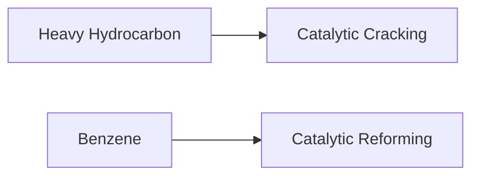

**General Processes in Chemical Technology**
=============================================

### Introduction
-----------------

Chemical technology involves various processes that transform raw materials into valuable chemicals, fuels, and other products. Understanding these processes is crucial for the petroleum/petrochemical industry, where complex reactions are used to convert heavy hydrocarbons into lighter, more useful ones.

### Core Concepts
-------------------

#### Catalytic Hydrocracking

Catalytic hydrocracking is a process that converts heavier hydrocarbons into lighter ones using a catalyst and hydrogen. This process involves breaking down larger molecules into smaller ones, such as gasoline and diesel. The general reaction can be represented by the following equation:

$$\text{Heavy hydrocarbon} + \text{H}_2 \rightarrow \text{Lighter hydrocarbon} + \text{Other product(s)}$$

For example, the cracking of $C_{10}H_{22}$ (a heavy hydrocarbon) into lighter products can be represented as:

$$C_{10}H_{22} + H_2 \rightarrow C_6H_{14} + \text{Other products}$$

#### Catalytic Reforming

Catalytic reforming is a process that converts straight-chain hydrocarbons (alkanes) into aromatics using a catalyst. This process involves dehydrogenation and hydrogen transfer reactions to form benzene, toluene, and other aromatic compounds.

#### Alkylation and Acylation

Alkylation is the process of transferring an alkyl group from one molecule to another. In the petroleum/petrochemical industry, alkylation is often used to manufacture cumene (a precursor for phenol production) by reacting benzene with propylene in the presence of a catalyst.

$$\text{Benzene} + \text{Propylene} \rightarrow \text{Cumene}$$

Acylation, on the other hand, involves transferring an acyl group from one molecule to another. This process is used in the manufacture of vinyl acetate by reacting methane with acetic acid over a palladium catalyst.

### Key Formulas/Theorems
---------------------------

None specifically applicable for this topic. However, understanding the general principles of chemical reactions and stoichiometry is essential.

### Problem Solving Patterns
---------------------------

*   Identify the type of reaction involved (e.g., cracking, reforming, alkylation/acylation).
*   Determine the reactants and products involved in the process.
*   Apply general principles of chemical reactions to solve problems.

### Examples with Solutions
---------------------------

1.  **Catalytic Hydrocracking**

    Consider the following reaction:

    $$\text{C}_6\text{H}_{12}\text{(heavy hydrocarbon)} + \text{H}_2 \rightarrow \text{C}_3\text{H}_8 + \text{CH}_4 + \text{Other products}$$

    Using the general equation for catalytic cracking, determine the products formed.

    **Solution:**

    From the given reaction, we can see that $C_6H_{12}$ is broken down into lighter hydrocarbons. The products are:

    $$\text{C}_3\text{H}_8 + \text{CH}_4 + \text{Other products}$$

    The other products formed may include $CO$, $CO_2$, and unreacted hydrogen.

2.  **Catalytic Reforming**

    Consider the following reaction:

    $$\text{C}_6\text{H}_{14} \rightarrow \text{Benzene} + \text{Toluene}$$

    Using the general principles of catalytic reforming, determine the products formed.

    **Solution:**

    From the given reaction, we can see that $C_6H_{14}$ is converted into benzene and toluene. This process involves dehydrogenation and hydrogen transfer reactions to form aromatic compounds.

### Common Pitfalls
-------------------

*   Failing to identify the type of reaction involved.
*   Misunderstanding the reactants and products in a given process.
*   Not applying general principles of chemical reactions to solve problems.

### Quick Summary
---------------

*   Catalytic hydrocracking: Converts heavy hydrocarbons into lighter ones using a catalyst and hydrogen.
*   Catalytic reforming: Converts straight-chain hydrocarbons into aromatics using a catalyst.
*   Alkylation and acylation: Transfer alkyl/acyl groups from one molecule to another in the presence of a catalyst.

### Mermaid Diagram

This note covers the basic principles and processes involved in general processes in chemical technology, including catalytic hydrocracking, reforming, alkylation, and acylation. The examples provided demonstrate how to apply these principles to solve problems.