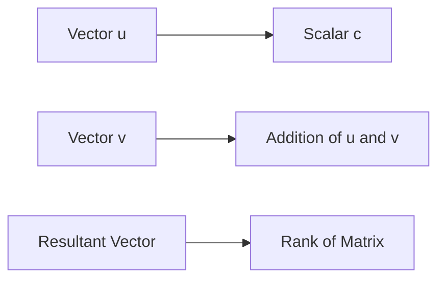

**Vector Operations**
=====================

### Introduction
---------------

In linear algebra and vector analysis, operations on vectors play a crucial role in various engineering applications. This note covers fundamental concepts, key formulas, and problem-solving strategies related to vector operations.

### Core Concepts
-----------------

*   **Vectors**: A vector is an ordered set of numbers that can be used to represent quantities with both magnitude (length) and direction.
*   **Vector Addition**: The sum of two or more vectors is another vector. The resulting vector has a component in each dimension equal to the sum of the corresponding components of the original vectors.
*   **Scalar Multiplication**: A scalar multiple of a vector is obtained by multiplying each component of the vector by the scalar value.

### Key Formulas/Theorems
-------------------------

*   **Vector Addition Formula**: For two vectors $\mathbf{u} = (u_1, u_2, ..., u_n)$ and $\mathbf{v} = (v_1, v_2, ..., v_n)$,
    \[
    \mathbf{u} + \mathbf{v} = \left( u_1 + v_1, u_2 + v_2, ..., u_n + v_n \right)
    \]
*   **Scalar Multiplication Formula**: For a vector $\mathbf{u}$ and scalar $c$,
    \[
    c\mathbf{u} = (cu_1, cu_2, ..., cu_n)
    \]

### Problem Solving Patterns
---------------------------

When solving problems involving vector operations, consider the following patterns:

*   **Check for Linear Independence**: Ensure that vectors are linearly independent before performing operations. If two or more vectors are not linearly independent, you can express one as a combination of the others.
*   **Use Properties of Vector Operations**: Utilize properties such as commutativity and associativity to simplify expressions.

### Examples with Solutions
---------------------------

**Example 1:**

Find $2\mathbf{u} + \mathbf{v}$, given $\mathbf{u} = (3, 5)$ and $\mathbf{v} = (7, -1)$.

Solution:

\[
2\mathbf{u} + \mathbf{v} = 2(3, 5) + (7, -1) = (6, 10) + (7, -1) = (13, 9)
\]

**Example 2:**

Find the rank of the matrix $\begin{bmatrix}
    a & b & c \\
    d & e & f
\end{bmatrix}$.

Solution:

The rank of the matrix is equal to the number of linearly independent rows or columns. Since each row has two distinct elements, the rank is 2.

### Common Pitfalls
-------------------

*   **Misunderstanding Linear Independence**: Failing to recognize when vectors are linearly dependent can lead to incorrect solutions.
*   **Incorrect Application of Vector Operations Properties**: Misusing properties such as commutativity and associativity can result in errors.

### Quick Summary
---------------

*   Vectors: Ordered sets of numbers representing quantities with magnitude and direction.
*   Vector Addition: Sum of two or more vectors is another vector with components equal to the sum of corresponding components.
*   Scalar Multiplication: Multiply each component of a vector by a scalar value.
*   Key Formulas/Theorems:
    *   Vector Addition Formula
    *   Scalar Multiplication Formula

### Mermaid Diagrams
-------------------

Note: The provided Mermaid diagram illustrates the concept of vector addition and scalar multiplication, as well as the connection to matrix rank.