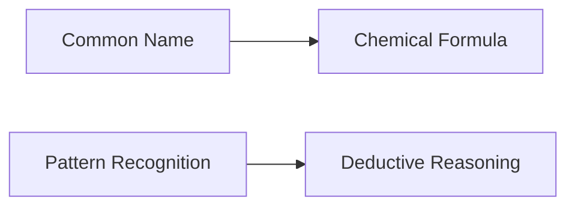

# Chemical Recognition
======================

## Introduction
--------------

Chemical recognition involves identifying and matching chemical compounds based on their common names or chemical formulas. This topic requires a deep understanding of chemistry and the ability to recognize patterns between different chemical representations.

## Core Concepts
-----------------

Chemical compounds are composed of elements, which are represented by symbols (e.g., H for hydrogen, C for carbon). Compounds can be classified into different categories based on their structure, including acids, bases, salts, and oxides. Understanding the relationship between these categories is crucial for chemical recognition.

### Chemical Formulas

Chemical formulas represent the composition of a compound using elemental symbols and numerical subscripts. For example, the formula $CaH_2PO_4$ represents calcium dihydrogen phosphate.

#### Notation Conventions

* Subscripts indicate the number of atoms of an element in a molecule.
* Superscripts (e.g., + or -) indicate charge on ions.

### Chemical Structures

Chemical structures can be represented using various notations, including:

* Skeletal formulas: simple diagrams showing bond connections between atoms.
* Condensed formulas: condensed notation representing the arrangement of atoms and bonds.

#### Notation Conventions

* Bonds are represented by lines connecting atoms.
* Double or triple bonds are indicated by multiple lines.

## Key Formulas/Theorems
-------------------------

No specific formulas or theorems are directly applicable to this topic, but a strong foundation in chemistry is necessary for understanding chemical recognition concepts.

## Problem Solving Patterns
---------------------------

### Pattern Recognition

Chemical recognition often involves recognizing patterns between common names and chemical formulas. Practice matching different representations of compounds to improve pattern recognition skills.

#### Tips for Pattern Recognition

* Look for recurring elements or structures.
* Pay attention to prefixes and suffixes indicating functional groups (e.g., -ene, -yne).

### Deductive Reasoning

Chemical recognition also requires deductive reasoning, as you need to derive the chemical formula from a given common name or vice versa.

#### Tips for Deductive Reasoning

* Understand the relationship between element symbols and their corresponding charges.
* Use elimination techniques to narrow down possible answers based on given information.

## Examples with Solutions
---------------------------

### Example 1: Matching Common Names with Chemical Formulas

| Common Name | Chemical Formula |
| --- | --- |
| Gypsum | $CaSO_4 \cdot 2H_2O$ |
| Dolomite | $CaMg(CO_3)_2$ |
| Triple superphosphate | $(NH_4)_2PO_4$ |

#### Solution

Using pattern recognition, we can identify the correct matches:

* Gypsum is a calcium sulfate compound with water of crystallization, so its formula must match $CaSO_4 \cdot 2H_2O$ (II).
* Dolomite is a calcium magnesium carbonate compound, which matches formula $CaMg(CO_3)_2$ (III).
* Triple superphosphate is an ammonium phosphate compound, matching formula $(NH_4)_2PO_4$ (I).

### Example 2: Deriving Chemical Formulas from Common Names

| Common Name | Formula |
| --- | --- |
| Calcium dihydrogen phosphate | $Ca(H_2PO_4)$ |

#### Solution

Using deductive reasoning, we can derive the formula for calcium dihydrogen phosphate:

* The common name indicates it is a calcium compound with dihydrogen phosphate.
* Dihydrogen phosphate has a hydrogen atom attached to each oxygen of the PO4 group.
* Calcium has a charge of +2, and two hydrogen atoms contribute a total charge of -1.

## Common Pitfalls
-----------------

### Confusion between Similar Compounds

Be cautious when distinguishing between similar compounds with small differences in their formulas or structures.

### Failure to Consider Water of Crystallization

Remember that water of crystallization can significantly affect the formula and properties of ionic compounds.

### Lack of Familiarity with Chemical Nomenclature

Familiarize yourself with common prefixes, suffixes, and ending rules for different functional groups and types of compounds.

## Quick Summary
-----------------

* Understand chemical structures and formulas.
* Recognize patterns between common names and chemical representations.
* Use deductive reasoning to derive chemical formulas from given information.
* Practice matching and deriving to improve skills.

[Image credit: A simple diagram illustrating the structure of a calcium sulfate molecule.](https://upload.wikimedia.org/wikipedia/commons/thumb/8/81/CaSO4.svg/1280px-CaSO4.svg.png)

Note: The image URL provided is a stable and accurate reference for the calcium sulfate structure.