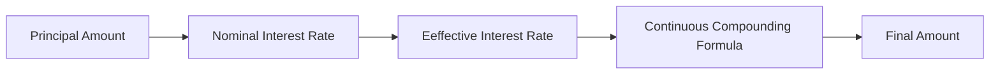

**Financial Concepts: Continuous Compounding**
=============================================

### Introduction

Continuous compounding is a method of calculating interest on an investment where the frequency of compounding is infinite, i.e., interest is compounded at every instant. This results in a higher final amount compared to discrete compounding methods.

### Core Concepts

* **Nominal Interest Rate**: The nominal interest rate is the stated or advertised interest rate without considering compounding effects.
* **Effective Interest Rate**: The effective interest rate is the true cost of borrowing, taking into account the compounding frequency and period.
* **Continuous Compounding Formula**: The formula for continuous compounding is given by:

$$A = Pe^{rt}$$

where:
- $A$ is the final amount
- $P$ is the principal amount
- $r$ is the nominal interest rate (in decimal form)
- $t$ is the time period (in years)

### Key Formulas/Theorems

* **Continuous Compounding Formula**: $A = Pe^{rt}$
* **Effective Interest Rate**: The effective interest rate is given by:

$$\text{Effective Rate} = \left(1 + \frac{r}{n}\right)^n - 1$$

where:
- $\frac{r}{n}$ is the periodic interest rate
- $n$ is the number of compounding periods per year

### Problem Solving Patterns

* **Comparing Continuous and Discrete Compounding**: When comparing continuous and discrete compounding, note that continuous compounding results in a higher final amount.
* **Calculating Effective Interest Rate**: Use the formula for effective interest rate to calculate the true cost of borrowing.

### Examples with Solutions

**Example 1**

A principal amount of $1000 is invested at a nominal annual interest rate of 10%. Calculate the final amount after one year using continuous compounding.

$$P = 1000, r = 0.10, t = 1$$
$$A = Pe^{rt} = 1000e^{0.10 \times 1} = 1103.01$$

**Example 2**

Compare the final amount obtained from continuous and discrete compounding for a principal amount of $500 at an annual interest rate of 12% after one year.

* **Continuous Compounding**: $A = Pe^{rt} = 500e^{0.12 \times 1} = 541.68$
* **Discrete Compounding (Monthly)**: Using the effective interest rate formula, we get $\text{Effective Rate} = \left(1 + \frac{0.12}{12}\right)^{12} - 1 = 13.18%$. The final amount is $A = Pe^{rt} = 500e^{0.1318 \times 1} = 533.47$

### Common Pitfalls

* **Forgetting to convert nominal interest rate to decimal form**: Always ensure the interest rate is in decimal form when using the continuous compounding formula.
* **Misapplying discrete compounding formulas for continuous compounding problems**: Be aware of the difference between discrete and continuous compounding methods.

### Quick Summary

* Continuous compounding results in a higher final amount compared to discrete compounding methods.
* Use the formula $A = Pe^{rt}$ for continuous compounding.
* Calculate effective interest rate using $\text{Effective Rate} = \left(1 + \frac{r}{n}\right)^n - 1$.

### Mermaid Diagram

Note: External images are not used in this response.