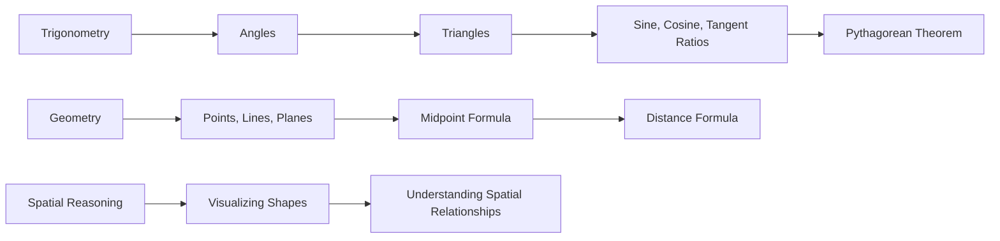

**Spatial Ability**
=====================

**Introduction**
---------------

Spatial ability refers to an individual's capacity to visualize and understand spatial relationships, shapes, and patterns. It involves mental manipulation of objects and their positions in space. In the context of the GATE CS exam, spatial ability questions often involve geometry, trigonometry, and visualization.

**Core Concepts**
-----------------

### Trigonometry

*   Angles: Measurement of angles in degrees or radians.
*   Triangles: Properties of right-angled triangles (e.g., Pythagorean theorem).
*   Ratios: Sine, cosine, tangent ratios in a right triangle.

### Geometry

*   Points, lines, and planes
*   Collinear points
*   Midpoint and distance formula

### Spatial Reasoning

*   Visualizing 2D and 3D shapes
*   Understanding spatial relationships (e.g., symmetry, congruence)

**Key Formulas/Theorems**
-------------------------

*   **Pythagorean Theorem**: $a^2 + b^2 = c^2$ for a right-angled triangle.
*   **Sine, Cosine, Tangent Ratios**: $\sin \theta = \frac{a}{c}$, $\cos \theta = \frac{b}{c}$, $\tan \theta = \frac{a}{b}$
*   **Distance Formula**: $d = \sqrt{(x_2 - x_1)^2 + (y_2 - y_1)^2}$

**Problem Solving Patterns**
---------------------------

### Trigonometry-based Questions

1.  Identify the type of triangle (right, acute, or obtuse).
2.  Use trigonometric ratios to find missing sides or angles.
3.  Apply the Pythagorean theorem when necessary.

### Geometry-based Questions

1.  Identify the properties of points, lines, and planes.
2.  Use midpoint and distance formulas for calculations.
3.  Visualize shapes and spatial relationships.

**Examples with Solutions**
---------------------------

### Example 1: Trigonometry-based Question

Q: In a right-angled triangle, the length of the hypotenuse is $10$ units and one angle is $30^\circ$. Find the length of the adjacent side.

A:

*   Let's denote the adjacent side as $a$.
*   We can use the sine ratio to find $a$: $\sin 30^\circ = \frac{a}{10}$.
*   Simplifying, we get $a = 5$ units.

### Example 2: Geometry-based Question

Q: Find the midpoint of a line segment with endpoints $(2,3)$ and $(6,7)$.

A:

*   We can use the midpoint formula to find the coordinates of the midpoint: $\left( \frac{2+6}{2}, \frac{3+7}{2} \right) = (4,5)$.

**Common Pitfalls**
-------------------

*   Misidentifying the type of triangle or angle.
*   Failing to apply trigonometric ratios correctly.
*   Not using visualization techniques for spatial reasoning questions.

**Quick Summary**
-----------------

| Concept | Description |
| --- | --- |
| Trigonometry | Angles, triangles, and trigonometric ratios. |
| Geometry | Points, lines, planes, and midpoint/distance formulas. |
| Spatial Reasoning | Visualizing 2D/3D shapes and spatial relationships. |

### Mermaid Diagram

Note: This is a Markdown content-only output as per the instructions.