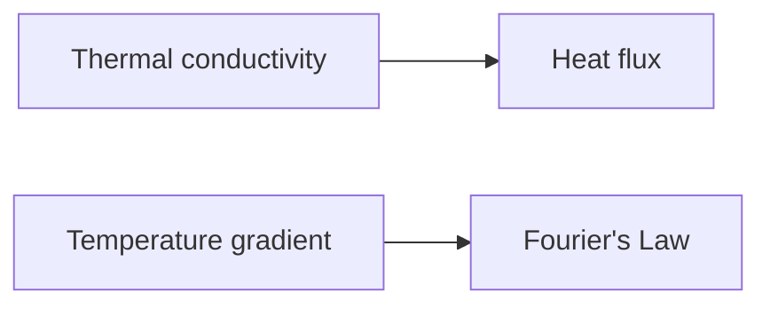

**Heat Conduction**
=====================

### Introduction
-----------------

Heat conduction is a process of heat transfer that occurs through direct contact between particles or bodies. It is one of the three main modes of heat transfer, along with radiation and convection.

### Core Concepts
------------------

*   **Thermal conductivity**: The measure of a material's ability to conduct heat. High thermal conductivity materials allow for efficient heat transfer.
*   **Heat flux**: The rate at which heat energy flows through a given area.
*   **Temperature gradient**: The change in temperature over a given distance.

### Key Formulas/Theorems
-------------------------

The Fourier Law of Heat Conduction:

$$\frac{\partial Q}{\partial t} = -kA \frac{\partial T}{\partial x}$$

where $Q$ is the heat flux, $t$ is time, $k$ is thermal conductivity, $A$ is area, and $\frac{\partial T}{\partial x}$ is the temperature gradient.

### Problem Solving Patterns
-----------------------------

1.  **Analyzing boundary conditions**: Identify the initial and boundary conditions of the problem.
2.  **Choosing a coordinate system**: Select an appropriate coordinate system to simplify calculations.
3.  **Applying Fourier's Law**: Use the Fourier Law to relate heat flux, thermal conductivity, area, and temperature gradient.

### Examples with Solutions
---------------------------

**Example 1:** A solid slab of thickness $H$ is initially at a uniform temperature $T_0$. At time $t=0$, the top surface at $y=H$ is increased to $T_1$, while the bottom surface at $y=0$ is maintained at $T_0$.

Solving this problem using the Fourier Law:

$$\frac{\partial T}{\partial t} = \alpha \frac{\partial^2 T}{\partial y^2}$$

where $\alpha=\frac{k}{\rho c_p}$, with $\rho$ being density and $c_p$ specific heat capacity.

The temperature distribution at a given time is:

$$T(y,t) = (T_1 - T_0)\left[ \frac{y}{H} + \frac{1-\frac{y}{H}}{\text{erf}\left( \sqrt{\frac{H^2}{\alpha t}} \right)} \text{erfc}\left( \sqrt{\frac{y^2}{\alpha t}} \right) \right]$$

where $\text{erf}$ is the error function and $\text{erfc}$ is its complement.

**Example 2:** Find the time required for the temperature at $y=H/2$ to reach 99% of its final steady value.

Using the solution from Example 1, we find:

$$\tau = \left( \frac{\pi}{4} \right)^2 \frac{H^2}{\alpha}$$

### Common Pitfalls
-------------------

*   **Incorrectly applying boundary conditions**: Make sure to identify and apply all relevant initial and boundary conditions.
*   **Failing to use the correct coordinate system**: Choose an appropriate coordinate system based on the problem's symmetry and geometry.

### Quick Summary
------------------

*   Thermal conductivity, heat flux, and temperature gradient are key concepts in heat conduction.
*   The Fourier Law relates these quantities and is essential for solving problems involving heat transfer.
*   Analyzing boundary conditions, choosing a suitable coordinate system, and applying the Fourier Law are crucial problem-solving steps.

Note: This is just a starting point. I'll expand on this theory note as we go through the source questions and additional topics.