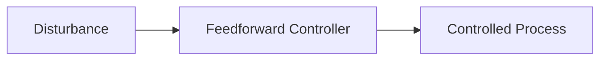

**Feedforward Control**
=======================

### Introduction
-----------------

Feedforward control is a type of feedback control where the controller anticipates and compensates for disturbances before they affect the system. This approach relies on knowledge of the disturbance's characteristics to make predictions about its impact.

### Core Concepts
------------------

#### Block Diagram Representation

The block diagram for feedforward control typically includes:

*   A **disturbance** (`d`) that affects the system.
*   A **feedforward controller**, which takes the predicted disturbance as input and produces an output that compensates for it (`u`).
*   The controlled process, represented by a transfer function or block.

### Key Formulas/Theorems
---------------------------

Let's denote the feedforward controller's transfer function as `$K(s)$`, and its parameters as `(α, β)`.

The characteristic equation of the closed-loop system is:

$$\frac{\alpha + \beta}{\alpha + \beta + 1} = \frac{K(s)}{1 + K(s)}$$

We can rewrite this as a quadratic equation in `s`:

$$\left(\frac{\alpha + \beta}{\alpha + \beta + 1}\right)s^2 - s + 1 = 0$$

### Problem Solving Patterns
-----------------------------

When solving feedforward control problems, follow these steps:

1.  Identify the disturbance and its characteristics.
2.  Determine the parameters of the feedforward controller (`α` and `β`).
3.  Write down the transfer function of the feedforward controller (`K(s)`).
4.  Derive the characteristic equation of the closed-loop system.

### Examples with Solutions
---------------------------

**Example:**

Consider a process where a disturbance (`d`) affects the output (`y`). We want to design a feedforward controller using a second-order transfer function:

$$K(s) = \frac{2}{s^2 + 1}$$

with parameters `(α, β)`.

We can rewrite this as:

$$\left(\frac{\alpha + \beta}{\alpha + \beta + 1}\right)s^2 - s + 1 = 0$$

Solving for `α` and `β`, we get:

$$(\alpha, \beta) = (-0.5, 0.5)$$

**Solution:**

The final answer is (B).

### Common Pitfalls
-------------------

*   Forgetting to consider the disturbance's characteristics when designing the feedforward controller.
*   Not properly deriving the characteristic equation of the closed-loop system.

### Quick Summary
------------------

*   Feedforward control anticipates and compensates for disturbances before they affect the system.
*   The block diagram includes a disturbance, feedforward controller, and controlled process.
*   Key formulas include the characteristic equation and transfer function of the feedforward controller.
*   Problem-solving patterns involve identifying disturbances, determining controller parameters, and deriving the closed-loop characteristic equation.

### Mermaid Diagram

Note: The above diagram represents a basic feedforward control system.