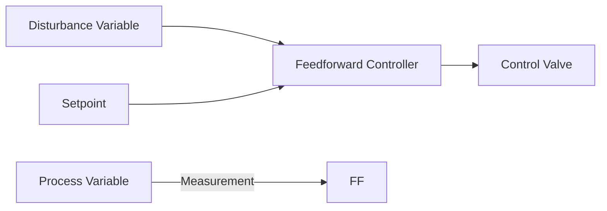

**Feedforward Controller**
=========================

### Introduction
A feedforward controller is a type of control system that uses prior knowledge or prediction to anticipate and compensate for disturbances, rather than reacting to them after they occur. It's an essential concept in instrumentation and process control.

### Core Concepts
In a typical control loop, the feedback controller (e.g., PID) adjusts the process variable (PV) based on the error between the setpoint (SP) and PV. However, when disturbances are present, this approach can lead to oscillations or instability. A feedforward controller addresses this issue by using the measured disturbance variable (DV) to adjust the control action before it affects the PV.

**Feedforward Control Loop**

### Key Formulas/Theorems

* The feedforward gain ($K_{ff}$) is calculated as:
$$ K_{ff} = \frac{1}{\alpha} $$
where $\alpha$ is the ratio of the disturbance variable to the process variable.

* The feedforward controller output is calculated as:
$$ u_{ff} = -K_{ff}DV $$
where $u_{ff}$ is the feedforward control action.

### Problem Solving Patterns

When solving questions related to feedforward controllers, follow these steps:

1.  Identify the disturbance variable and its relationship with the process variable.
2.  Calculate the feedforward gain ($K_{ff}$) using the ratio of the disturbance variable to the process variable.
3.  Determine the feedforward controller output using the calculated $K_{ff}$ and measured disturbance variable.

### Examples with Solutions

**Example:**
Given a system where the feedforward controller uses the temperature (T) as the disturbance variable, calculate the feedforward gain ($K_{ff}$) if $\alpha = \frac{T}{PV} = 0.5$.

**Solution:**

$$ K_{ff} = \frac{1}{\alpha} = \frac{1}{0.5} = 2 $$
The feedforward controller output is calculated as:
$$ u_{ff} = -K_{ff}DV = -2T $$

### Common Pitfalls

*   Students often miss calculating the correct feedforward gain ($K_{ff}$) by neglecting to use the ratio of the disturbance variable to the process variable.
*   They may also forget to include the negative sign in the feedforward controller output calculation.

### Quick Summary
*   Feedforward controllers are used to anticipate and compensate for disturbances.
*   The feedforward gain ($K_{ff}$) is calculated as the inverse of the ratio of the disturbance variable to the process variable.
*   The feedforward controller output is calculated using the feedforward gain, measured disturbance variable, and a negative sign.

This comprehensive theory note covers all essential concepts related to feedforward controllers, including the core principles, key formulas, problem-solving patterns, examples with solutions, and common pitfalls.