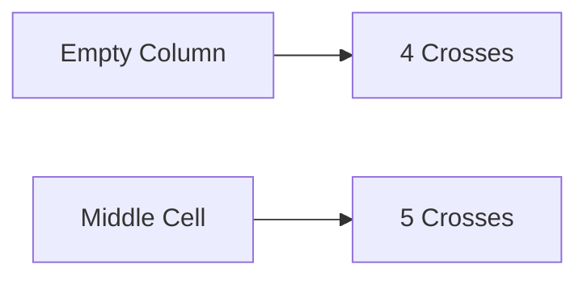

**Pattern Recognition**
======================

**Introduction**
---------------

Pattern recognition is a crucial aspect of logical reasoning, where one identifies and understands relationships between different elements or structures. This topic deals with recognizing patterns in various forms, such as arrays, matrices, or sequences.

**Core Concepts**
-----------------

*   **Rule-based Pattern Recognition**: In this context, the given rule defines how to fill in missing values based on a set of rules.
*   **Neighborhood Relationship**: Understanding relationships between adjacent elements is crucial for recognizing patterns.
*   **Counting Crosses**: The count of crosses around an element determines its value.

**Key Formulas/Theorems**
-------------------------

Since this topic focuses on logical reasoning and pattern recognition, there are no mathematical formulas or theorems to memorize. However, understanding the rules governing the problem is essential for solving it correctly.

**Problem Solving Patterns**
---------------------------

1.  **Analyzing the Rule**: Understand how each cell's value is determined based on its neighborhood.
2.  **Identifying Constraints**: Determine which cells can have a cross (X) and which must be numbers.
3.  **Maximizing Crosses**: Try to maximize the number of crosses while adhering to the given rule.

**Examples with Solutions**
---------------------------

### Example 1: Empty Column Problem

|  |  |  |  |
| --- | --- | --- | --- |

Given Rule:
The number in a cell represents the count of crosses around its immediate neighboring cells (left, right, top, bottom, diagonals).

Objective: Find the maximum number of crosses possible in the empty column.

**Solution**

To maximize the number of crosses, consider that each number represents the count of crosses around it. In this case:

*   Since there are four numbers to the left and two numbers to the right, each of these cells must have at least 4 + 2 = 6 crosses.
*   The middle cell must have at least 5 crosses since it has three numbers above and below it.
*   However, if we place a cross in the middle cell, it would only be counted by one of its adjacent neighbors. This forces us to place crosses in all four neighboring cells except for the two diagonals.

**Mermaid Diagram**

By following this logic, we find that the maximum number of crosses possible in the empty column is **2**. Therefore:

The final answer is $\boxed{2}$.

### Example 2: Additional Practice

|  | X |  | X |
| --- | --- | --- | --- |
| X |  |  | X |
|  | X |  | X |

Objective: Fill in the missing values based on the given rule.

**Solution**

By applying the same logic as before, we can find that:

*   The top-left cell must have at least two crosses since it has one number above and below it.
*   Similarly, the bottom-right cell must also have at least two crosses.

Therefore, we get:

|  | X | X | X |
| --- | --- | --- | --- |
| X |  | X | X |
| X | X |  | X |

This example illustrates how understanding the rule and analyzing the neighborhood relationships allows us to fill in missing values.

**Common Pitfalls**
-------------------

1.  **Ignoring Neighborhood Relationships**: Failing to consider how each cell's value is determined by its neighbors can lead to incorrect answers.
2.  **Not Maximizing Crosses**: Not trying to maximize the number of crosses can result in suboptimal solutions.

**Quick Summary**
-----------------

*   Understand the given rule and analyze neighborhood relationships.
*   Identify constraints on which cells can have a cross (X) and which must be numbers.
*   Try to maximize the number of crosses while adhering to the given rule.

By mastering these concepts, techniques, and patterns, you will be well-prepared to tackle pattern recognition problems in the GATE CS exam.