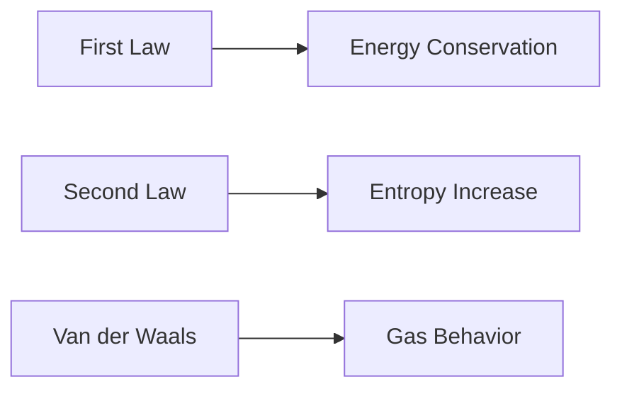

**First and Second Laws of Thermodynamics**
=====================================

### Introduction

The first and second laws of thermodynamics are fundamental principles that describe the relationships between heat, work, and energy. These laws have far-reaching implications in various fields, including engineering, chemistry, and physics.

### Core Concepts

#### First Law of Thermodynamics (Law of Energy Conservation)

The first law states that energy cannot be created or destroyed, only converted from one form to another. Mathematically, this is represented as:

$$\Delta E = Q - W$$

where $\Delta E$ is the change in energy, $Q$ is the heat added to the system, and $W$ is the work done by the system.

#### Second Law of Thermodynamics (Entropy)

The second law states that the total entropy of an isolated system always increases over time. Entropy is a measure of disorder or randomness. Mathematically, this is represented as:

$$\Delta S = \frac{Q}{T}$$

where $\Delta S$ is the change in entropy, $Q$ is the heat added to the system, and $T$ is the temperature.

#### Van der Waals Equation of State

The van der Waals equation is a thermodynamic equation that takes into account the effects of molecular volume and intermolecular forces on the behavior of gases. It is given by:

$$\left(P + \frac{a}{v^2}\right)\left(v - b\right) = RT$$

where $P$ is the pressure, $V$ is the molar volume, $R$ is the gas constant, and $T$ is the temperature.

### Key Formulas/Theorems

* First Law of Thermodynamics: $\Delta E = Q - W$
* Second Law of Thermodynamics: $\Delta S = \frac{Q}{T}$
* Van der Waals Equation of State: $\left(P + \frac{a}{v^2}\right)\left(v - b\right) = RT$

### Problem Solving Patterns

When solving problems involving the first and second laws of thermodynamics, follow these steps:

1. Identify the system and its boundaries.
2. Determine the energy transfers (heat, work) and their directions.
3. Apply the first law to calculate the change in energy.
4. Apply the second law to calculate the change in entropy.
5. Use the van der Waals equation of state as needed.

### Examples with Solutions

**Example 1:**

A gas is compressed from $v_1$ to $v_2$. The work done by the system is given by:

$$W = -nRT\ln\left(\frac{v_2}{v_1}\right)$$

where $n$ is the number of moles, $R$ is the gas constant, and $T$ is the temperature.

**Solution:**

Using the first law, we can calculate the change in energy:

$$\Delta E = Q - W$$

Since there is no heat transfer, $Q=0$. Therefore,

$$\Delta E = -W = nRT\ln\left(\frac{v_1}{v_2}\right)$$

**Example 2:**

A gas expands from $v_1$ to $v_2$. The temperature of the gas remains constant. Using the van der Waals equation of state, we can calculate the compressibility factor:

$$z = \frac{PV}{RT}$$

where $P$ is the pressure, $V$ is the molar volume, and $R$ is the gas constant.

**Solution:**

Using the van der Waals equation of state, we can rewrite the compressibility factor as:

$$z = 1 + \frac{a}{RTv^2} - \frac{b}{v}$$

Since the temperature remains constant, we can substitute $T$ with a constant value.

### Common Pitfalls

* Failing to account for all energy transfers (heat, work).
* Misapplying the first and second laws of thermodynamics.
* Not using the correct units for calculations.

### Quick Summary

* First Law of Thermodynamics: Energy cannot be created or destroyed, only converted from one form to another.
* Second Law of Thermodynamics: Total entropy always increases over time.
* Van der Waals Equation of State: Takes into account molecular volume and intermolecular forces on gas behavior.

**Mermaid Diagram**

Note: This is just a basic structure, and you can add more details as needed.