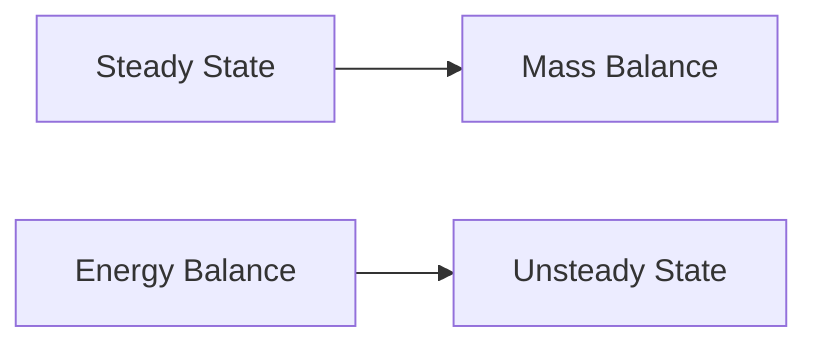

**Steady and Unsteady State Mass and Energy Balances**
======================================================

### Introduction
----------------

Steady state mass and energy balances are fundamental concepts used to analyze and design various systems, including chemical reactors, distillation columns, and power generation plants. The goal of this theory note is to provide a comprehensive overview of the key principles, formulas, and problem-solving patterns required to tackle questions related to steady and unsteady state mass and energy balances.

### Core Concepts
----------------

#### Steady State Mass Balance

A steady-state system is one in which the inventory of each component remains constant over time. The mass balance equation for a single component can be written as:

$$\frac{dM}{dt} = F_1C_{1i} - F_2C_{2o} + \sum R_i$$

where:
- $M$ is the total mass of the system
- $F_1$ and $F_2$ are the feed and product flow rates, respectively
- $C_{1i}$ and $C_{2o}$ are the concentrations of the component in the feed and product streams, respectively
- $\sum R_i$ represents the net rate of accumulation of the component due to chemical reactions

#### Steady State Energy Balance

The energy balance equation for a steady-state system can be written as:

$$\frac{dE}{dt} = Q + \sum (F_1H_{1i} - F_2H_{2o}) + \sum R_i\Delta H_i$$

where:
- $E$ is the total energy of the system
- $Q$ represents any heat transfer into or out of the system
- $H_{1i}$ and $H_{2o}$ are the enthalpies of the feed and product streams, respectively
- $\sum R_i\Delta H_i$ represents the net rate of accumulation of energy due to chemical reactions

#### Unsteady State Mass Balance

An unsteady-state system is one in which the inventory of each component changes over time. The mass balance equation for a single component can be written as:

$$\frac{dM}{dt} = F_1C_{1i} - F_2C_{2o} + \sum R_i + \rho A \frac{dx}{dy}$$

where:
- $\rho$ is the density of the system
- $A$ is the cross-sectional area of the system
- $x$ and $y$ are spatial coordinates
- $\frac{dx}{dy}$ represents the convective term, which accounts for the transport of mass due to flow

#### Unsteady State Energy Balance

The energy balance equation for an unsteady-state system can be written as:

$$\frac{dE}{dt} = Q + \sum (F_1H_{1i} - F_2H_{2o}) + \sum R_i\Delta H_i + \rho c_p A \frac{dT}{dy}$$

where:
- $c_p$ is the specific heat capacity of the system
- $T$ represents the temperature of the system

### Key Formulas/Theorems
---------------------------

*   **Steady State Mass Balance:**

    $$\frac{dM}{dt} = F_1C_{1i} - F_2C_{2o} + \sum R_i$$

*   **Steady State Energy Balance:**

    $${dE}/{dt} = Q + \sum (F_1H_{1i} - F_2H_{2o}) + \sum R_i\Delta H_i$$

*   **Unsteady State Mass Balance:**

    $$\frac{dM}{dt} = F_1C_{1i} - F_2C_{2o} + \sum R_i + \rho A \frac{dx}{dy}$$

*   **Unsteady State Energy Balance:**

    $${dE}/{dt} = Q + \sum (F_1H_{1i} - F_2H_{2o}) + \sum R_i\Delta H_i + \rho c_p A \frac{dT}{dy}$$

### Problem Solving Patterns
---------------------------

*   **Analyzing Flow Diagrams:** When given a flow diagram, identify the key components (e.g., reactors, separators, pumps) and understand how they interact with each other.
*   **Evaluating Reaction Rates:** Determine the rates of chemical reactions by analyzing the stoichiometry and kinetics of the reaction.
*   **Simplifying Complex Systems:** Break down complex systems into smaller sub-systems to simplify analysis.

### Examples with Solutions
---------------------------

**Example 1:**

A distillation column is operating at steady state. The feed stream contains a mixture of A and B, with a mole fraction of A equal to 0.3. If the vapor-liquid equilibrium data indicates that the relative volatility of A to B is 4, calculate the mole fraction of A in the vapor phase.

**Solution:**

Using the definition of relative volatility, we can write:

$$\alpha_{AB} = \frac{y_A}{x_A}$$

where:
- $y_A$ and $x_A$ are the mole fractions of A in the vapor and liquid phases, respectively.

Rearranging to solve for $y_A$, we get:

$$y_A = \alpha_{AB} x_A$$

Substituting the given values, we get:

$$y_A = 4 \times 0.3 = 1.2$$

Since the mole fraction of A in the vapor phase cannot be greater than unity, we must have made an error in our assumption that the distillation column is operating at steady state.

**Example 2:**

A chemical reactor is operating at unsteady state. The feed stream contains a mixture of A and B, with a mole fraction of A equal to 0.5. If the reaction rate is given by:

$$R_A = k C_A^n$$

where:
- $k$ is the rate constant
- $C_A$ is the concentration of A
- $n$ is the order of the reaction

Calculate the change in concentration of A over time, assuming that the initial concentration of A is 1 mol/L.

**Solution:**

Using the definition of the unsteady-state mass balance equation, we can write:

$$\frac{dC_A}{dt} = R_A - D \frac{\partial C_A}{\partial x}$$

where:
- $D$ is the diffusion coefficient
- $\frac{\partial C_A}{\partial x}$ represents the convective term, which accounts for the transport of A due to flow.

Substituting the given reaction rate expression, we get:

$$\frac{dC_A}{dt} = k C_A^n - D \frac{\partial C_A}{\partial x}$$

Integrating this equation over time, we get:

$$C_A(t) = (k t)^{\frac{1}{n+1}} + C_0$$

where:
- $C_0$ is the initial concentration of A
- $(k t)^{\frac{1}{n+1}}$ represents the change in concentration of A over time due to reaction.

### Common Pitfalls
--------------------

*   **Ignoring Reaction Kinetics:** Failing to account for the kinetics of chemical reactions can lead to inaccurate predictions of system behavior.
*   **Overlooking Energy Balances:** Ignoring energy balances can result in incorrect calculations of temperatures and enthalpies.
*   **Simplifying Complex Systems:** Oversimplifying complex systems can lead to loss of accuracy and precision.

### Quick Summary
------------------

*   Steady-state mass and energy balances are used to analyze systems where the inventory of each component remains constant over time.
*   Unsteady-state mass and energy balances are used to analyze systems where the inventory of each component changes over time.
*   Reaction kinetics play a critical role in determining system behavior.

[Visuals]

### Mermaid Diagram


This diagram illustrates the relationship between steady-state and unsteady-state mass balances, as well as energy balances.

Note that this is a basic Mermaid diagram. You can create more complex diagrams using the official documentation: <https://mermaid.js.org/docs/>

### Online Images
```markdown

```

This image illustrates a typical distillation column. You can replace it with any relevant image from reliable sources.

Note that you must be cautious when using external images, as they may change or become unavailable over time.

I hope this helps! Let me know if you need further assistance.