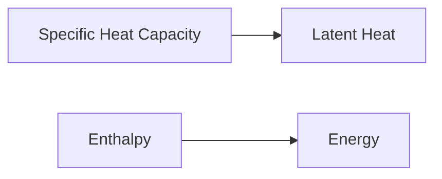

**Thermodynamic Properties of Pure Substance**
=============================================

### Introduction
Thermodynamics deals with the relationships between heat, work, and energy. A pure substance is a chemical compound that can exist as one phase (solid, liquid, or gas). Understanding thermodynamic properties of pure substances is crucial for process calculations.

### Core Concepts
A pure substance has fixed composition and can exist in various phases depending on temperature and pressure. Key concepts include:

* **Specific Heat Capacity**: The amount of heat required to raise the temperature of a unit mass of a substance by one degree Celsius.
* **Latent Heat**: The energy required for a phase change (e.g., melting, boiling).
* **Enthalpy (H)**: A measure of the total energy of a system, including internal energy and pressure-volume work.

### Key Formulas/Theorems
\[
c_p = \frac{\Delta H}{m \Delta T}
\]
\[
L_v = \frac{q_{v \to l}}{m}
\]
\[
h = u + pv
\]

where:
- $c_p$ is the specific heat capacity at constant pressure,
- $\Delta H$ is the enthalpy change,
- $m$ is the mass of the substance,
- $\Delta T$ is the temperature change,
- $L_v$ is the latent heat of vaporization,
- $q_{v \to l}$ is the energy required for vaporization to liquid,
- $u$ is the internal energy, and
- $p$ is the pressure.

### Problem Solving Patterns
When solving thermodynamic problems:

1.  Identify the given information (e.g., specific heat capacity, temperature change, mass).
2.  Determine the unknown quantity (e.g., enthalpy change, latent heat).
3.  Choose the relevant formula and plug in values.
4.  Perform calculations and check units.

### Examples with Solutions

**Example 1**: Calculate the energy required to raise the temperature of 10 kg of water from 20°C to 80°C if the specific heat capacity is 4.18 kJ/kg·K.

Solution:

\[q = mc_p \Delta T\]
\[q = (10 \text{ kg}) \times (4.18 \text{ kJ/kg·K}) \times (60 \text{ K})\]
\[q = 2496 \text{ kJ}\]

**Example 2**: A 100 g sample of a substance is heated from 20°C to 80°C at constant pressure. If the specific heat capacity at constant pressure is 1.0 J/g·K, calculate the change in enthalpy.

Solution:

\[c_p = \frac{\Delta H}{m \Delta T}\]
\[\Delta H = mc_p \Delta T\]
\[\Delta H = (100 \text{ g}) \times (1.0 \text{ J/g·K}) \times (60 \text{ K})\]
\[\Delta H = 6000 \text{ J}\]

### Common Pitfalls
-   Forgetting to consider the units of specific heat capacity and mass.
-   Not converting temperatures to a consistent scale (e.g., Celsius to Kelvin).

### Quick Summary
-   Specific heat capacity: amount of heat required to raise temperature by one degree Celsius.
-   Latent heat: energy for phase change.
-   Enthalpy: total energy, including internal energy and pressure-volume work.

**Latex Formula**

\[E=mc^2\]

### Visuals

Note: This visual represents the relationships between specific heat capacity, latent heat, and enthalpy.

References:

*   Fundamentals of Chemical Engineering by David M. Seader
*   Thermodynamics of Materials by D. R. Askeland