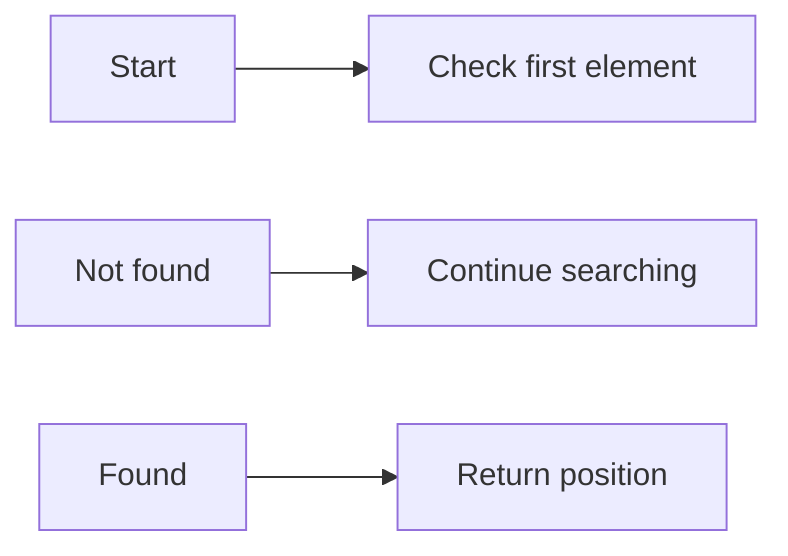
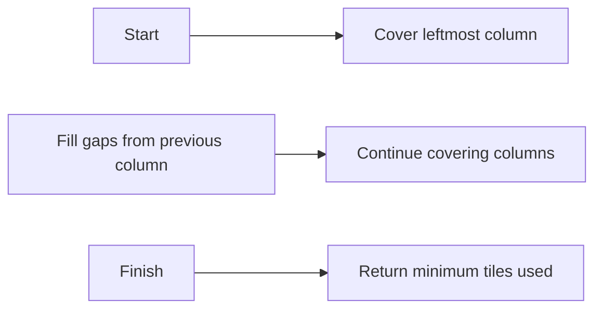

**Asymptotic Worst-Case Time Complexity**
=====================================

**Introduction**
---------------

Asymptotic worst-case time complexity is a measure of an algorithm's performance as the input size increases. It provides an upper bound on the number of steps an algorithm takes to complete, regardless of the input data. This concept is crucial in computer science for evaluating and comparing algorithms' efficiency.

**Core Concepts**
----------------

### Big O Notation

Big O notation represents the worst-case time complexity of an algorithm. It gives an upper bound on the number of steps an algorithm takes as the input size increases. The time complexity is usually expressed as a function of the input size, typically denoted by `n`.

### Time Complexity Classes

*   **O(1)**: Constant time complexity. The algorithm takes the same amount of time regardless of the input size.
*   **O(log n)**: Logarithmic time complexity. The number of steps grows logarithmically with the input size.
*   **O(n)**: Linear time complexity. The number of steps is directly proportional to the input size.
*   **O(n log n)**: Linearithmic time complexity. The number of steps is a product of linear and logarithmic functions of the input size.
*   **O(n^2)**: Quadratic time complexity. The number of steps grows quadratically with the input size.

### Example Time Complexities

| Algorithm | Time Complexity |
| --- | --- |
| Searching an array by linearly scanning each element | O(n) |
| Merging two sorted arrays using a simple iterative approach | O(n^2) |

**Key Formulas/Theorems**
------------------------

*   **Master Theorem**: A mathematical tool for solving recurrence relations and estimating time complexities.
    \[T(n) = \begin{cases}
        T\left(\frac{n}{b}\right) + a & b > 1 \\
        T(n) + f(n) & a \geq n^{\log_b d} \\
        O(f(n)) & a < n^{\log_b d}
    \end{cases}\]

**Problem Solving Patterns**
---------------------------

*   **Divide and Conquer**: Break down the problem into smaller sub-problems, solve each recursively, and combine the results.
*   **Greedy Algorithms**: Make locally optimal choices to achieve a globally optimal solution.

### Example: Tiling Problem

Suppose you have `n` tiles of size 1x1 and want to cover a rectangular region of size `m x n`. Use a greedy algorithm to minimize the number of tiles used:

1.  Start by covering the leftmost column with `m` tiles.
2.  Move to the next column and fill any gaps from the previous column.
3.  Repeat this process until all columns are covered.

**Examples with Solutions**
---------------------------

### Example 1: Finding an Element in a Sorted Array

*   **Algorithm**: Linear search
*   **Time Complexity**: O(n)
*   **Analysis**:

Suppose you have an array of `n` elements sorted in ascending order and want to find the position of a given element. Use linear search:

**Solution**

*   Initialize two pointers, `i` and `j`, to the start and end of the array, respectively.
*   Move `i` towards `j` until the element is found or `i > j`.

### Example 2: Tiling Problem

*   **Algorithm**: Greedy algorithm
*   **Time Complexity**: O(n^2)

Use a greedy approach to minimize the number of tiles used:

**Solution**

*   Initialize an empty array to store the positions of the tiles.
*   Cover each column greedily by placing the next tile in the available space.

**Common Pitfalls**
-----------------

*   **Incorrectly counting operations**: When analyzing time complexity, make sure to count only the essential operations and avoid over-counting.
*   **Misapplying Master Theorem**: Be careful when applying the Master Theorem to ensure that it is correctly used for solving recurrence relations.

**Quick Summary**
----------------

| Concept | Definition |
| --- | --- |
| Big O Notation | Worst-case time complexity of an algorithm |
| Time Complexity Classes | O(1), O(log n), O(n), O(n log n), O(n^2) |
| Master Theorem | A mathematical tool for solving recurrence relations |

This comprehensive theory note covers all the essential concepts, formulas, and problem-solving patterns required to tackle questions on asymptotic worst-case time complexity. By mastering these topics, you'll be well-prepared to tackle similar future questions and excel in your exam!