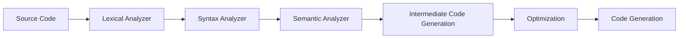

# Compilation Phase
======================

## Introduction
---------------

The compilation phase is a crucial step in the translation of source code into machine-executable code. It involves analyzing and transforming the source code into an intermediate form that can be understood by the computer's processor.

## Core Concepts
-----------------

### Phases of Compiler Design
A typical 7-phase compiler design includes:

1. **Preprocessing**: Expansion of macros, inclusion of header files, etc.
2. **Lexical Analysis (Scanner)**: Breaking the source code into individual tokens.
3. **Syntax Analysis (Parser)**: Verifying the syntax of the tokens.
4. **Semantic Analysis**: Checking the meaning and consistency of the program.
5. **Intermediate Code Generation**: Generating intermediate code from the parse tree.
6. **Optimization**: Improving the performance of the generated code.
7. **Code Generation**: Translating the intermediate code into machine-executable code.

### Errors in Compilation Phase
Errors can occur during any phase of compilation. In the context of the given ANSI C program, an error will be thrown by a phase that checks for consistency and correctness of the input data.

## Key Formulas/Theorems
---------------------------

No specific formulas or theorems are applicable to this topic.

## Problem Solving Patterns
---------------------------

### Pattern 1: Identifying Error-Throwing Phase

*   Analyze the source code for any syntax errors.
*   Check if there are any inconsistencies in data types or operations.
*   Identify which phase is responsible for catching such errors.

### Example

Consider the following ANSI C program:
```c
int main() {
  Integer x;
  Return 0;
}
```

*   Identify the syntax error: The `Return` keyword should be spelled as `return`.
*   Analyze the data type of variable `x`: It is declared as an integer, but it is not initialized.
*   Determine which phase will throw an error for such inconsistencies.

## Examples with Solutions
---------------------------

### Example 1

*   Source Code:
    ```c
int main() {
  int x;
  x = "hello";
  return 0;
}
```
*   Error Thrown: Semantic Analyzer (checking for consistent data types)
*   Reason: The expression `"hello"` is a string literal, which cannot be assigned to an integer variable `x`.

### Example 2

*   Source Code:
    ```c
int main() {
  int x;
  y = 5; // undeclared variable
  return 0;
}
```
*   Error Thrown: Syntax Analyzer (checking for syntax errors)
*   Reason: The variable `y` is not declared before it is used.

## Common Pitfalls
-------------------

*   Confusing the roles of different phases in compilation.
*   Overlooking inconsistencies in data types or operations.
*   Failing to identify syntax errors.

## Quick Summary
---------------

| Phase | Description |
| --- | --- |
| Lexical Analyzer | Breaking source code into tokens. |
| Syntax Analyzer | Verifying syntax of tokens. |
| Semantic Analyzer | Checking meaning and consistency of program. |
| Machine Dependent Optimizer | Improving performance of generated code. |

Visuals:


Note: The Mermaid diagram above illustrates the flow of compilation phases. Each phase receives input from the previous one and produces output for the next one.