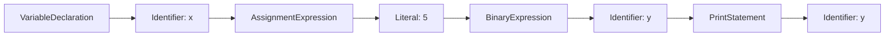

**Intermediate Code Generation**
=============================

**Introduction**
---------------

Intermediate code generation is a crucial step in compiler design, where the source program is translated into an intermediate representation (IR) that can be executed by a machine or further optimized. This process involves analyzing the source code, applying transformations, and generating IR that captures the essence of the original program.

**Core Concepts**
-----------------

### 1. Intermediate Representation

An intermediate representation is an abstract syntax tree (AST) that represents the source program in a platform-independent format. It serves as a bridge between the high-level source code and the machine code.

### 2. Code Generation

Code generation involves translating the IR into machine-specific code, which can be executed directly by the computer.

**Key Formulas/Theorems**
-------------------------

None

**Problem Solving Patterns**
---------------------------

1. **Identify IR types**: Determine whether a given representation is an intermediate representation of the source program.
2. **AST analysis**: Analyze the abstract syntax tree to identify its structure and contents.
3. **Code generation**: Translate the IR into machine-specific code.

**Examples with Solutions**
---------------------------

### Q1: cs_2021-N_42

In the context of compilers, which of the following is/are NOT an intermediate representation of the source program?

(A) 3 Address code
(B) Symbol Table
(C) Control Flow Graph
(D) Abstract Syntax Tree

**Solution**

To solve this question, identify IR types:

* 3 Address code: **IR**
* Symbol Table: **Not IR** (maintains information about variables)
* Control Flow Graph: **IR**
* Abstract Syntax Tree: **IR**

The correct answer is (B).

### Additional Example

Consider the following source code:
```python
x = 5
y = x + 3
print(y)
```
Generate an intermediate representation in the form of an AST:


This AST represents the source program in a platform-independent format.

**Common Pitfalls**
-------------------

1. **Misidentifying IR types**: Confusing intermediate representations with other data structures, such as symbol tables or control flow graphs.
2. **Failing to analyze AST structure**: Not examining the abstract syntax tree's contents and structure when evaluating its correctness.

**Quick Summary**
-----------------

* Intermediate code generation: translating source program into IR
* IR types:
	+ 3 Address code
	+ Control Flow Graph
	+ Abstract Syntax Tree
* Symbol Table: not an IR (maintains variable information)
* Code generation: translating IR into machine-specific code

Note that this is a high-yield summary, and it's recommended to review the entire theory note for comprehensive coverage.