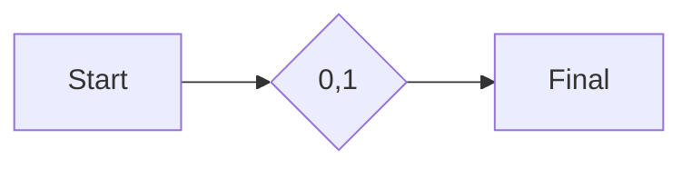
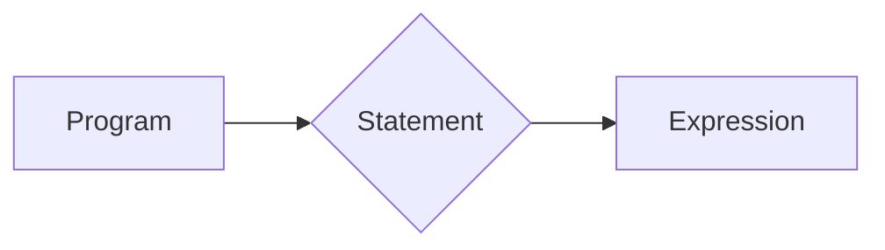
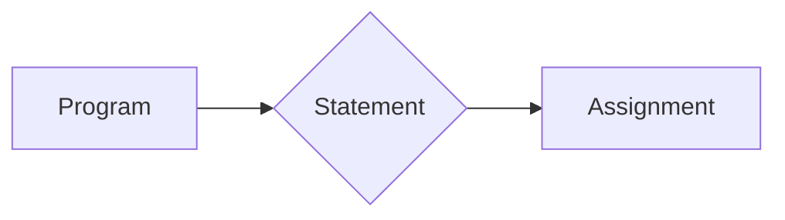

**Lexical Analysis and Parsing**
=====================================

**Introduction**
---------------

Lexical analysis and parsing are crucial components of compiler design, responsible for breaking down high-level programming languages into machine-readable instructions. Lexical analysis involves scanning source code to identify individual tokens, while parsing involves analyzing these tokens to ensure they adhere to the language's syntax.

**Core Concepts**
-----------------

### 1. Lexical Analysis

Lexical analysis is the process of tokenizing input text into a series of symbols or lexemes. It is typically performed using a set of rules defined in a lexer (also known as a scanner).

#### Types of Tokens

*   **Keyword**: A reserved word with special meaning, such as `if`, `else`, etc.
*   **Identifier**: A sequence of characters that identifies a variable, function, or label.
*   **Literal**: A constant value, such as an integer or floating-point number.

### 2. Regular Expressions (R.E.)

Regular expressions are used to describe sets of strings using a formal language. They are often employed in lexical analysis for pattern matching.

#### Example: DFA with R.E.



The regular expression $0^{*}1^{*}$ is equivalent to the above DFA. This DFA accepts strings consisting of 0s and/or 1s, but must start with a 1.

### 3. Parsing

Parsing involves analyzing the output from lexical analysis to identify syntactic structures in the source code. There are two main types of parsing:

#### Top-Down Parsing

Top-down parsing starts with the overall structure of the program and breaks it down into smaller components.



#### Bottom-Up Parsing

Bottom-up parsing begins with individual tokens and builds up to the overall structure of the program.

### 4. Context-Free Grammars (CFG)

A CFG is a set of production rules that define the syntax of a programming language.

```mermaid
graph LR;
    S --> NP VP;
    NP --> Det N;
```

**Key Formulas/Theorems**
-------------------------

*   **Pumping Lemma**: For any regular language L, there exists an integer p (the pumping length) such that for all strings w in L with |w| ≥ p, there exist u, v, x, y, and z such that:
    $w = uv^ixyv^jz$
    where:
    *   |v| ≥ 1
    *   |xy| ≥ 1
    *   For all integers i ≥ 0,
        $(uv^i) \in L$

**Problem Solving Patterns**
---------------------------

### 1. Tokenization

Tokenize input text into a series of tokens.

### 2. Parsing

Apply parsing rules to the tokenized output to identify syntactic structures in the source code.

### 3. Regular Expression Matching

Use regular expressions to describe sets of strings for pattern matching.

**Examples with Solutions**
-------------------------

### Example 1: Tokenization

Suppose we have the following input:

`x = 5; y = x + 10;`

Tokenize this input into individual tokens.

|   | Token Type    | Value      |
|---|---------------|------------|
| 1 | Identifier    | `x`        |
| 2 | Assignment    | `=`        |
| 3 | Integer       | `5`        |
| 4 | Semicolon     | `;`        |
| 5 | Identifier    | `y`        |
| 6 | Assignment    | `=`        |
| 7 | Identifier    | `x`        |
| 8 | Plus          | `+`        |
| 9 | Integer       | `10`       |
|10 | Semicolon     | `;`        |

### Example 2: Parsing

Apply parsing rules to the tokenized output.



This produces the following parse tree:

A (Program)
|
|--B (Statement)
|   |
|   |--C (Assignment)
|   |   |
|   |   |--D (Identifier)  // x
|   |   |--E (Equals)      // =
|   |   |--F (Integer)     // 5
|   |   |--G (Semicolon)   // ;
|   |   |
|   |   |--H (Identifier)  // y
|   |   |--I (Equals)      // =
|   |   |--J (Identifier)  // x
|   |   |--K (Plus)       // +
|   |   |--L (Integer)     // 10
|   |   |--M (Semicolon)   // ;

**Common Pitfalls**
-----------------

*   **Misunderstanding of Tokenization**: Confusing token types or values.
*   **Incorrect Parsing Rules**: Applying incorrect parsing rules to the tokenized output.

**Quick Summary**
----------------

Lexical analysis and parsing are crucial components of compiler design. Lexical analysis involves tokenizing input text into a series of tokens, while parsing involves applying parsing rules to identify syntactic structures in the source code. Regular expressions are used for pattern matching during lexical analysis. Top-down and bottom-up parsing methods can be applied to build parse trees.

### Key Concepts:

*   Tokenization
*   Parsing
*   Regular Expressions (R.E.)
*   Context-Free Grammars (CFG)
*   Pumping Lemma

### Techniques:

*   Tokenizing input text
*   Applying parsing rules
*   Using regular expressions for pattern matching