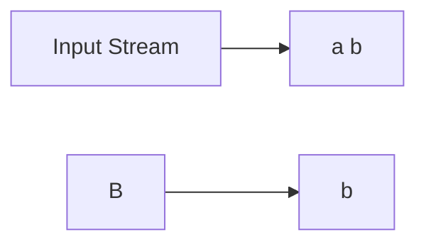
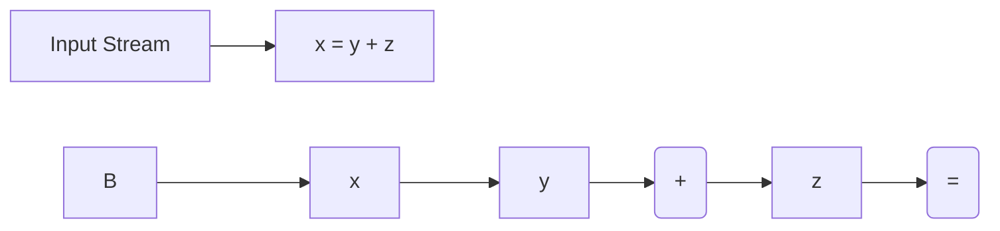

**Lexical Analysis**
======================

**Introduction**
---------------

Lexical analysis is the first phase of a compiler's front end, responsible for scanning the source code and identifying the meaningful units (lexemes) within it. This process breaks down the source code into individual tokens that can be further analyzed by the parser.

**Core Concepts**
-----------------

*   **Token**: A sequence of characters representing a single unit of meaning in the source code.
*   **Lexical Analysis Algorithm**: The algorithm used to perform lexical analysis, such as regular expressions or finite automata.
*   **Scanner/Parser**: The scanner reads the input stream and produces tokens that are then passed to the parser for further processing.

**Key Formulas/Theorems**
-------------------------

No specific formulas or theorems are directly related to lexical analysis. However, understanding the concept of regular languages and their representation using regular expressions is crucial.

### Regular Languages

A regular language is a set of strings that can be recognized by a finite automaton (FA). The regular language represented by an FA can be specified using a regular expression, which is a string consisting of atoms and operators.

*   **Atoms**: Literals in the regular expression, such as `a` or `(`.
*   **Operators**:
    *   `|`: Alternation
    *   `.`: Kleene star (zero or more occurrences)
    *   `+`: One or more occurrences

### Example Regular Expression

Suppose we want to match strings consisting of either the characters "ab" or "ba". The regular expression representing this language is:

`ab|ba`

**Problem Solving Patterns**
---------------------------

When dealing with lexical analysis questions, focus on understanding the regular expressions and how they relate to the tokens being produced.

*   **Token recognition**: Identify the patterns that match a particular token.
*   **Tokenization**: Break down the input stream into individual tokens based on the recognized patterns.

**Examples with Solutions**
---------------------------

### Example 1: Token Recognition

Suppose we have the following code segment:

`a = b + c;`

We want to recognize the token `b`. The regular expression for recognizing `b` is `[a-zA-Z]`, which matches any single character that is a letter.

### Example 2: Tokenization

Suppose we have the following code segment:

`x = y + z;`

We want to break down this input stream into individual tokens. We can use the regular expression `([a-zA-Z_][a-zA-Z0-9_]*)|(\+)|=|[a-zA-Z]` to match the tokens.

**Common Pitfalls**
-----------------

*   **Overlooking corner cases**: Make sure to consider edge cases, such as empty input or invalid characters.
*   **Incorrect token recognition**: Double-check that the regular expression correctly recognizes the tokens.

**Quick Summary**
----------------

*   Lexical analysis breaks down source code into individual tokens.
*   Regular expressions are used to represent and recognize patterns in the input stream.
*   Understanding token recognition and tokenization is crucial for lexical analysis questions.