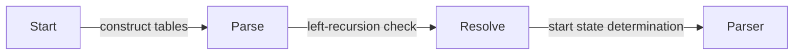
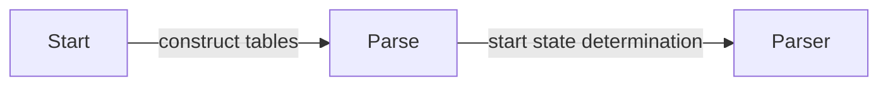

**Parser Theory**
================

### Introduction

A parser is a program that analyzes input according to the rules of a formal grammar and produces one or more outputs, such as an abstract syntax tree (AST). Parser theory provides the foundation for understanding how parsers work and how they can be designed.

### Core Concepts

#### Definition of a Context-Free Grammar (CFG)

A CFG is a 4-tuple `(N, \(\Sigma\), P, S)`:

* `N`: A set of non-terminal symbols
* `\(\Sigma\)`: A set of terminal symbols
* `P`: A set of production rules
* `S`: The start symbol

Production rules are written as `A → \(\alpha\)` where `A` is a non-terminal and `\(\alpha\)` is a string of terminals or non-terminals.

#### Left-Recursion

Left-recursion occurs when a production rule has the form:

```latex
A → A\(\beta\)
```

This can lead to infinite loops during parsing.

### Key Formulas/Theorems

#### SLR(1) Parsing Algorithm

The SLR(1) (Simple LR(1)) parser generates a table based on the CFG's production rules. The table is used for parsing and has two parts: the action table `A` and the goto table `G`.

Given a grammar, we can construct the tables using the following rules:

* For each production rule \(A → \alpha\), add an entry to \(A\) with label `reduce A → \(\alpha\)`.
* If \(A\) appears on both sides of a production rule, it is left-recursive. In this case, add an entry to \(G\) with label `goto state` for each non-terminal in the RHS.

```latex
\begin{array}{l}
A = \begin{pmatrix}
\text{reduce A → } \alpha & \ldots \\
\end{pmatrix}\\[5pt]
G = \begin{pmatrix}
\text{goto } state & \ldots \\
\end{pmatrix}
\end{array}
```

#### LL(1) Parsing Algorithm

The LL(1) parser generates two tables: the lookahead table `L` and the action table `A`.

```latex
\begin{array}{l}
L = \begin{pmatrix}
a & b & c & \ldots \\
\end{pmatrix}\\[5pt]
A = \begin{pmatrix}
\text{reduce A → } \alpha & \ldots \\
\end{pmatrix}
\end{array}
```

### Problem Solving Patterns

#### Analyzing SLR(1) Parsing Algorithm

To determine if an SLR(1) parser can parse a given grammar, we need to:

* Construct the action table `A` and goto table `G`
* Check for left-recursion and resolve it
* Determine the start state of the parser



#### Analyzing LL(1) Parsing Algorithm

To determine if an LL(1) parser can parse a given grammar, we need to:

* Construct the lookahead table `L` and action table `A`
* Determine the start state of the parser



### Examples with Solutions

#### Example 1: SLR(1) Parsing Algorithm

Given a grammar:

`S → AB | a`

Construct the action table `A` and goto table `G`.

```latex
\begin{array}{l}
A = \begin{pmatrix}
\text{reduce S → AB} & \ldots \\
\end{pmatrix}\\[5pt]
G = \begin{pmatrix}
\text{goto state } 1 & \ldots \\
\end{pmatrix}
\end{array}
```

Determine the start state of the parser.

#### Example 2: LL(1) Parsing Algorithm

Given a grammar:

`S → AB | aB`

Construct the lookahead table `L` and action table `A`.

```latex
\begin{array}{l}
L = \begin{pmatrix}
a & b \\
\end{pmatrix}\\[5pt]
A = \begin{pmatrix}
\text{reduce S → AB} & \ldots \\
\end{pmatrix}
\end{array}
```

Determine the start state of the parser.

### Common Pitfalls

* Left-recursion can lead to infinite loops during parsing.
* The SLR(1) and LL(1) algorithms have limitations, such as not handling left-recursive grammars.
* Constructing the tables correctly is crucial for determining the start state of the parser.

### Quick Summary

* A CFG consists of non-terminals, terminals, production rules, and a start symbol.
* Left-recursion can occur in production rules.
* The SLR(1) and LL(1) algorithms generate action tables and goto tables (or lookahead tables).
* Determining the start state of the parser is crucial for parsing.

### References

* [Hopcroft, Ullman, and Motwani. Introduction to Automata Theory, Languages, and Computation]
* [Aho, Sethi, and Ullman. Compilers: Principles, Techniques, and Tools]