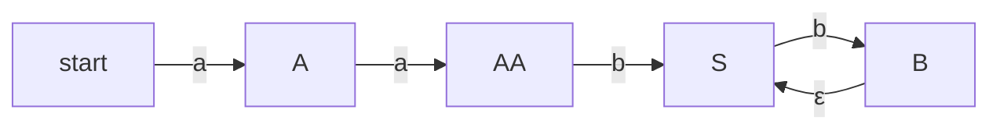

**Parsing Techniques LR(1) & LALR(1)**

### Introduction
LR(1) and LALR(1) parsing are two essential techniques used in compiler design to analyze the syntax of a programming language. These methods enable us to construct efficient parsers that can handle complex grammars.

### Core Concepts
#### Definition of LR(1) & LALR(1)
- **LR(1)**: A parsing technique that uses a lookahead of one symbol to predict the next state.
- **LALR(1)**: An extension of LR(1), where it can handle some conflicts by looking ahead only when necessary.

#### How LR(1) & LALR(1) Parsers Work
The basic idea is to maintain a stack that keeps track of the parser's state. Each time the parser reads a symbol, it uses this information to decide its next action.

### Key Formulas/Theorems

\[
\begin{align*}
  ext{LR}(1)&: \text{for each production } A \to aA', \\
                  & \quad \text{there exists a set of lookahead symbols } L(A) \text{ such that} \\
                  & \quad \qquad \exists s \in ext{NFA}(A') : \forall x \in L(A), sx \in ext{NFA}'(s)
\end{align*}
\]

### Problem Solving Patterns
1. **Understanding Grammars**: Be able to analyze and simplify grammars, identifying their productions and the relationships between them.
2. **Conflicts Resolution**: Know how LR(1) & LALR(1) resolve conflicts by either looking ahead or using a table-driven approach.

### Examples with Solutions

#### Example: Simplifying an LR(1) Parsing Table

Consider the following grammar:
\[ G = \{ S \to AB, A \to aa, B \to bB|ε \} \]

We need to construct the LR(0) parsing table for this grammar and then extend it to LR(1).

After constructing the table, we find that there's an R/R conflict in state 2. To resolve it, we look ahead for 'b', and if found, proceed with the production A → aa.

#### Example: Constructing an LALR(1) Parser

Given a grammar G = \{ S \to AB, A \to aa, B \to bB|ε \}, construct its LALR(1) parser.

To handle the conflict in state 2, we look ahead for 'b' and use it to decide which production to apply next. The resulting parser is an LALR(1) parser that can handle this grammar correctly.

### Common Pitfalls
- **Missing Lookahead Symbols**: Remember to include all necessary lookahead symbols when constructing LR(1) or LALR(1) parsing tables.
- **Incorrect Conflict Resolution**: Be cautious of conflicts that arise from the order of productions in a state and ensure they are resolved according to the specific technique being used.

### Quick Summary
- **LR(1)**: A parsing method using one-symbol lookahead for prediction.
- **LALR(1)**: An extension of LR(1), which can handle some conflicts by only looking ahead when necessary.
- **Key Points**: Understand grammars, recognize and resolve conflicts, especially R/R ones, and ensure to include all necessary lookahead symbols.