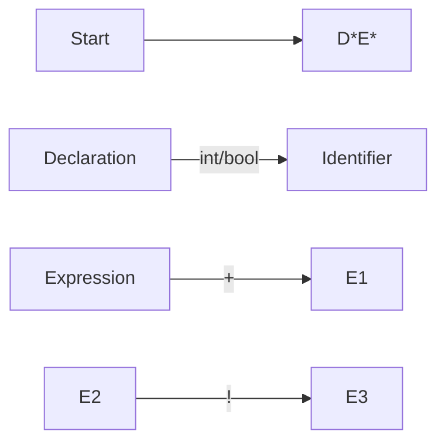
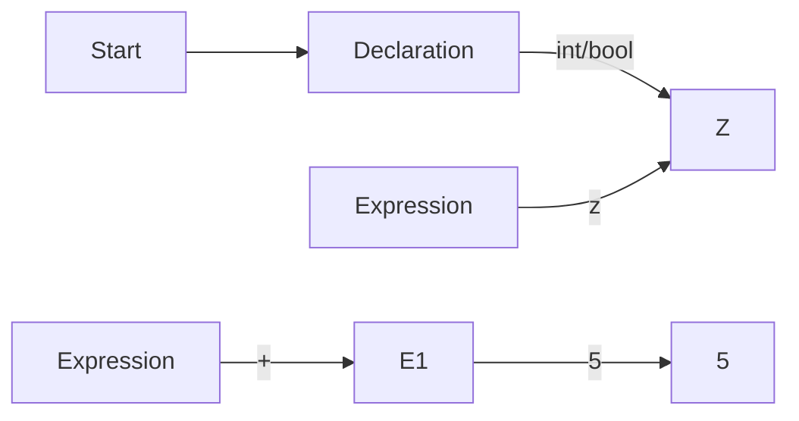
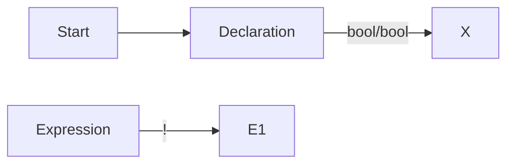

**Syntax Directed Translation (SDT)**
=====================================

### Introduction
-----------------

Syntax Directed Translation (SDT) is a technique used in compiler design to translate source code into machine code. It involves creating a parser that generates an abstract syntax tree (AST) and associates actions with each production rule in the grammar.

### Core Concepts
------------------

#### Syntax Directed Definitions (SDD)

A SDD consists of:

1. **Production Rules**: A set of productions that define the structure of the source code.
2. **Actions**: Associated with each production rule, these are functions or procedures that perform some operation on the AST.

The goal is to create a parser that can recognize the syntax of the source code and generate an AST that reflects this structure.

#### Parse Tree
-----------------

A parse tree is a hierarchical representation of the source code's syntactic structure. It consists of nodes, each representing a production rule in the grammar.

**Mermaid Diagram**


### Key Formulas/Theorems
-------------------------

There are no specific formulas or theorems in SDT, as it is a design technique rather than a mathematical theory.

### Problem Solving Patterns
-----------------------------

When dealing with SDT, follow these patterns:

1. **Read and Understand the Grammar**: Familiarize yourself with the production rules and actions.
2. **Create an AST**: Generate an abstract syntax tree based on the parse tree.
3. **Apply Actions**: Associate each node in the AST with its corresponding action.

### Examples with Solutions
---------------------------

**Example 1**

Consider the following grammar:
```markdown
S → D E
D → int ID
E → + E E
```
Suppose we want to translate `int x; y = 5 + z;` using SDT.

1. **Read and Understand the Grammar**: Note that the production rule for `D` has an action associated with it.
2. **Create an AST**: The parse tree would look like this:

3. **Apply Actions**: The action associated with the `D` node would record that `x` is of type int.

**Example 2**

Consider the following grammar:
```markdown
S → D* E*
E → ! E
D → bool ID
```
Suppose we want to translate `if (x) y = true;` using SDT.

1. **Read and Understand the Grammar**: Note that the production rule for `E` has an action associated with it.
2. **Create an AST**: The parse tree would look like this:

3. **Apply Actions**: The action associated with the `E` node would check that `X` is of type bool and set `Y` to be of type bool.

### Common Pitfalls
-------------------

* Failing to understand the grammar and production rules.
* Not creating a parse tree or abstract syntax tree correctly.
* Not applying actions to each node in the AST.

### Quick Summary
-----------------

* SDT is a technique used in compiler design to translate source code into machine code.
* It involves creating a parser that generates an abstract syntax tree (AST) and associates actions with each production rule in the grammar.
* A SDD consists of production rules and actions.
* The goal is to create a parser that can recognize the syntax of the source code and generate an AST that reflects this structure.

I hope this helps! Let me know if you have any questions or need further clarification.